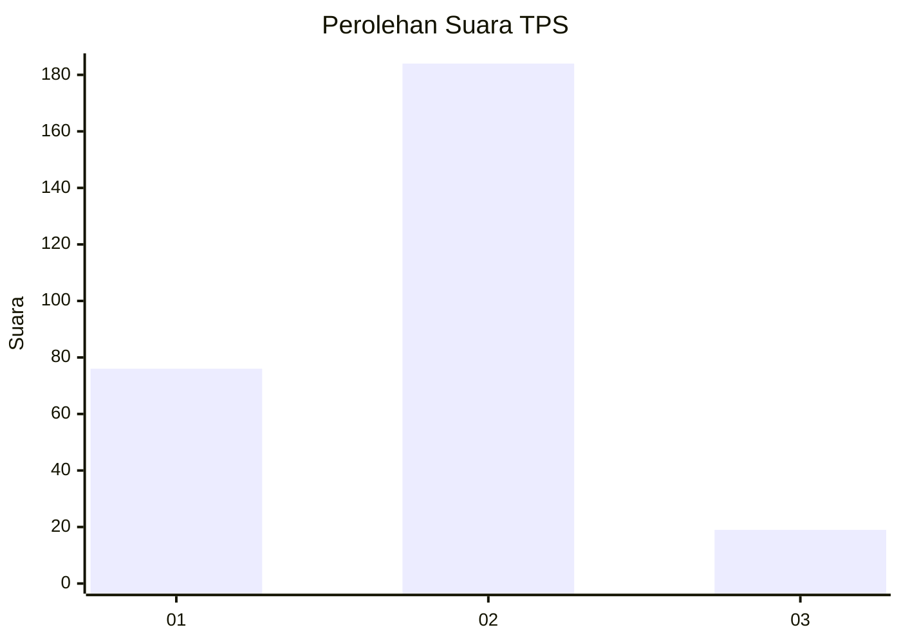
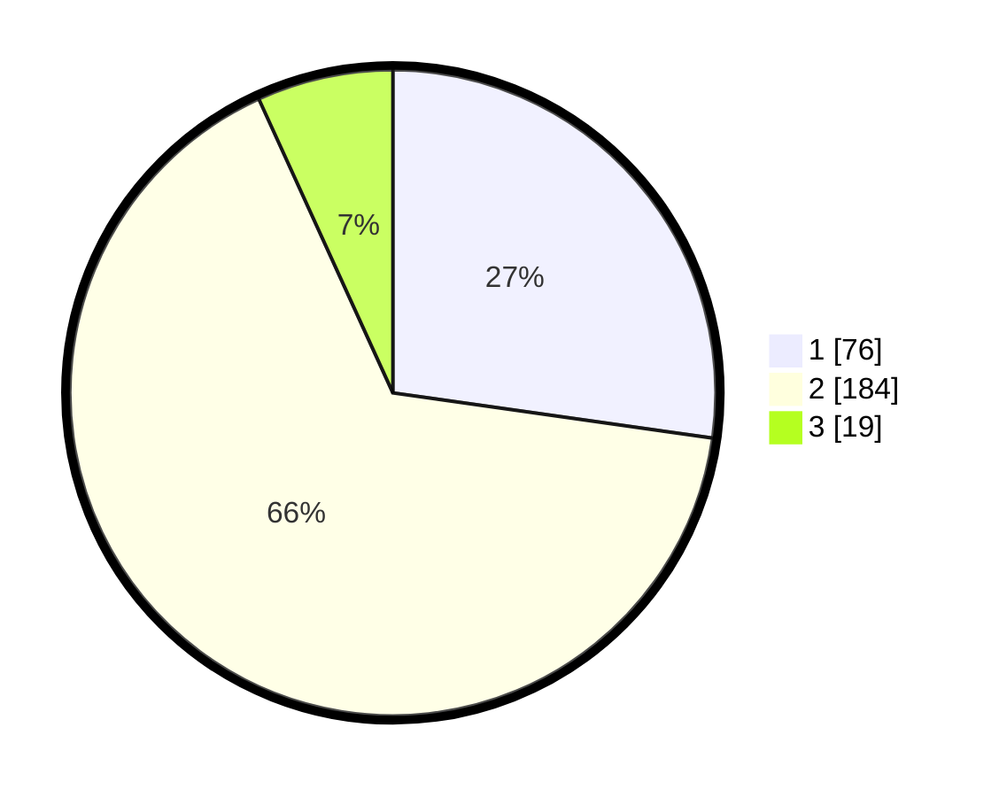

# Hasil

## Grafik

## Tabel

| No. | Nama Paslon    | Suara | Suara (raw) | Persentase |
|:--- |:-------------- | -----:| -----------:| ----------:|
| 1   | ANIES MUHAIMIN | 76    | [76][p-1]   | 27,24      |
| 2   | PRABOWO GIBRAN | 184   | [184][p-2]  | 65,95      |
| 3   | GANJAR MAHFUD  | 19    | [19][p-3]   | 6,81       |

[p-1]: https://github.com/gigit-pemilu/pemilu-2024/blob/main/pilpres/hitung-suara/sub/35-jawa-timur/sub/27-sampang/sub/03-sampang/sub/2002-aengsareh/sub/003-tps/sub/paslon-1.txt
[p-2]: https://github.com/gigit-pemilu/pemilu-2024/blob/main/pilpres/hitung-suara/sub/35-jawa-timur/sub/27-sampang/sub/03-sampang/sub/2002-aengsareh/sub/003-tps/sub/paslon-2.txt
[p-3]: https://github.com/gigit-pemilu/pemilu-2024/blob/main/pilpres/hitung-suara/sub/35-jawa-timur/sub/27-sampang/sub/03-sampang/sub/2002-aengsareh/sub/003-tps/sub/paslon-3.txt

## Foto C Plano

https://sirekap-obj-formc.kpu.go.id/3047/pemilu/ppwp/35/27/03/20/02/3527032002003-20240215-090023--16ec5ae2-ba99-40d6-ab5a-025454e838fb.jpg

https://sirekap-obj-formc.kpu.go.id/3047/pemilu/ppwp/35/27/03/20/02/3527032002003-20240215-064328--f0b38bea-cd6a-4386-ba2b-1b14a2abae7c.jpg

https://sirekap-obj-formc.kpu.go.id/3047/pemilu/ppwp/35/27/03/20/02/3527032002003-20240215-064526--cd85b54b-db5b-4b35-af57-d5681b9a55c3.jpg

## Metadata

| Key        | Value               |
| ---------- | ------------------- |
| Time Stamp | 2024-02-16 11:00:29 |

