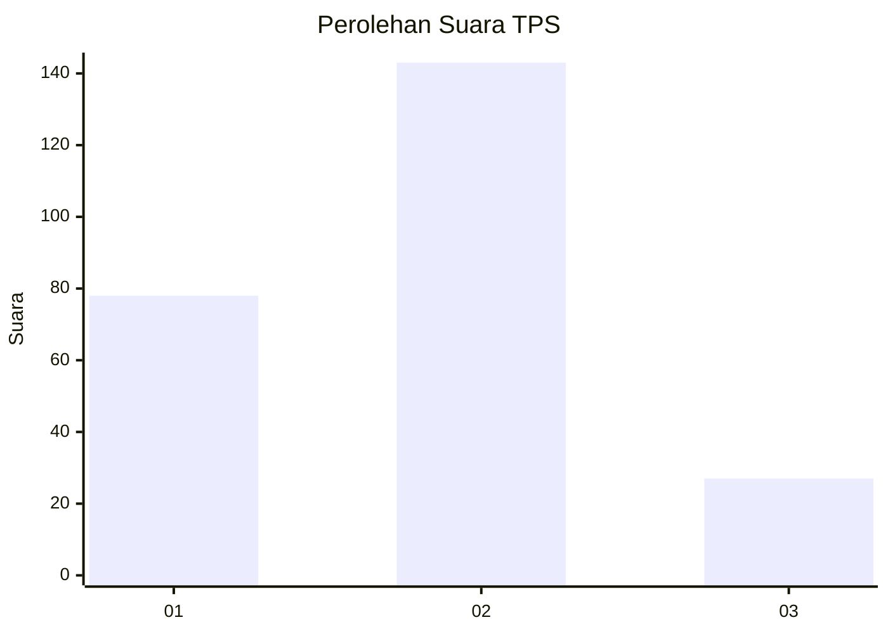
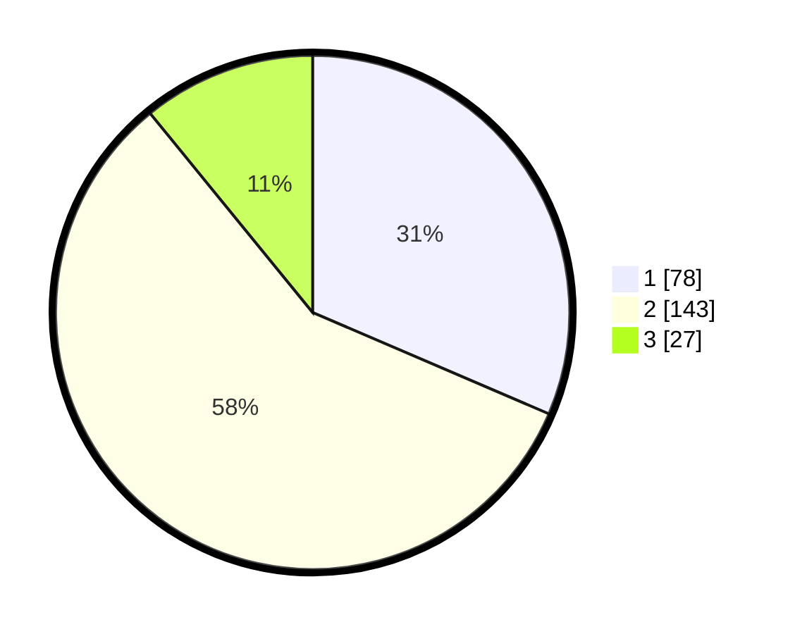

# Hasil

## Grafik

## Tabel

| No. | Nama Paslon    | Suara | Suara (raw) | Persentase |
|:--- |:-------------- | -----:| -----------:| ----------:|
| 1   | ANIES MUHAIMIN | 78    | [78][p-1]   | 31,45      |
| 2   | PRABOWO GIBRAN | 143   | [143][p-2]  | 57,66      |
| 3   | GANJAR MAHFUD  | 27    | [27][p-3]   | 10,89      |

[p-1]: https://github.com/gigit-pemilu/pemilu-2024-35-jawa-timur/blob/main/pilpres/hitung-suara/sub/35-jawa-timur/sub/27-sampang/sub/03-sampang/sub/2002-aengsareh/sub/004-tps/sub/paslon-1.txt
[p-2]: https://github.com/gigit-pemilu/pemilu-2024-35-jawa-timur/blob/main/pilpres/hitung-suara/sub/35-jawa-timur/sub/27-sampang/sub/03-sampang/sub/2002-aengsareh/sub/004-tps/sub/paslon-2.txt
[p-3]: https://github.com/gigit-pemilu/pemilu-2024-35-jawa-timur/blob/main/pilpres/hitung-suara/sub/35-jawa-timur/sub/27-sampang/sub/03-sampang/sub/2002-aengsareh/sub/004-tps/sub/paslon-3.txt

## Foto C Plano

https://sirekap-obj-formc.kpu.go.id/945e/pemilu/ppwp/35/27/03/20/02/3527032002004-20240215-001255--bd0e562a-740a-4f4b-b2c3-c59f1fec7c85.jpg

https://sirekap-obj-formc.kpu.go.id/945e/pemilu/ppwp/35/27/03/20/02/3527032002004-20240214-194135--3416b6a0-508a-456f-adc6-31c62ab3d183.jpg

https://sirekap-obj-formc.kpu.go.id/945e/pemilu/ppwp/35/27/03/20/02/3527032002004-20240215-001135--4d02f33f-2dd1-4604-a0d1-68b5abb47eb0.jpg

## Metadata

| Key        | Value               |
| ---------- | ------------------- |
| Time Stamp | 2024-02-15 12:00:28 |

