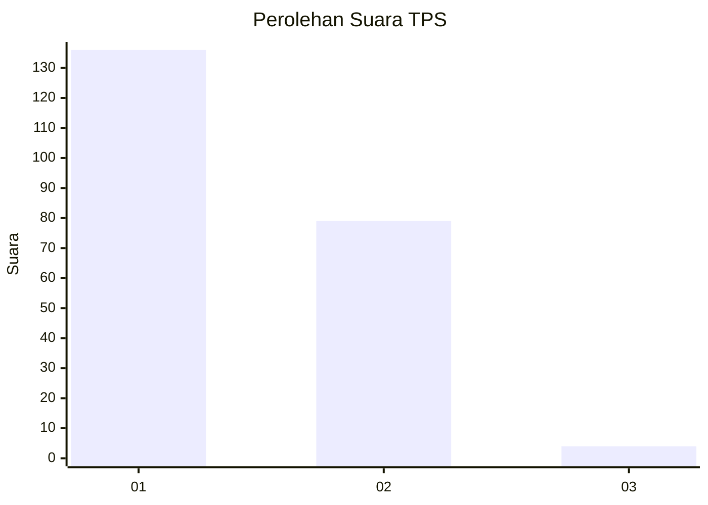
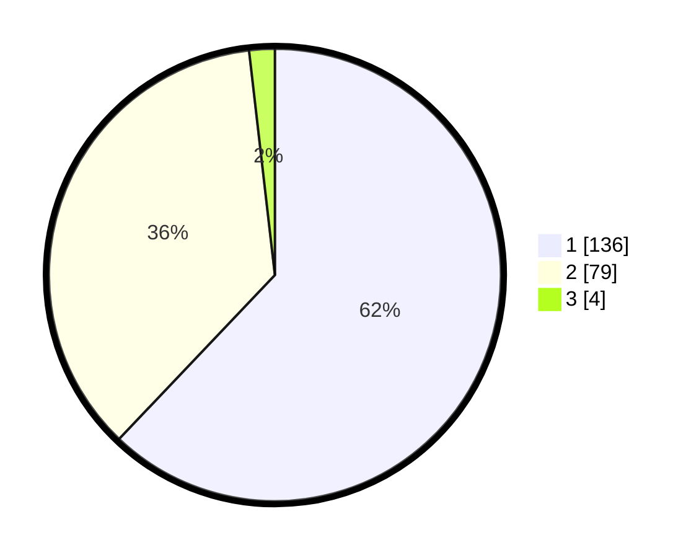

# Hasil

## Grafik

## Tabel

| No. | Nama Paslon    | Suara | Suara (raw) | Persentase |
|:--- |:-------------- | -----:| -----------:| ----------:|
| 1   | ANIES MUHAIMIN | 136   | [136][p-1]  | 62,10      |
| 2   | PRABOWO GIBRAN | 79    | [79][p-2]   | 36,07      |
| 3   | GANJAR MAHFUD  | 4     | [4][p-3]    | 1,83       |

[p-1]: https://github.com/gigit-pemilu/pemilu-2024/blob/main/pilpres/hitung-suara/sub/35-jawa-timur/sub/27-sampang/sub/03-sampang/sub/2002-aengsareh/sub/010-tps/sub/paslon-1.txt
[p-2]: https://github.com/gigit-pemilu/pemilu-2024/blob/main/pilpres/hitung-suara/sub/35-jawa-timur/sub/27-sampang/sub/03-sampang/sub/2002-aengsareh/sub/010-tps/sub/paslon-2.txt
[p-3]: https://github.com/gigit-pemilu/pemilu-2024/blob/main/pilpres/hitung-suara/sub/35-jawa-timur/sub/27-sampang/sub/03-sampang/sub/2002-aengsareh/sub/010-tps/sub/paslon-3.txt

## Foto C Plano

https://sirekap-obj-formc.kpu.go.id/13ad/pemilu/ppwp/35/27/03/20/02/3527032002010-20240214-234336--b6d03177-6f84-489e-bd20-c83f53423ed6.jpg

https://sirekap-obj-formc.kpu.go.id/13ad/pemilu/ppwp/35/27/03/20/02/3527032002010-20240214-234424--8f093291-350d-466c-b099-00f973f7cc5b.jpg

https://sirekap-obj-formc.kpu.go.id/13ad/pemilu/ppwp/35/27/03/20/02/3527032002010-20240214-234516--52ea3ac9-b456-4619-9b5e-1e046635b6e4.jpg

## Metadata

| Key        | Value               |
| ---------- | ------------------- |
| Time Stamp | 2024-02-16 11:00:29 |

