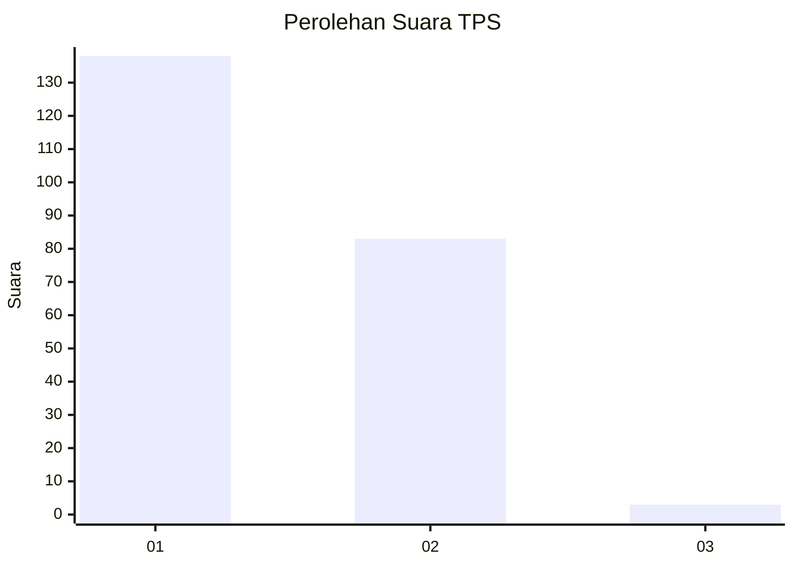
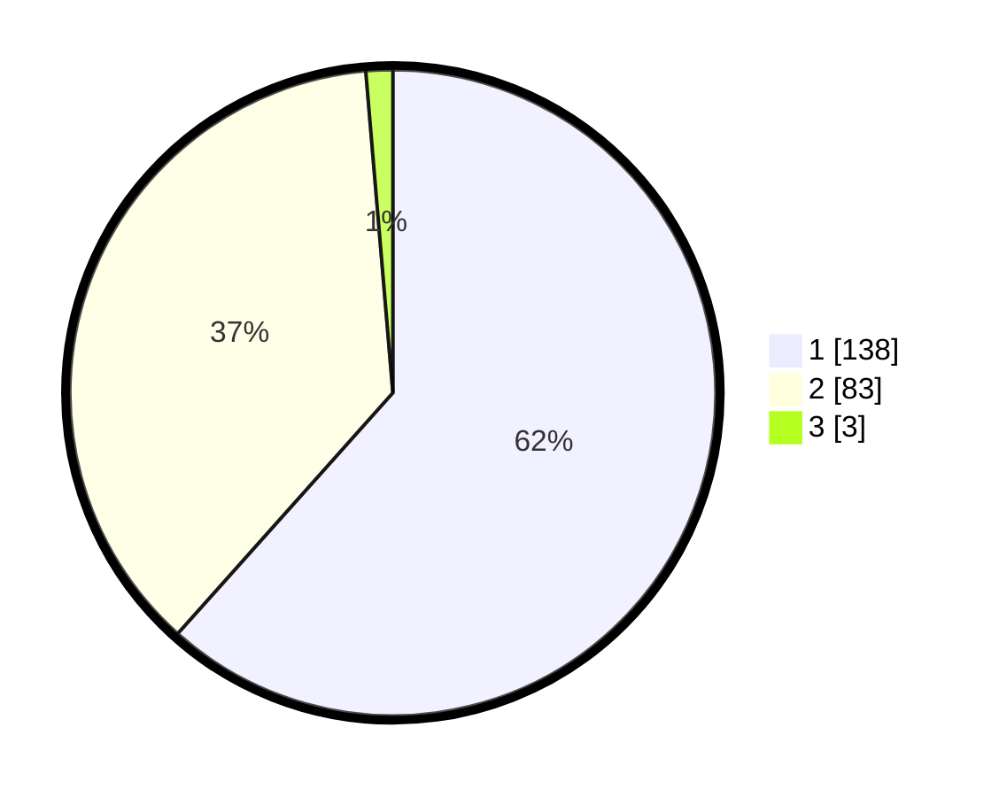

# Hasil

## Grafik

## Tabel

| No. | Nama Paslon    | Suara | Suara (raw) | Persentase |
|:--- |:-------------- | -----:| -----------:| ----------:|
| 1   | ANIES MUHAIMIN | 138   | [138][p-1]  | 61,61      |
| 2   | PRABOWO GIBRAN | 83    | [83][p-2]   | 37,05      |
| 3   | GANJAR MAHFUD  | 3     | [3][p-3]    | 1,34       |

[p-1]: https://github.com/gigit-pemilu/pemilu-2024-35-jawa-timur/blob/main/pilpres/hitung-suara/sub/35-jawa-timur/sub/27-sampang/sub/03-sampang/sub/2002-aengsareh/sub/011-tps/sub/paslon-1.txt
[p-2]: https://github.com/gigit-pemilu/pemilu-2024-35-jawa-timur/blob/main/pilpres/hitung-suara/sub/35-jawa-timur/sub/27-sampang/sub/03-sampang/sub/2002-aengsareh/sub/011-tps/sub/paslon-2.txt
[p-3]: https://github.com/gigit-pemilu/pemilu-2024-35-jawa-timur/blob/main/pilpres/hitung-suara/sub/35-jawa-timur/sub/27-sampang/sub/03-sampang/sub/2002-aengsareh/sub/011-tps/sub/paslon-3.txt

## Foto C Plano

https://sirekap-obj-formc.kpu.go.id/e52b/pemilu/ppwp/35/27/03/20/02/3527032002011-20240214-204012--2955f725-250f-4d41-9bb5-5bc656776fc5.jpg

https://sirekap-obj-formc.kpu.go.id/e52b/pemilu/ppwp/35/27/03/20/02/3527032002011-20240214-194627--62860e8d-6d45-4587-9b3e-1953c754355d.jpg

https://sirekap-obj-formc.kpu.go.id/e52b/pemilu/ppwp/35/27/03/20/02/3527032002011-20240214-194703--669412fb-e94a-4b2b-ba62-f371c095e107.jpg

## Metadata

| Key        | Value               |
| ---------- | ------------------- |
| Time Stamp | 2024-02-16 11:00:29 |

