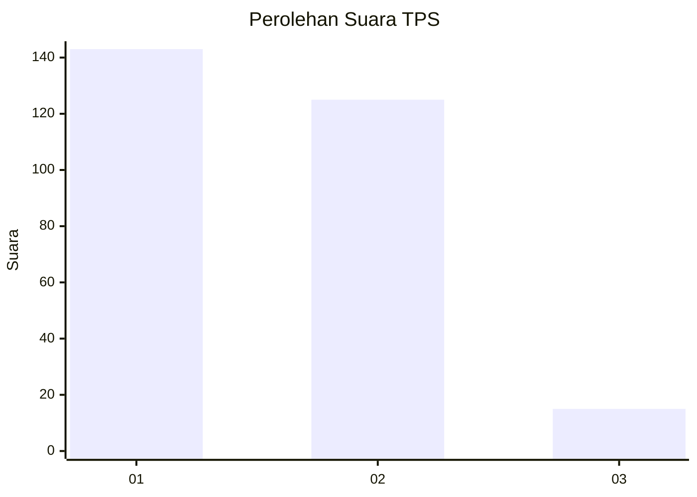
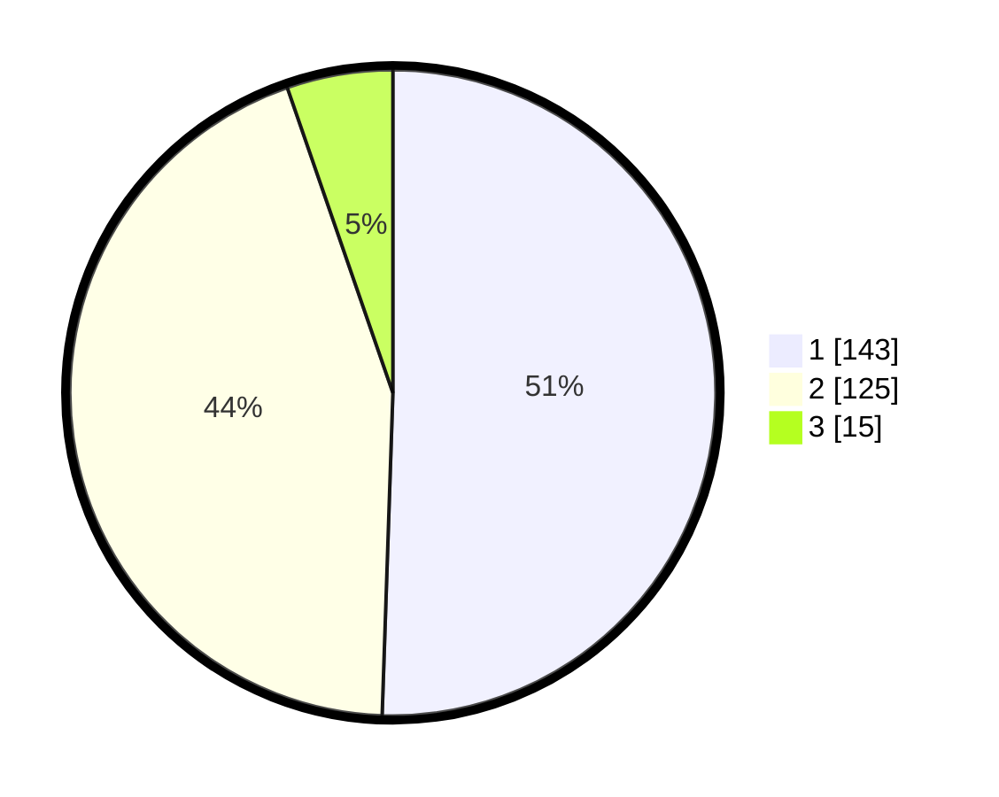

# Hasil

## Grafik

## Tabel

| No. | Nama Paslon    | Suara | Suara (raw) | Persentase |
|:--- |:-------------- | -----:| -----------:| ----------:|
| 1   | ANIES MUHAIMIN | 143   | [143][p-1]  | 50,53      |
| 2   | PRABOWO GIBRAN | 125   | [125][p-2]  | 44,17      |
| 3   | GANJAR MAHFUD  | 15    | [15][p-3]   | 5,30       |

[p-1]: https://github.com/gigit-pemilu/pemilu-2024-35-jawa-timur/blob/main/pilpres/hitung-suara/sub/35-jawa-timur/sub/27-sampang/sub/03-sampang/sub/2002-aengsareh/sub/012-tps/sub/paslon-1.txt
[p-2]: https://github.com/gigit-pemilu/pemilu-2024-35-jawa-timur/blob/main/pilpres/hitung-suara/sub/35-jawa-timur/sub/27-sampang/sub/03-sampang/sub/2002-aengsareh/sub/012-tps/sub/paslon-2.txt
[p-3]: https://github.com/gigit-pemilu/pemilu-2024-35-jawa-timur/blob/main/pilpres/hitung-suara/sub/35-jawa-timur/sub/27-sampang/sub/03-sampang/sub/2002-aengsareh/sub/012-tps/sub/paslon-3.txt

## Foto C Plano

https://sirekap-obj-formc.kpu.go.id/c58d/pemilu/ppwp/35/27/03/20/02/3527032002012-20240214-195951--0c8eb3ad-e626-48f1-9070-1db31c25b7dc.jpg

https://sirekap-obj-formc.kpu.go.id/c58d/pemilu/ppwp/35/27/03/20/02/3527032002012-20240214-200339--478bdc25-cf11-4ed9-894b-58ca2fffd365.jpg

https://sirekap-obj-formc.kpu.go.id/c58d/pemilu/ppwp/35/27/03/20/02/3527032002012-20240214-200201--d09d9435-01ef-4ec0-b918-3bd4791ba26a.jpg

## Metadata

| Key        | Value               |
| ---------- | ------------------- |
| Time Stamp | 2024-02-16 11:00:29 |

