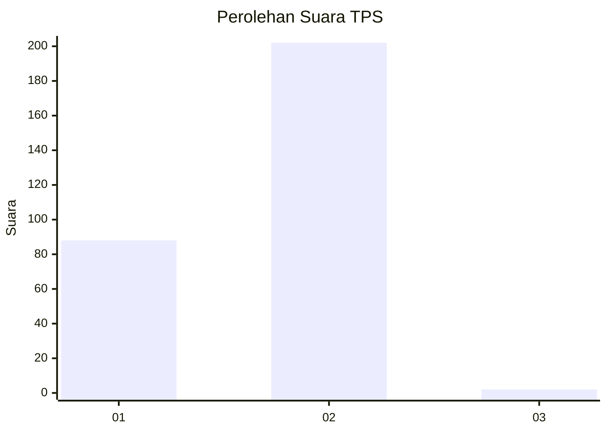
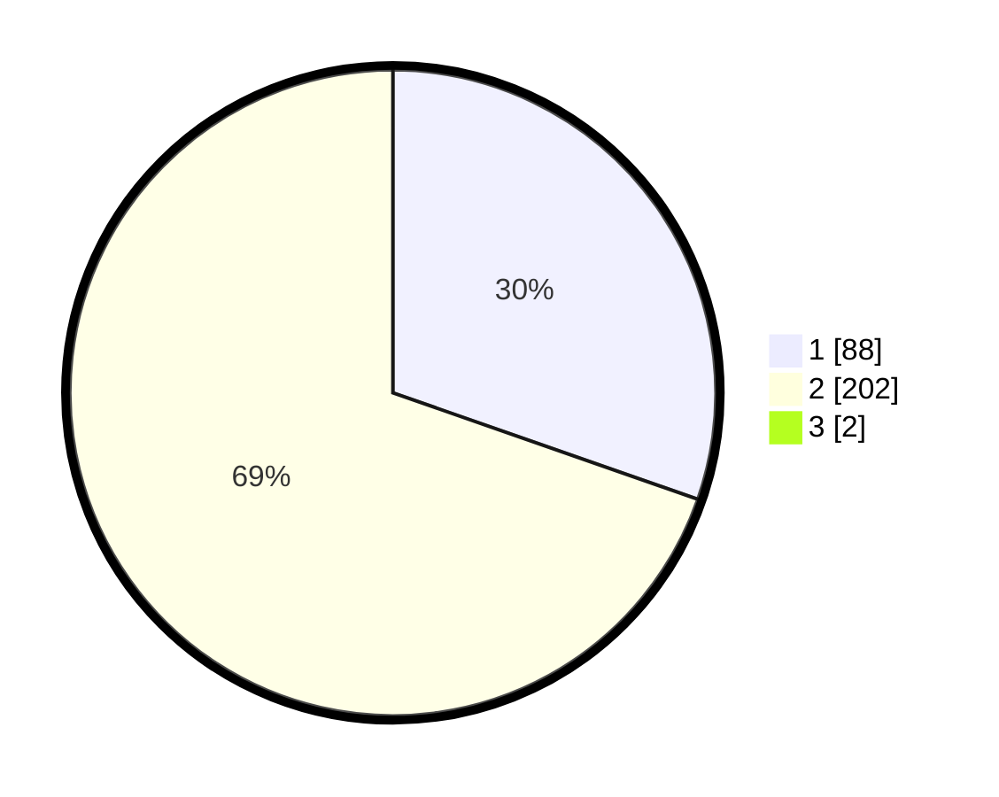

# Hasil

## Grafik

## Tabel

| No. | Nama Paslon    | Suara | Suara (raw) | Persentase |
|:--- |:-------------- | -----:| -----------:| ----------:|
| 1   | ANIES MUHAIMIN | 88    | [88][p-1]   | 30,14      |
| 2   | PRABOWO GIBRAN | 202   | [202][p-2]  | 69,18      |
| 3   | GANJAR MAHFUD  | 2     | [2][p-3]    | 0,68       |

[p-1]: https://github.com/gigit-pemilu/pemilu-2024-35-jawa-timur/blob/main/pilpres/hitung-suara/sub/35-jawa-timur/sub/27-sampang/sub/03-sampang/sub/2005-gunung-maddah/sub/002-tps/sub/paslon-1.txt
[p-2]: https://github.com/gigit-pemilu/pemilu-2024-35-jawa-timur/blob/main/pilpres/hitung-suara/sub/35-jawa-timur/sub/27-sampang/sub/03-sampang/sub/2005-gunung-maddah/sub/002-tps/sub/paslon-2.txt
[p-3]: https://github.com/gigit-pemilu/pemilu-2024-35-jawa-timur/blob/main/pilpres/hitung-suara/sub/35-jawa-timur/sub/27-sampang/sub/03-sampang/sub/2005-gunung-maddah/sub/002-tps/sub/paslon-3.txt

## Foto C Plano

https://sirekap-obj-formc.kpu.go.id/1976/pemilu/ppwp/35/27/03/20/05/3527032005002-20240214-192346--fc8e07d2-47f9-41c4-966f-a747cd7ab564.jpg

https://sirekap-obj-formc.kpu.go.id/1976/pemilu/ppwp/35/27/03/20/05/3527032005002-20240214-191415--a24c0af5-6bb7-4104-aba3-d662a71c0f2a.jpg

https://sirekap-obj-formc.kpu.go.id/1976/pemilu/ppwp/35/27/03/20/05/3527032005002-20240214-191924--3a9d56f8-4c82-4997-9e6f-959a44154f0a.jpg

## Metadata

| Key        | Value               |
| ---------- | ------------------- |
| Time Stamp | 2024-02-15 22:00:27 |

