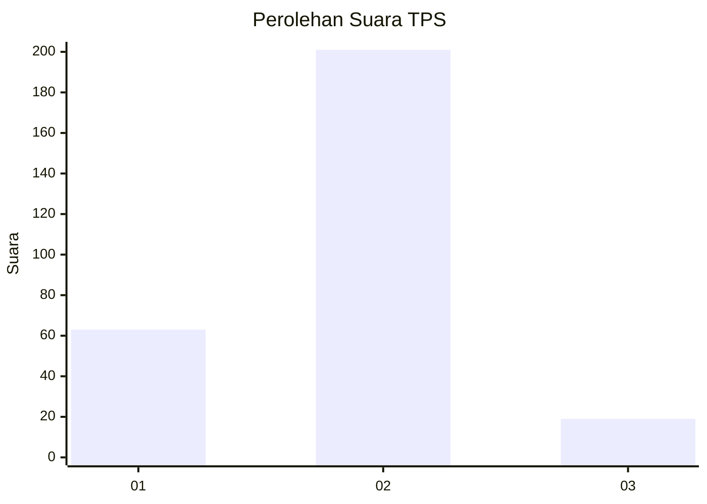

# Hasil

## Grafik

## Tabel

| No. | Nama Paslon    | Suara | Suara (raw) | Persentase |
|:--- |:-------------- | -----:| -----------:| ----------:|
| 1   | ANIES MUHAIMIN | 63    | [63][p-1]   | 22,26      |
| 2   | PRABOWO GIBRAN | 201   | [201][p-2]  | 71,02      |
| 3   | GANJAR MAHFUD  | 19    | [19][p-3]   | 6,71       |

[p-1]: https://github.com/gigit-pemilu/pemilu-2024-35-jawa-timur/blob/main/pilpres/hitung-suara/sub/35-jawa-timur/sub/27-sampang/sub/03-sampang/sub/2005-gunung-maddah/sub/004-tps/sub/paslon-1.txt
[p-2]: https://github.com/gigit-pemilu/pemilu-2024-35-jawa-timur/blob/main/pilpres/hitung-suara/sub/35-jawa-timur/sub/27-sampang/sub/03-sampang/sub/2005-gunung-maddah/sub/004-tps/sub/paslon-2.txt
[p-3]: https://github.com/gigit-pemilu/pemilu-2024-35-jawa-timur/blob/main/pilpres/hitung-suara/sub/35-jawa-timur/sub/27-sampang/sub/03-sampang/sub/2005-gunung-maddah/sub/004-tps/sub/paslon-3.txt

## Foto C Plano

https://sirekap-obj-formc.kpu.go.id/f736/pemilu/ppwp/35/27/03/20/05/3527032005004-20240214-235907--aa71b1df-0e8f-4638-bcb5-3f4ad1089242.jpg

https://sirekap-obj-formc.kpu.go.id/f736/pemilu/ppwp/35/27/03/20/05/3527032005004-20240214-235923--7f25b073-0d4f-4e9e-bda1-5a914da21663.jpg

https://sirekap-obj-formc.kpu.go.id/f736/pemilu/ppwp/35/27/03/20/05/3527032005004-20240214-235930--2923a0b9-fa15-4c01-99f6-f35ce68f5f4c.jpg

## Metadata

| Key        | Value               |
| ---------- | ------------------- |
| Time Stamp | 2024-02-15 15:00:29 |

