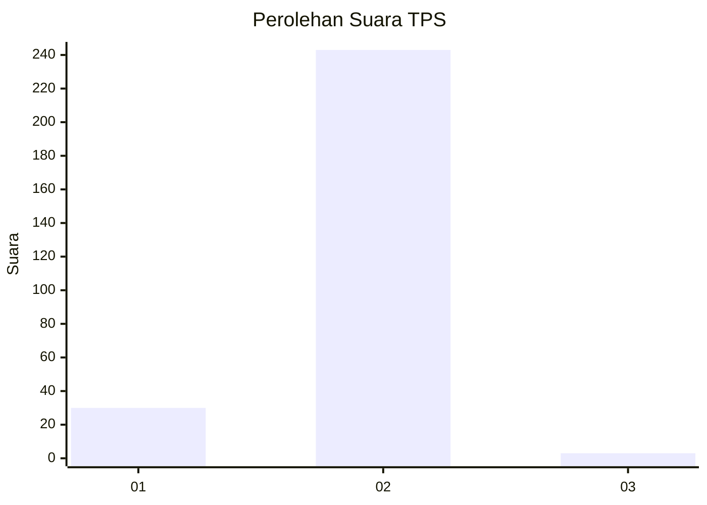
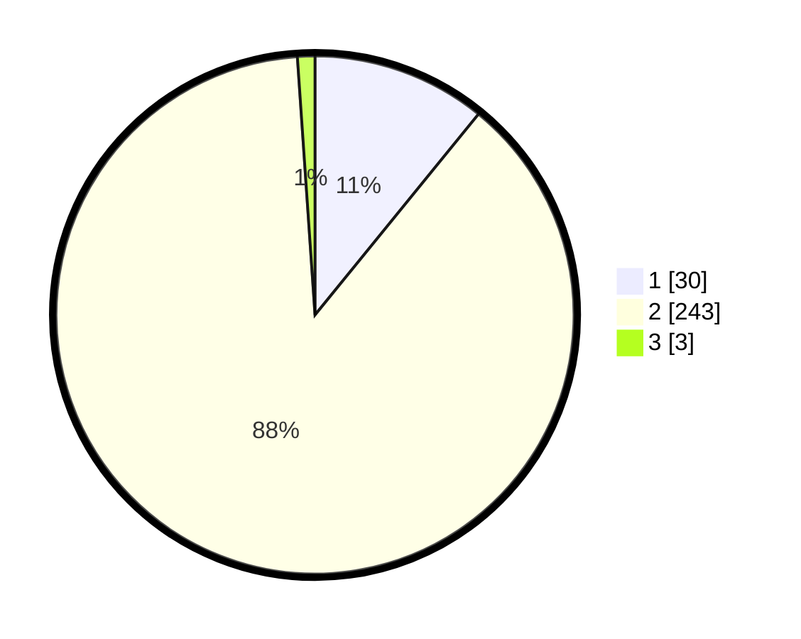

# Hasil

## Grafik

## Tabel

| No. | Nama Paslon    | Suara | Suara (raw) | Persentase |
|:--- |:-------------- | -----:| -----------:| ----------:|
| 1   | ANIES MUHAIMIN | 30    | [30][p-1]   | 10,87      |
| 2   | PRABOWO GIBRAN | 243   | [243][p-2]  | 88,04      |
| 3   | GANJAR MAHFUD  | 3     | [3][p-3]    | 1,09       |

[p-1]: https://github.com/gigit-pemilu/pemilu-2024-35-jawa-timur/blob/main/pilpres/hitung-suara/sub/35-jawa-timur/sub/27-sampang/sub/03-sampang/sub/2005-gunung-maddah/sub/007-tps/sub/paslon-1.txt
[p-2]: https://github.com/gigit-pemilu/pemilu-2024-35-jawa-timur/blob/main/pilpres/hitung-suara/sub/35-jawa-timur/sub/27-sampang/sub/03-sampang/sub/2005-gunung-maddah/sub/007-tps/sub/paslon-2.txt
[p-3]: https://github.com/gigit-pemilu/pemilu-2024-35-jawa-timur/blob/main/pilpres/hitung-suara/sub/35-jawa-timur/sub/27-sampang/sub/03-sampang/sub/2005-gunung-maddah/sub/007-tps/sub/paslon-3.txt

## Foto C Plano

https://sirekap-obj-formc.kpu.go.id/4458/pemilu/ppwp/35/27/03/20/05/3527032005007-20240214-222508--4d20ca44-8e17-4390-a495-201d3b699624.jpg

https://sirekap-obj-formc.kpu.go.id/4458/pemilu/ppwp/35/27/03/20/05/3527032005007-20240214-232313--6aff51f1-b01f-48dd-85ef-55333ec0bdd6.jpg

https://sirekap-obj-formc.kpu.go.id/4458/pemilu/ppwp/35/27/03/20/05/3527032005007-20240214-232316--0a8e9ec3-6a83-4934-99ca-018c2153afb7.jpg

## Metadata

| Key        | Value               |
| ---------- | ------------------- |
| Time Stamp | 2024-02-16 11:00:29 |

