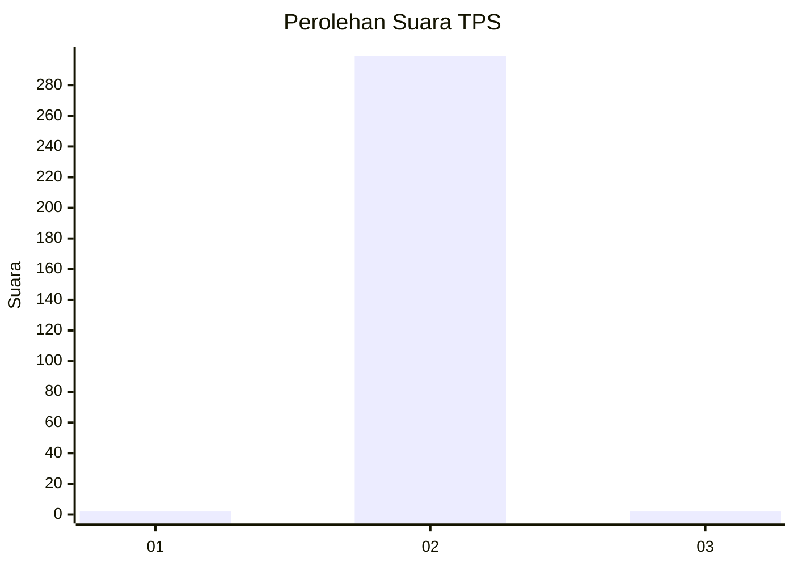
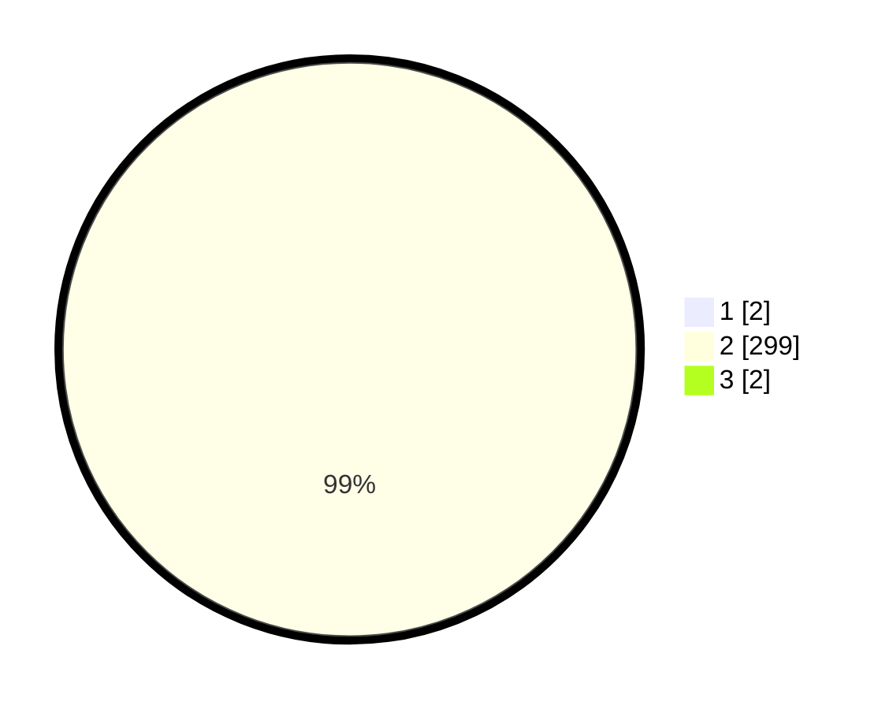

# Hasil

## Grafik

## Tabel

| No. | Nama Paslon    | Suara | Suara (raw) | Persentase |
|:--- |:-------------- | -----:| -----------:| ----------:|
| 1   | ANIES MUHAIMIN | 2     | [2][p-1]    | 0,66       |
| 2   | PRABOWO GIBRAN | 299   | [299][p-2]  | 98,68      |
| 3   | GANJAR MAHFUD  | 2     | [2][p-3]    | 0,66       |

[p-1]: https://github.com/gigit-pemilu/pemilu-2024-35-jawa-timur/blob/main/pilpres/hitung-suara/sub/35-jawa-timur/sub/27-sampang/sub/03-sampang/sub/2005-gunung-maddah/sub/022-tps/sub/paslon-1.txt
[p-2]: https://github.com/gigit-pemilu/pemilu-2024-35-jawa-timur/blob/main/pilpres/hitung-suara/sub/35-jawa-timur/sub/27-sampang/sub/03-sampang/sub/2005-gunung-maddah/sub/022-tps/sub/paslon-2.txt
[p-3]: https://github.com/gigit-pemilu/pemilu-2024-35-jawa-timur/blob/main/pilpres/hitung-suara/sub/35-jawa-timur/sub/27-sampang/sub/03-sampang/sub/2005-gunung-maddah/sub/022-tps/sub/paslon-3.txt

## Foto C Plano

https://sirekap-obj-formc.kpu.go.id/c502/pemilu/ppwp/35/27/03/20/05/3527032005022-20240215-043825--379910e2-69fe-46a5-8d5f-b6cee69eaabe.jpg

https://sirekap-obj-formc.kpu.go.id/c502/pemilu/ppwp/35/27/03/20/05/3527032005022-20240215-044105--f58c4ef6-30f7-42cc-8e56-659cb6410f99.jpg

https://sirekap-obj-formc.kpu.go.id/c502/pemilu/ppwp/35/27/03/20/05/3527032005022-20240215-044121--6494c8e6-5064-40f2-8f16-5eca158b65df.jpg

## Metadata

| Key        | Value               |
| ---------- | ------------------- |
| Time Stamp | 2024-02-16 11:00:29 |

