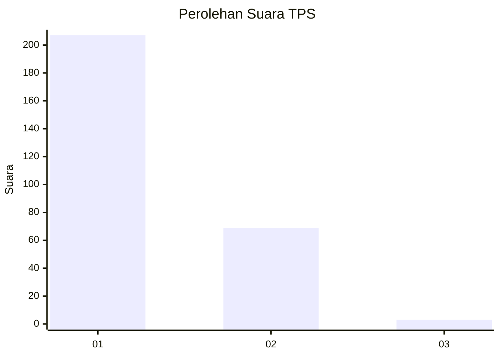
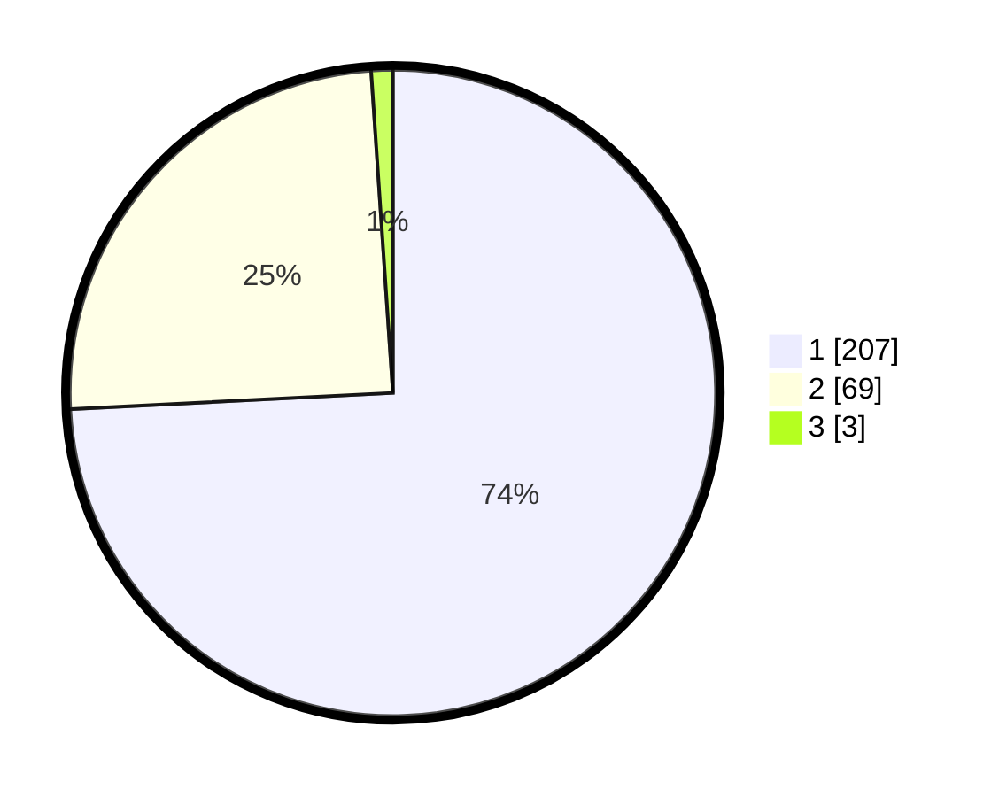

# Hasil

## Grafik

## Tabel

| No. | Nama Paslon    | Suara | Suara (raw) | Persentase |
|:--- |:-------------- | -----:| -----------:| ----------:|
| 1   | ANIES MUHAIMIN | 207   | [207][p-1]  | 74,19      |
| 2   | PRABOWO GIBRAN | 69    | [69][p-2]   | 24,73      |
| 3   | GANJAR MAHFUD  | 3     | [3][p-3]    | 1,08       |

[p-1]: https://github.com/gigit-pemilu/pemilu-2024/blob/main/pilpres/hitung-suara/sub/35-jawa-timur/sub/27-sampang/sub/03-sampang/sub/2010-panggung/sub/003-tps/sub/paslon-1.txt
[p-2]: https://github.com/gigit-pemilu/pemilu-2024/blob/main/pilpres/hitung-suara/sub/35-jawa-timur/sub/27-sampang/sub/03-sampang/sub/2010-panggung/sub/003-tps/sub/paslon-2.txt
[p-3]: https://github.com/gigit-pemilu/pemilu-2024/blob/main/pilpres/hitung-suara/sub/35-jawa-timur/sub/27-sampang/sub/03-sampang/sub/2010-panggung/sub/003-tps/sub/paslon-3.txt

## Foto C Plano

https://sirekap-obj-formc.kpu.go.id/3aa4/pemilu/ppwp/35/27/03/20/10/3527032010003-20240214-194126--25b73678-5b58-493e-889c-beeaf4787597.jpg

https://sirekap-obj-formc.kpu.go.id/3aa4/pemilu/ppwp/35/27/03/20/10/3527032010003-20240214-194243--964c08ee-bcc2-45a2-b458-48778729da6f.jpg

https://sirekap-obj-formc.kpu.go.id/3aa4/pemilu/ppwp/35/27/03/20/10/3527032010003-20240214-194352--7949cff2-0a19-47ff-84e3-3ed2ae4fb6fd.jpg

## Metadata

| Key        | Value               |
| ---------- | ------------------- |
| Time Stamp | 2024-02-16 11:00:29 |

