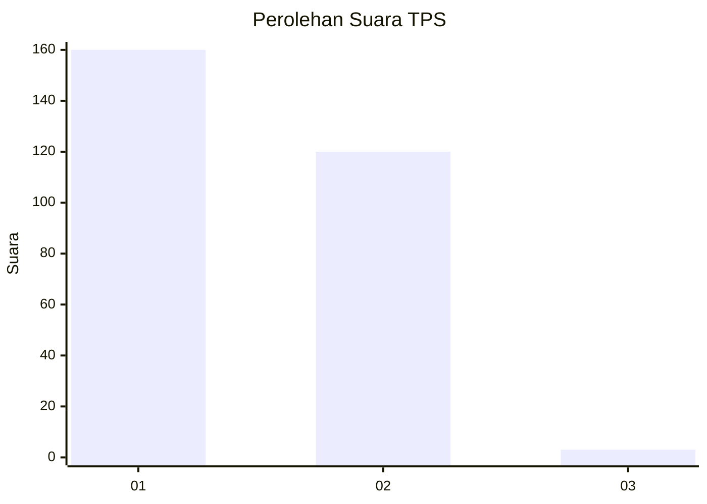
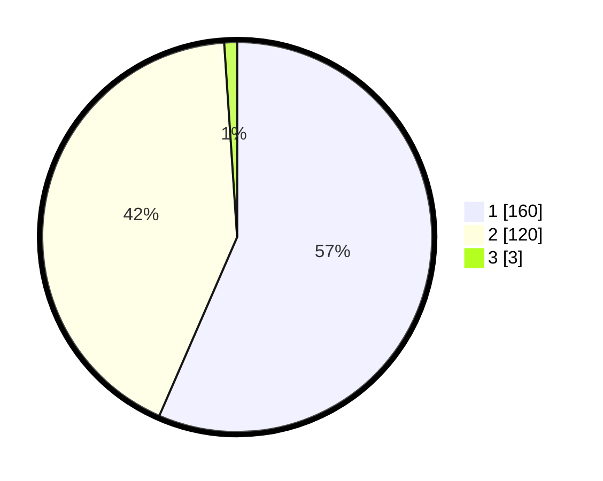

# Hasil

## Grafik

## Tabel

| No. | Nama Paslon    | Suara | Suara (raw) | Persentase |
|:--- |:-------------- | -----:| -----------:| ----------:|
| 1   | ANIES MUHAIMIN | 160   | [160][p-1]  | 56,54      |
| 2   | PRABOWO GIBRAN | 120   | [120][p-2]  | 42,40      |
| 3   | GANJAR MAHFUD  | 3     | [3][p-3]    | 1,06       |

[p-1]: https://github.com/gigit-pemilu/pemilu-2024/blob/main/pilpres/hitung-suara/sub/35-jawa-timur/sub/27-sampang/sub/03-sampang/sub/2010-panggung/sub/005-tps/sub/paslon-1.txt
[p-2]: https://github.com/gigit-pemilu/pemilu-2024/blob/main/pilpres/hitung-suara/sub/35-jawa-timur/sub/27-sampang/sub/03-sampang/sub/2010-panggung/sub/005-tps/sub/paslon-2.txt
[p-3]: https://github.com/gigit-pemilu/pemilu-2024/blob/main/pilpres/hitung-suara/sub/35-jawa-timur/sub/27-sampang/sub/03-sampang/sub/2010-panggung/sub/005-tps/sub/paslon-3.txt

## Foto C Plano

https://sirekap-obj-formc.kpu.go.id/45f4/pemilu/ppwp/35/27/03/20/10/3527032010005-20240217-151209--fba0950d-a19a-4f17-8742-b11d13aacebe.jpg

https://sirekap-obj-formc.kpu.go.id/45f4/pemilu/ppwp/35/27/03/20/10/3527032010005-20240217-150615--8aeb3480-e8c4-47b2-b3b8-784251163e99.jpg

https://sirekap-obj-formc.kpu.go.id/45f4/pemilu/ppwp/35/27/03/20/10/3527032010005-20240217-151325--5a0597a9-de87-48ef-917c-4fcd620df8a7.jpg

## Metadata

| Key        | Value               |
| ---------- | ------------------- |
| Time Stamp | 2024-02-17 18:00:00 |

