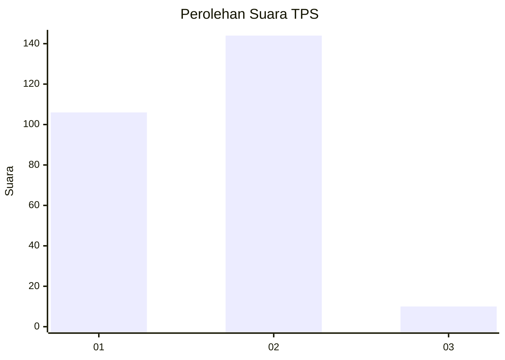
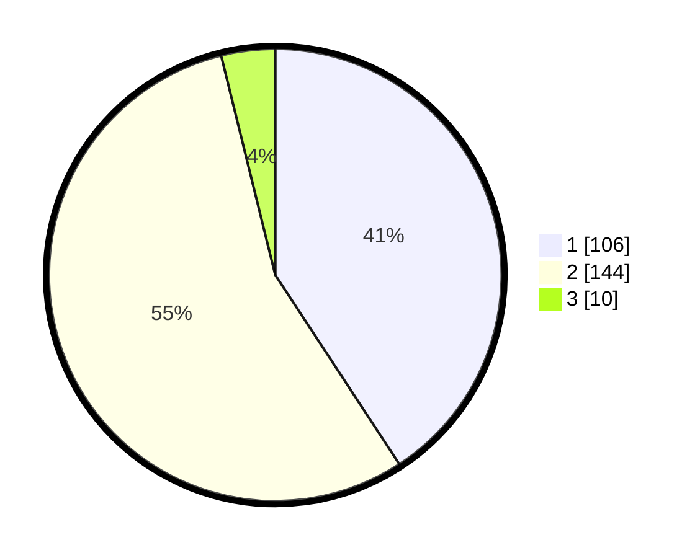

# Hasil

## Grafik

## Tabel

| No. | Nama Paslon    | Suara | Suara (raw) | Persentase |
|:--- |:-------------- | -----:| -----------:| ----------:|
| 1   | ANIES MUHAIMIN | 106   | [106][p-1]  | 40,77      |
| 2   | PRABOWO GIBRAN | 144   | [144][p-2]  | 55,38      |
| 3   | GANJAR MAHFUD  | 10    | [10][p-3]   | 3,85       |

[p-1]: https://github.com/gigit-pemilu/pemilu-2024/blob/main/pilpres/hitung-suara/sub/35-jawa-timur/sub/27-sampang/sub/03-sampang/sub/2010-panggung/sub/011-tps/sub/paslon-1.txt
[p-2]: https://github.com/gigit-pemilu/pemilu-2024/blob/main/pilpres/hitung-suara/sub/35-jawa-timur/sub/27-sampang/sub/03-sampang/sub/2010-panggung/sub/011-tps/sub/paslon-2.txt
[p-3]: https://github.com/gigit-pemilu/pemilu-2024/blob/main/pilpres/hitung-suara/sub/35-jawa-timur/sub/27-sampang/sub/03-sampang/sub/2010-panggung/sub/011-tps/sub/paslon-3.txt

## Foto C Plano

https://sirekap-obj-formc.kpu.go.id/4452/pemilu/ppwp/35/27/03/20/10/3527032010011-20240226-085554--00306260-4aff-4b73-a5b2-99475d536235.jpg

https://sirekap-obj-formc.kpu.go.id/4452/pemilu/ppwp/35/27/03/20/10/3527032010011-20240226-085810--2661a810-bd80-4251-9c58-b60c37b03f76.jpg

https://sirekap-obj-formc.kpu.go.id/4452/pemilu/ppwp/35/27/03/20/10/3527032010011-20240226-090315--0fa5d54a-c298-4310-9115-9b0a8fccd899.jpg

## Metadata

| Key        | Value               |
| ---------- | ------------------- |
| Time Stamp | 2024-02-28 22:00:00 |

