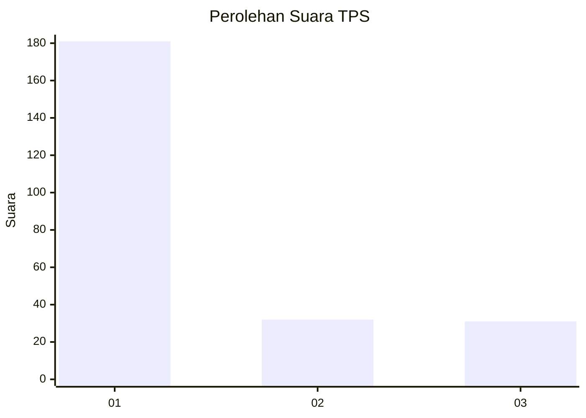
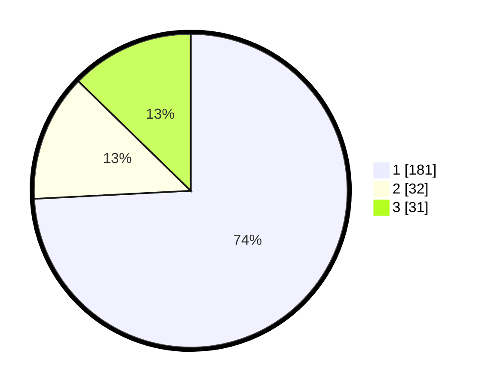

# Hasil

## Grafik

## Tabel

| No. | Nama Paslon    | Suara | Suara (raw) | Persentase |
|:--- |:-------------- | -----:| -----------:| ----------:|
| 1   | ANIES MUHAIMIN | 181   | [181][p-1]  | 74,18      |
| 2   | PRABOWO GIBRAN | 32    | [32][p-2]   | 13,11      |
| 3   | GANJAR MAHFUD  | 31    | [31][p-3]   | 12,70      |

[p-1]: https://github.com/gigit-pemilu/pemilu-2024/blob/main/pilpres/hitung-suara/sub/35-jawa-timur/sub/27-sampang/sub/03-sampang/sub/2011-taman-sareh/sub/009-tps/sub/paslon-1.txt
[p-2]: https://github.com/gigit-pemilu/pemilu-2024/blob/main/pilpres/hitung-suara/sub/35-jawa-timur/sub/27-sampang/sub/03-sampang/sub/2011-taman-sareh/sub/009-tps/sub/paslon-2.txt
[p-3]: https://github.com/gigit-pemilu/pemilu-2024/blob/main/pilpres/hitung-suara/sub/35-jawa-timur/sub/27-sampang/sub/03-sampang/sub/2011-taman-sareh/sub/009-tps/sub/paslon-3.txt

## Foto C Plano

https://sirekap-obj-formc.kpu.go.id/b728/pemilu/ppwp/35/27/03/20/11/3527032011009-20240216-183301--8db4f155-eac5-4417-a71b-f7e8a5e102ee.jpg

https://sirekap-obj-formc.kpu.go.id/b728/pemilu/ppwp/35/27/03/20/11/3527032011009-20240214-141250--e64ebf27-d602-45bb-86cb-86ddc12e3186.jpg

https://sirekap-obj-formc.kpu.go.id/b728/pemilu/ppwp/35/27/03/20/11/3527032011009-20240214-141444--b240c774-90fe-425e-83c7-240a151eb642.jpg

## Metadata

| Key        | Value               |
| ---------- | ------------------- |
| Time Stamp | 2024-02-16 21:01:00 |

