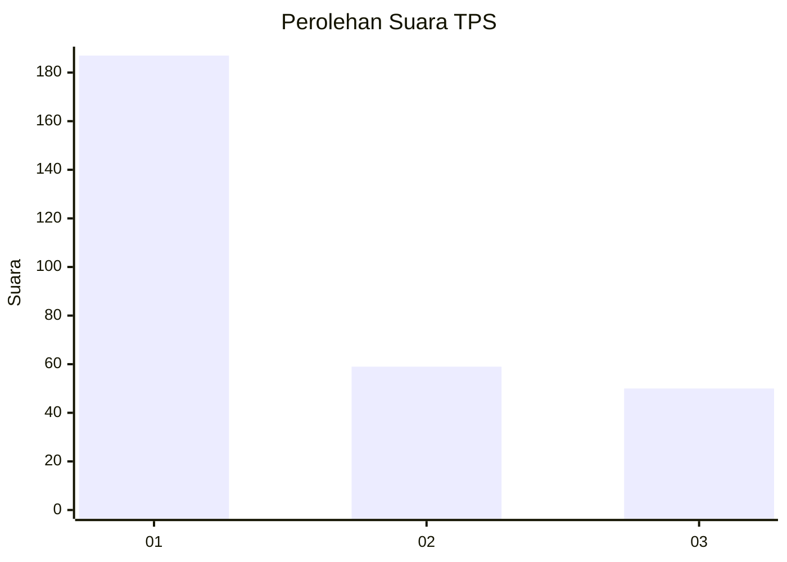
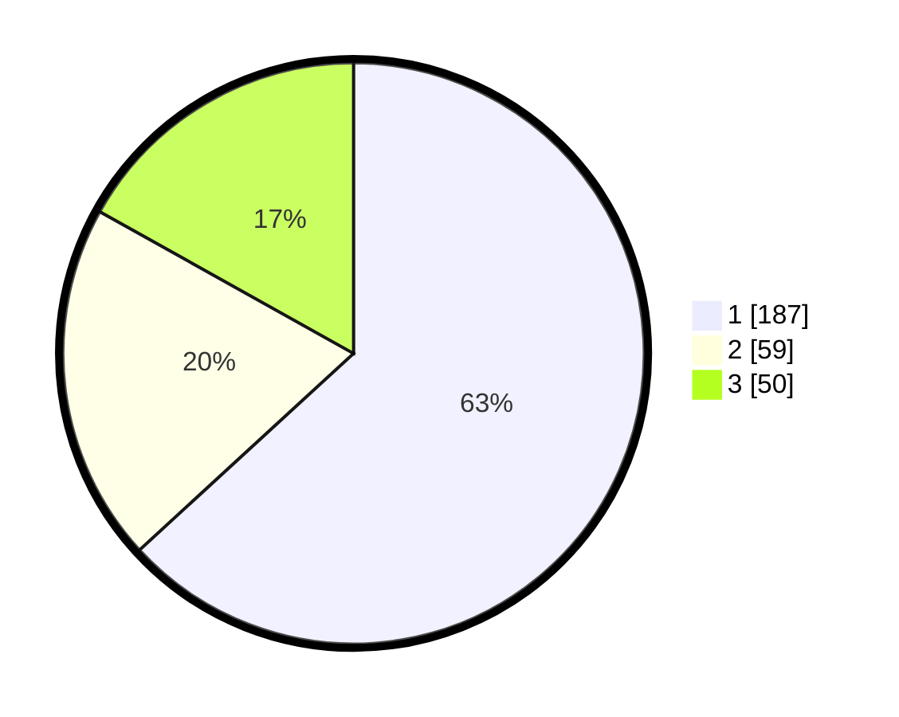

# Hasil

## Grafik

## Tabel

| No. | Nama Paslon    | Suara | Suara (raw) | Persentase |
|:--- |:-------------- | -----:| -----------:| ----------:|
| 1   | ANIES MUHAIMIN | 187   | [187][p-1]  | 63,18      |
| 2   | PRABOWO GIBRAN | 59    | [59][p-2]   | 19,93      |
| 3   | GANJAR MAHFUD  | 50    | [50][p-3]   | 16,89      |

[p-1]: https://github.com/gigit-pemilu/pemilu-2024-35-jawa-timur/blob/main/pilpres/hitung-suara/sub/35-jawa-timur/sub/27-sampang/sub/03-sampang/sub/2012-pakalongan/sub/002-tps/sub/paslon-1.txt
[p-2]: https://github.com/gigit-pemilu/pemilu-2024-35-jawa-timur/blob/main/pilpres/hitung-suara/sub/35-jawa-timur/sub/27-sampang/sub/03-sampang/sub/2012-pakalongan/sub/002-tps/sub/paslon-2.txt
[p-3]: https://github.com/gigit-pemilu/pemilu-2024-35-jawa-timur/blob/main/pilpres/hitung-suara/sub/35-jawa-timur/sub/27-sampang/sub/03-sampang/sub/2012-pakalongan/sub/002-tps/sub/paslon-3.txt

## Foto C Plano

https://sirekap-obj-formc.kpu.go.id/f97f/pemilu/ppwp/35/27/03/20/12/3527032012002-20240214-214159--5a507ca2-fa3e-463f-ab07-2bf60b89e05b.jpg

https://sirekap-obj-formc.kpu.go.id/f97f/pemilu/ppwp/35/27/03/20/12/3527032012002-20240214-213927--5184e1cd-7b93-4f32-8d1e-1f9b95e692bb.jpg

https://sirekap-obj-formc.kpu.go.id/f97f/pemilu/ppwp/35/27/03/20/12/3527032012002-20240214-213958--cc5f0fa5-8b7d-4304-ad47-7ea177748d7f.jpg

## Metadata

| Key        | Value               |
| ---------- | ------------------- |
| Time Stamp | 2024-02-16 12:51:22 |

