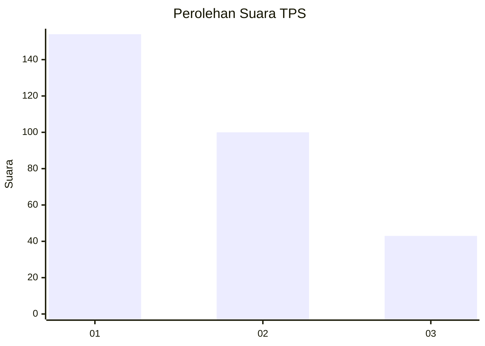
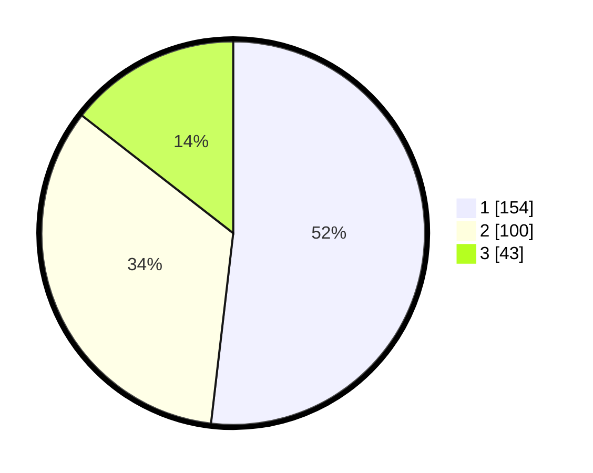

# Hasil

## Grafik

## Tabel

| No. | Nama Paslon    | Suara | Suara (raw) | Persentase |
|:--- |:-------------- | -----:| -----------:| ----------:|
| 1   | ANIES MUHAIMIN | 154   | [154][p-1]  | 51,85      |
| 2   | PRABOWO GIBRAN | 100   | [100][p-2]  | 33,67      |
| 3   | GANJAR MAHFUD  | 43    | [43][p-3]   | 14,48      |

[p-1]: https://github.com/gigit-pemilu/pemilu-2024-35-jawa-timur/blob/main/pilpres/hitung-suara/sub/35-jawa-timur/sub/27-sampang/sub/03-sampang/sub/2012-pakalongan/sub/003-tps/sub/paslon-1.txt
[p-2]: https://github.com/gigit-pemilu/pemilu-2024-35-jawa-timur/blob/main/pilpres/hitung-suara/sub/35-jawa-timur/sub/27-sampang/sub/03-sampang/sub/2012-pakalongan/sub/003-tps/sub/paslon-2.txt
[p-3]: https://github.com/gigit-pemilu/pemilu-2024-35-jawa-timur/blob/main/pilpres/hitung-suara/sub/35-jawa-timur/sub/27-sampang/sub/03-sampang/sub/2012-pakalongan/sub/003-tps/sub/paslon-3.txt

## Foto C Plano

https://sirekap-obj-formc.kpu.go.id/cf20/pemilu/ppwp/35/27/03/20/12/3527032012003-20240214-223943--d3323a9a-7f78-4773-b6ba-8e8c3a1b4b37.jpg

https://sirekap-obj-formc.kpu.go.id/cf20/pemilu/ppwp/35/27/03/20/12/3527032012003-20240214-155513--855ee79b-472c-4249-8a6f-9b2d3cdf539b.jpg

https://sirekap-obj-formc.kpu.go.id/cf20/pemilu/ppwp/35/27/03/20/12/3527032012003-20240214-224057--31fce8d7-d5b7-48b6-8b78-659bd844dabc.jpg

## Metadata

| Key        | Value               |
| ---------- | ------------------- |
| Time Stamp | 2024-02-16 12:51:22 |

