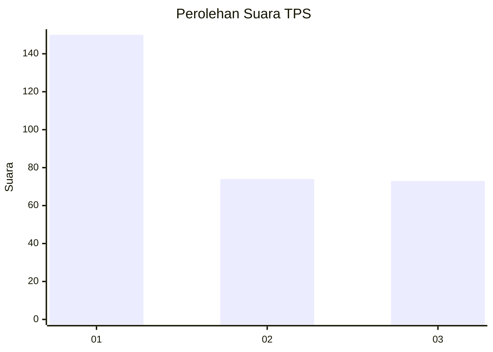
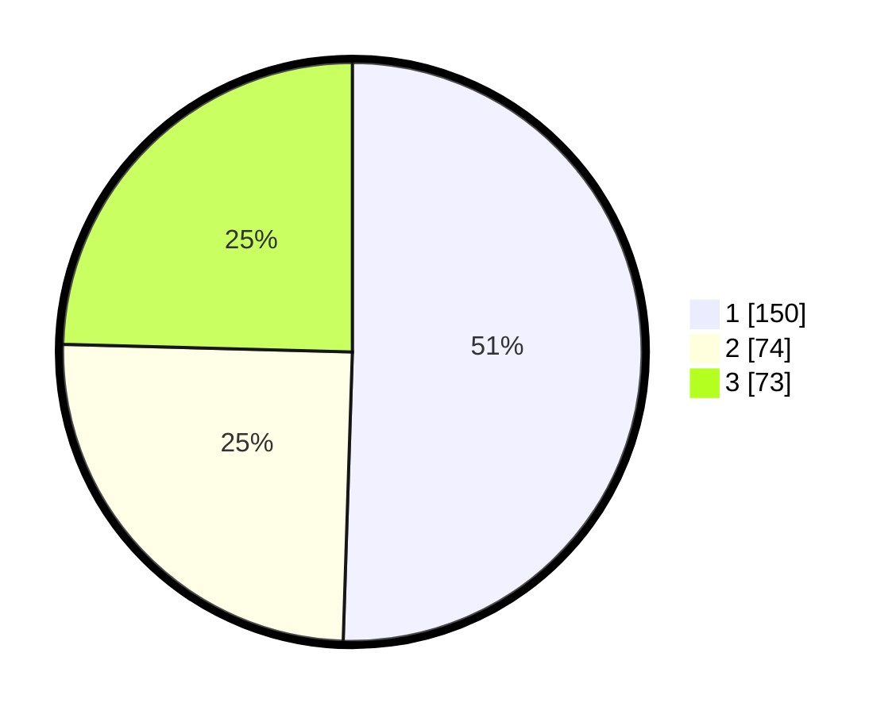

# Hasil

## Grafik

## Tabel

| No. | Nama Paslon    | Suara | Suara (raw) | Persentase |
|:--- |:-------------- | -----:| -----------:| ----------:|
| 1   | ANIES MUHAIMIN | 150   | [150][p-1]  | 50,51      |
| 2   | PRABOWO GIBRAN | 74    | [74][p-2]   | 24,92      |
| 3   | GANJAR MAHFUD  | 73    | [73][p-3]   | 24,58      |

[p-1]: https://github.com/gigit-pemilu/pemilu-2024/blob/main/pilpres/hitung-suara/sub/35-jawa-timur/sub/27-sampang/sub/03-sampang/sub/2012-pakalongan/sub/005-tps/sub/paslon-1.txt
[p-2]: https://github.com/gigit-pemilu/pemilu-2024/blob/main/pilpres/hitung-suara/sub/35-jawa-timur/sub/27-sampang/sub/03-sampang/sub/2012-pakalongan/sub/005-tps/sub/paslon-2.txt
[p-3]: https://github.com/gigit-pemilu/pemilu-2024/blob/main/pilpres/hitung-suara/sub/35-jawa-timur/sub/27-sampang/sub/03-sampang/sub/2012-pakalongan/sub/005-tps/sub/paslon-3.txt

## Foto C Plano

https://sirekap-obj-formc.kpu.go.id/a32e/pemilu/ppwp/35/27/03/20/12/3527032012005-20240214-220447--2452e267-b996-423e-8d4f-64036804977e.jpg

https://sirekap-obj-formc.kpu.go.id/a32e/pemilu/ppwp/35/27/03/20/12/3527032012005-20240214-220626--238940fe-e9da-4b69-a273-7b546ce264bc.jpg

https://sirekap-obj-formc.kpu.go.id/a32e/pemilu/ppwp/35/27/03/20/12/3527032012005-20240214-220801--567ba467-49df-4a77-9a76-0a8f33ce46f2.jpg

## Metadata

| Key        | Value               |
| ---------- | ------------------- |
| Time Stamp | 2024-02-17 09:30:03 |

