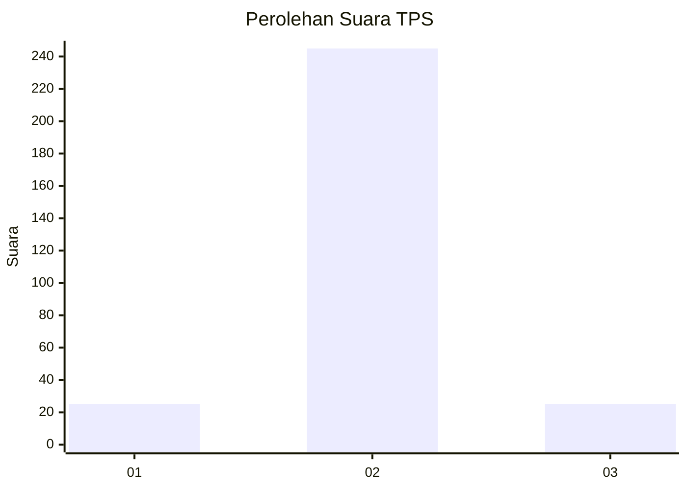
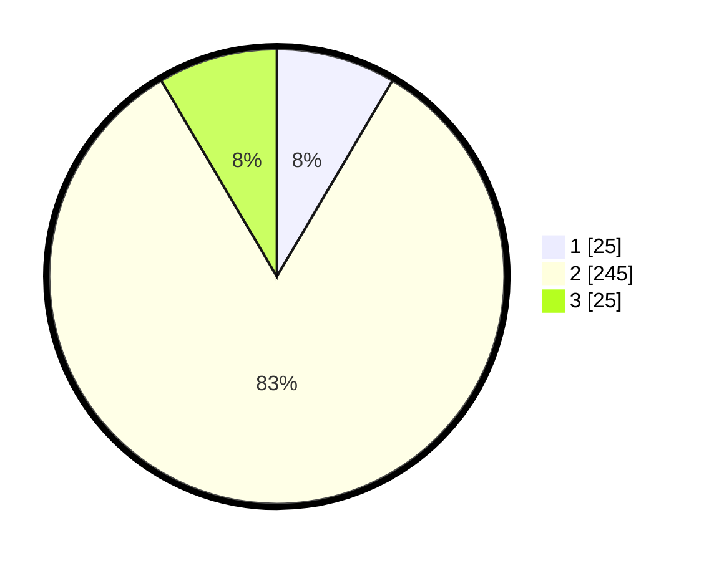

# Hasil

## Grafik

## Tabel

| No. | Nama Paslon    | Suara | Suara (raw) | Persentase |
|:--- |:-------------- | -----:| -----------:| ----------:|
| 1   | ANIES MUHAIMIN | 25    | [25][p-1]   | 8,47       |
| 2   | PRABOWO GIBRAN | 245   | [245][p-2]  | 83,05      |
| 3   | GANJAR MAHFUD  | 25    | [25][p-3]   | 8,47       |

[p-1]: https://github.com/gigit-pemilu/pemilu-2024/blob/main/pilpres/hitung-suara/sub/35-jawa-timur/sub/27-sampang/sub/03-sampang/sub/2012-pakalongan/sub/008-tps/sub/paslon-1.txt
[p-2]: https://github.com/gigit-pemilu/pemilu-2024/blob/main/pilpres/hitung-suara/sub/35-jawa-timur/sub/27-sampang/sub/03-sampang/sub/2012-pakalongan/sub/008-tps/sub/paslon-2.txt
[p-3]: https://github.com/gigit-pemilu/pemilu-2024/blob/main/pilpres/hitung-suara/sub/35-jawa-timur/sub/27-sampang/sub/03-sampang/sub/2012-pakalongan/sub/008-tps/sub/paslon-3.txt

## Foto C Plano

https://sirekap-obj-formc.kpu.go.id/3321/pemilu/ppwp/35/27/03/20/12/3527032012008-20240214-210539--895f820c-f4da-4088-8fdc-9d2f7dc98895.jpg

https://sirekap-obj-formc.kpu.go.id/3321/pemilu/ppwp/35/27/03/20/12/3527032012008-20240214-203334--f6755031-98f7-4f84-8fa5-46ee059c3cf0.jpg

https://sirekap-obj-formc.kpu.go.id/3321/pemilu/ppwp/35/27/03/20/12/3527032012008-20240214-203756--e6391ebb-26a4-4e56-8cd0-5a51fc4931c1.jpg

## Metadata

| Key        | Value               |
| ---------- | ------------------- |
| Time Stamp | 2024-02-17 09:30:03 |

