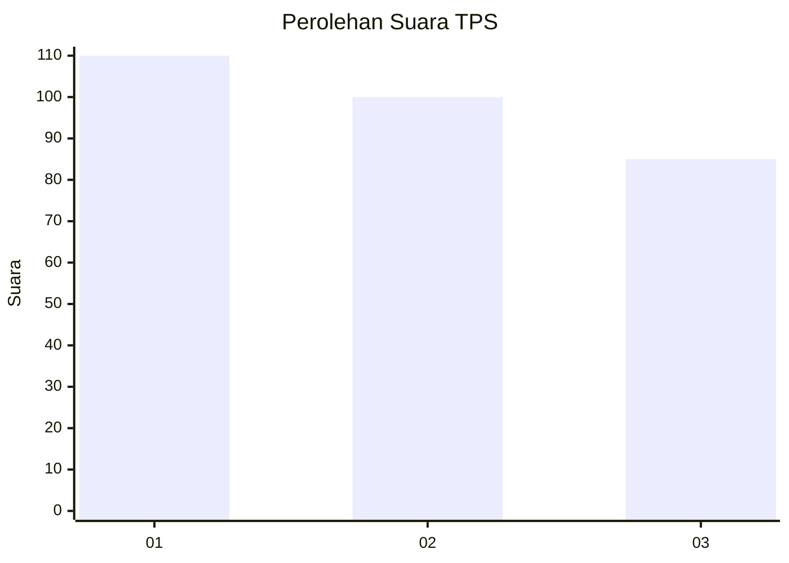
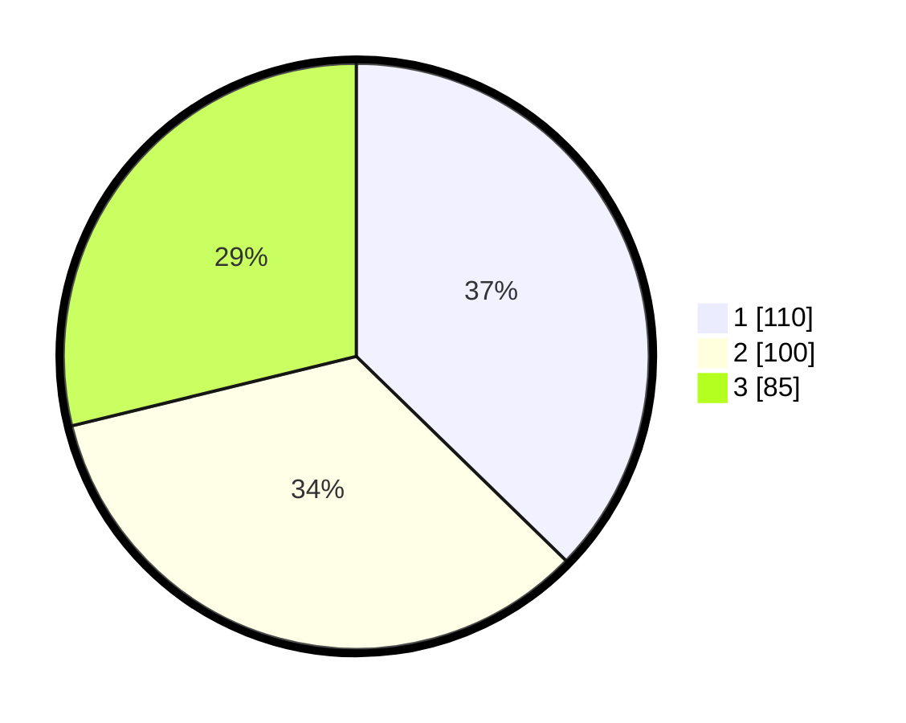

# Hasil

## Grafik

## Tabel

| No. | Nama Paslon    | Suara | Suara (raw) | Persentase |
|:--- |:-------------- | -----:| -----------:| ----------:|
| 1   | ANIES MUHAIMIN | 110   | [110][p-1]  | 37,29      |
| 2   | PRABOWO GIBRAN | 100   | [100][p-2]  | 33,90      |
| 3   | GANJAR MAHFUD  | 85    | [85][p-3]   | 28,81      |

[p-1]: https://github.com/gigit-pemilu/pemilu-2024-35-jawa-timur/blob/main/pilpres/hitung-suara/sub/35-jawa-timur/sub/27-sampang/sub/03-sampang/sub/2012-pakalongan/sub/009-tps/sub/paslon-1.txt
[p-2]: https://github.com/gigit-pemilu/pemilu-2024-35-jawa-timur/blob/main/pilpres/hitung-suara/sub/35-jawa-timur/sub/27-sampang/sub/03-sampang/sub/2012-pakalongan/sub/009-tps/sub/paslon-2.txt
[p-3]: https://github.com/gigit-pemilu/pemilu-2024-35-jawa-timur/blob/main/pilpres/hitung-suara/sub/35-jawa-timur/sub/27-sampang/sub/03-sampang/sub/2012-pakalongan/sub/009-tps/sub/paslon-3.txt

## Foto C Plano

https://sirekap-obj-formc.kpu.go.id/69a7/pemilu/ppwp/35/27/03/20/12/3527032012009-20240215-004033--29022deb-776a-4ee7-b11c-5cf31d53ab34.jpg

https://sirekap-obj-formc.kpu.go.id/69a7/pemilu/ppwp/35/27/03/20/12/3527032012009-20240215-004123--7163a9d6-5415-4bfc-a959-981175a279b0.jpg

https://sirekap-obj-formc.kpu.go.id/69a7/pemilu/ppwp/35/27/03/20/12/3527032012009-20240215-004206--00d07d91-f69d-4d5f-bd81-b719fe9b4f78.jpg

## Metadata

| Key        | Value               |
| ---------- | ------------------- |
| Time Stamp | 2024-02-16 12:51:22 |

