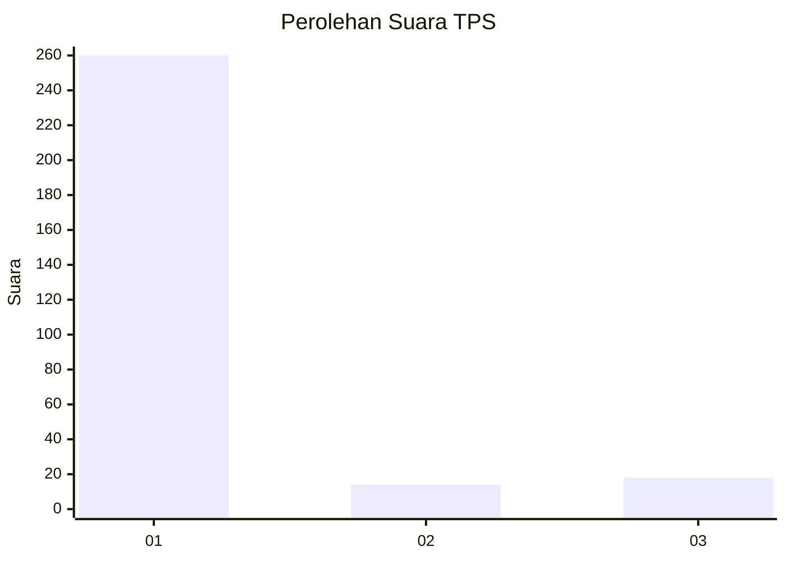
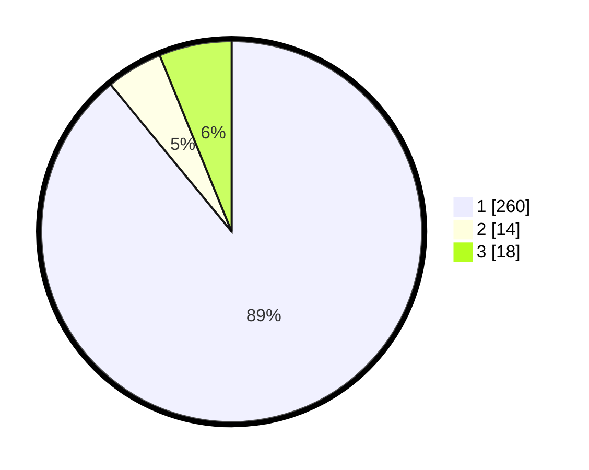

# Hasil

## Grafik

## Tabel

| No. | Nama Paslon    | Suara | Suara (raw) | Persentase |
|:--- |:-------------- | -----:| -----------:| ----------:|
| 1   | ANIES MUHAIMIN | 260   | [260][p-1]  | 89,04      |
| 2   | PRABOWO GIBRAN | 14    | [14][p-2]   | 4,79       |
| 3   | GANJAR MAHFUD  | 18    | [18][p-3]   | 6,16       |

[p-1]: https://github.com/gigit-pemilu/pemilu-2024/blob/main/pilpres/hitung-suara/sub/35-jawa-timur/sub/27-sampang/sub/03-sampang/sub/2012-pakalongan/sub/010-tps/sub/paslon-1.txt
[p-2]: https://github.com/gigit-pemilu/pemilu-2024/blob/main/pilpres/hitung-suara/sub/35-jawa-timur/sub/27-sampang/sub/03-sampang/sub/2012-pakalongan/sub/010-tps/sub/paslon-2.txt
[p-3]: https://github.com/gigit-pemilu/pemilu-2024/blob/main/pilpres/hitung-suara/sub/35-jawa-timur/sub/27-sampang/sub/03-sampang/sub/2012-pakalongan/sub/010-tps/sub/paslon-3.txt

## Foto C Plano

https://sirekap-obj-formc.kpu.go.id/0a7c/pemilu/ppwp/35/27/03/20/12/3527032012010-20240214-220041--dd0b0f60-e7a5-473c-b622-ec6c9f168e0a.jpg

https://sirekap-obj-formc.kpu.go.id/0a7c/pemilu/ppwp/35/27/03/20/12/3527032012010-20240214-220127--22db32fd-9e8e-41d5-b850-063adcb54fbe.jpg

https://sirekap-obj-formc.kpu.go.id/0a7c/pemilu/ppwp/35/27/03/20/12/3527032012010-20240214-220214--e958c57b-966e-4890-8136-273183af92ae.jpg

## Metadata

| Key        | Value               |
| ---------- | ------------------- |
| Time Stamp | 2024-02-16 12:51:22 |

