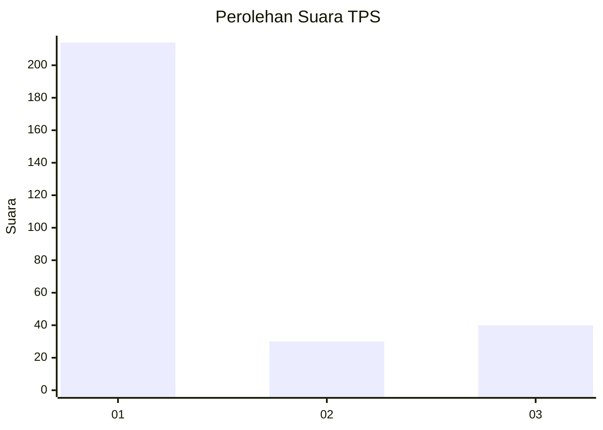
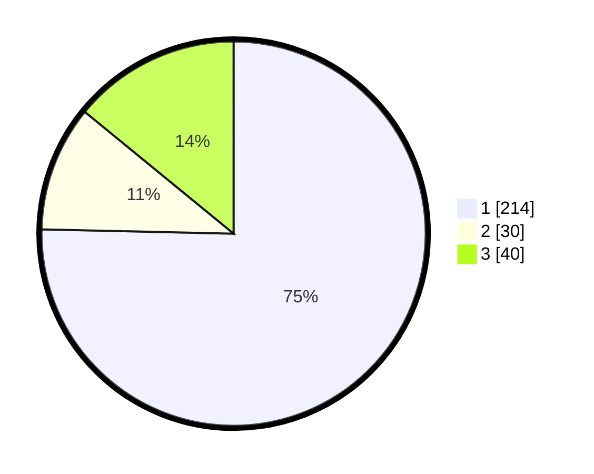

# Hasil

## Grafik

## Tabel

| No. | Nama Paslon    | Suara | Suara (raw) | Persentase |
|:--- |:-------------- | -----:| -----------:| ----------:|
| 1   | ANIES MUHAIMIN | 214   | [214][p-1]  | 75,35      |
| 2   | PRABOWO GIBRAN | 30    | [30][p-2]   | 10,56      |
| 3   | GANJAR MAHFUD  | 40    | [40][p-3]   | 14,08      |

[p-1]: https://github.com/gigit-pemilu/pemilu-2024/blob/main/pilpres/hitung-suara/sub/35-jawa-timur/sub/27-sampang/sub/03-sampang/sub/2013-tanggumong/sub/001-tps/sub/paslon-1.txt
[p-2]: https://github.com/gigit-pemilu/pemilu-2024/blob/main/pilpres/hitung-suara/sub/35-jawa-timur/sub/27-sampang/sub/03-sampang/sub/2013-tanggumong/sub/001-tps/sub/paslon-2.txt
[p-3]: https://github.com/gigit-pemilu/pemilu-2024/blob/main/pilpres/hitung-suara/sub/35-jawa-timur/sub/27-sampang/sub/03-sampang/sub/2013-tanggumong/sub/001-tps/sub/paslon-3.txt

## Foto C Plano

https://sirekap-obj-formc.kpu.go.id/098c/pemilu/ppwp/35/27/03/20/13/3527032013001-20240215-145736--40d7335b-3ad5-4a75-afae-24a4e27ef2cd.jpg

https://sirekap-obj-formc.kpu.go.id/098c/pemilu/ppwp/35/27/03/20/13/3527032013001-20240215-145837--fdfce71a-de9e-4a0a-97bc-9db0f68a1d62.jpg

https://sirekap-obj-formc.kpu.go.id/098c/pemilu/ppwp/35/27/03/20/13/3527032013001-20240215-150003--cca7d9e2-f3a1-4953-b3e0-7bf5dfcf4720.jpg

## Metadata

| Key        | Value               |
| ---------- | ------------------- |
| Time Stamp | 2024-02-25 14:00:00 |

