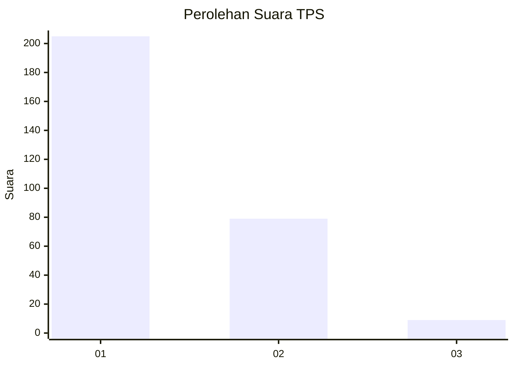
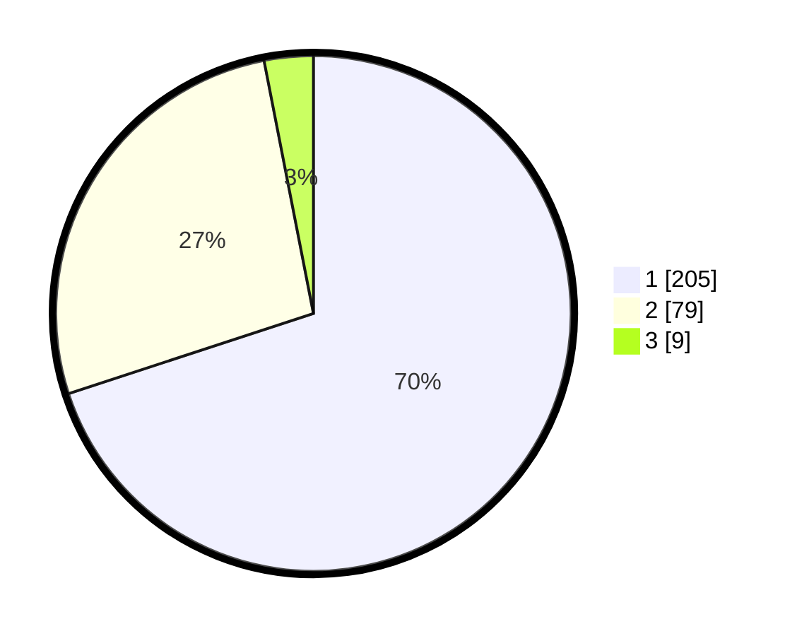

# Hasil

## Grafik

## Tabel

| No. | Nama Paslon    | Suara | Suara (raw) | Persentase |
|:--- |:-------------- | -----:| -----------:| ----------:|
| 1   | ANIES MUHAIMIN | 205   | [205][p-1]  | 69,97      |
| 2   | PRABOWO GIBRAN | 79    | [79][p-2]   | 26,96      |
| 3   | GANJAR MAHFUD  | 9     | [9][p-3]    | 3,07       |

[p-1]: https://github.com/gigit-pemilu/pemilu-2024-35-jawa-timur/blob/main/pilpres/hitung-suara/sub/35-jawa-timur/sub/27-sampang/sub/03-sampang/sub/2013-tanggumong/sub/014-tps/sub/paslon-1.txt
[p-2]: https://github.com/gigit-pemilu/pemilu-2024-35-jawa-timur/blob/main/pilpres/hitung-suara/sub/35-jawa-timur/sub/27-sampang/sub/03-sampang/sub/2013-tanggumong/sub/014-tps/sub/paslon-2.txt
[p-3]: https://github.com/gigit-pemilu/pemilu-2024-35-jawa-timur/blob/main/pilpres/hitung-suara/sub/35-jawa-timur/sub/27-sampang/sub/03-sampang/sub/2013-tanggumong/sub/014-tps/sub/paslon-3.txt

## Foto C Plano

https://sirekap-obj-formc.kpu.go.id/e749/pemilu/ppwp/35/27/03/20/13/3527032013014-20240216-224013--4ad3e896-25cf-49fa-b3c4-32ef7025d3cc.jpg

https://sirekap-obj-formc.kpu.go.id/e749/pemilu/ppwp/35/27/03/20/13/3527032013014-20240216-224926--16119151-0107-4411-a284-72e123247f6d.jpg

https://sirekap-obj-formc.kpu.go.id/e749/pemilu/ppwp/35/27/03/20/13/3527032013014-20240216-225042--87b0c4ce-b958-4d0f-b7c0-b3c94a921d96.jpg

## Metadata

| Key        | Value               |
| ---------- | ------------------- |
| Time Stamp | 2024-02-25 21:00:00 |

