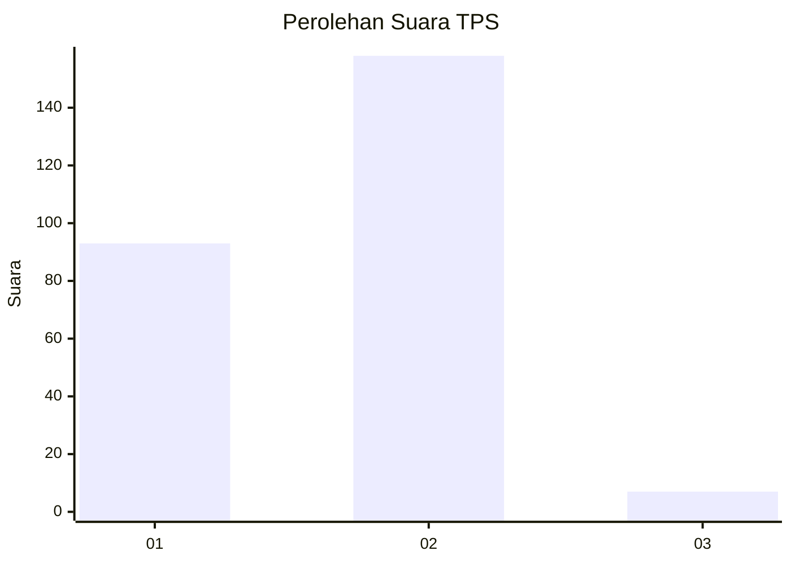
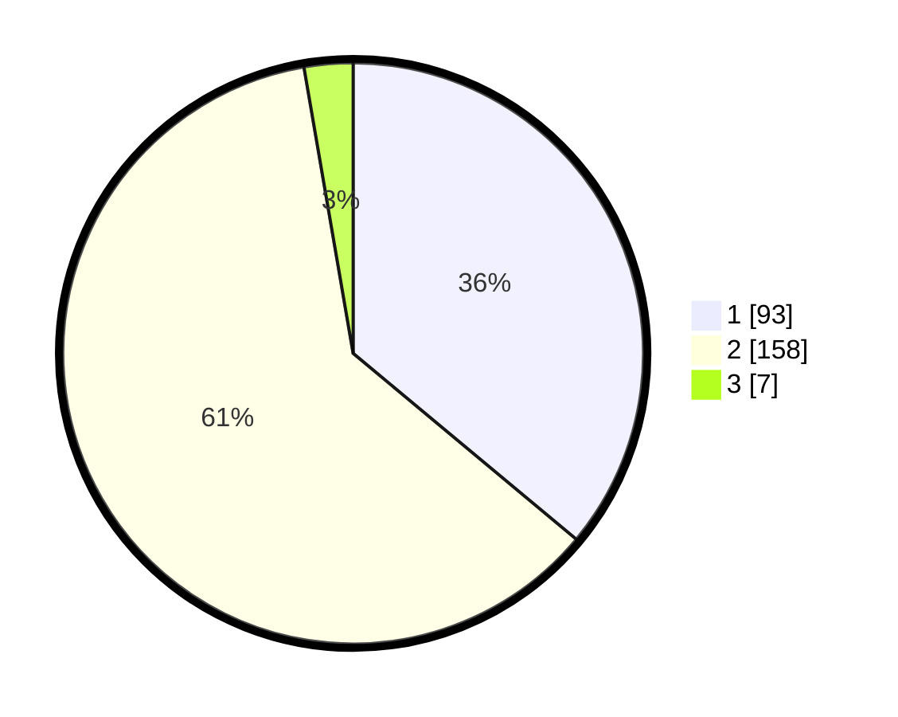

# Hasil

## Grafik

## Tabel

| No. | Nama Paslon    | Suara | Suara (raw) | Persentase |
|:--- |:-------------- | -----:| -----------:| ----------:|
| 1   | ANIES MUHAIMIN | 93    | [93][p-1]   | 36,05      |
| 2   | PRABOWO GIBRAN | 158   | [158][p-2]  | 61,24      |
| 3   | GANJAR MAHFUD  | 7     | [7][p-3]    | 2,71       |

[p-1]: https://github.com/gigit-pemilu/pemilu-2024-35-jawa-timur/blob/main/pilpres/hitung-suara/sub/35-jawa-timur/sub/27-sampang/sub/03-sampang/sub/2014-kamuning/sub/008-tps/sub/paslon-1.txt
[p-2]: https://github.com/gigit-pemilu/pemilu-2024-35-jawa-timur/blob/main/pilpres/hitung-suara/sub/35-jawa-timur/sub/27-sampang/sub/03-sampang/sub/2014-kamuning/sub/008-tps/sub/paslon-2.txt
[p-3]: https://github.com/gigit-pemilu/pemilu-2024-35-jawa-timur/blob/main/pilpres/hitung-suara/sub/35-jawa-timur/sub/27-sampang/sub/03-sampang/sub/2014-kamuning/sub/008-tps/sub/paslon-3.txt

## Foto C Plano

https://sirekap-obj-formc.kpu.go.id/854c/pemilu/ppwp/35/27/03/20/14/3527032014008-20240214-185339--60aa151d-d949-44b4-89bc-2e9e4b2a3d8a.jpg

https://sirekap-obj-formc.kpu.go.id/854c/pemilu/ppwp/35/27/03/20/14/3527032014008-20240214-185001--e04f88fa-9f8d-495d-8e4a-9aaf5375d3c9.jpg

https://sirekap-obj-formc.kpu.go.id/854c/pemilu/ppwp/35/27/03/20/14/3527032014008-20240214-185137--2db46d8c-3654-4d38-b4d4-8d7077dcb92b.jpg

## Metadata

| Key        | Value               |
| ---------- | ------------------- |
| Time Stamp | 2024-02-25 11:00:00 |

