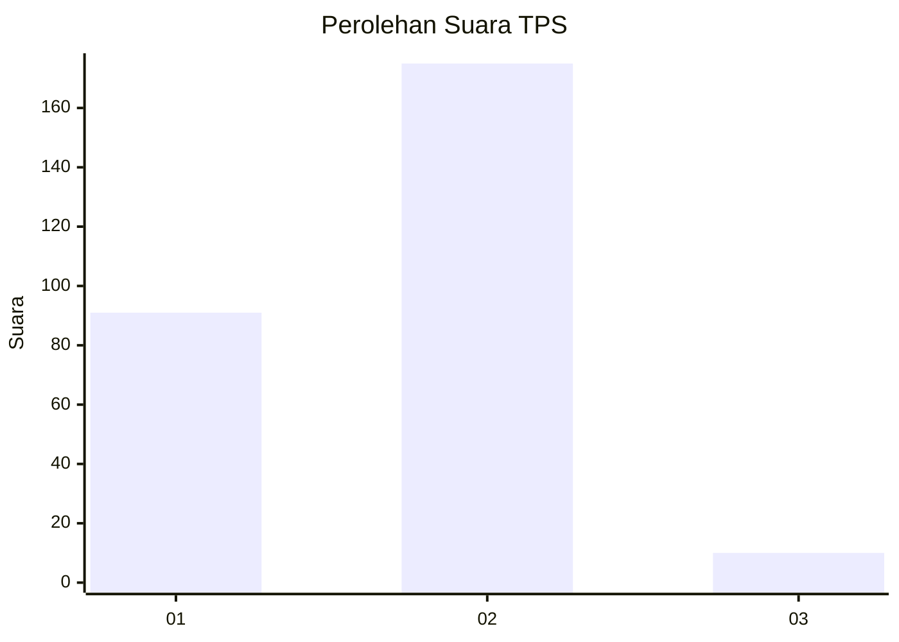
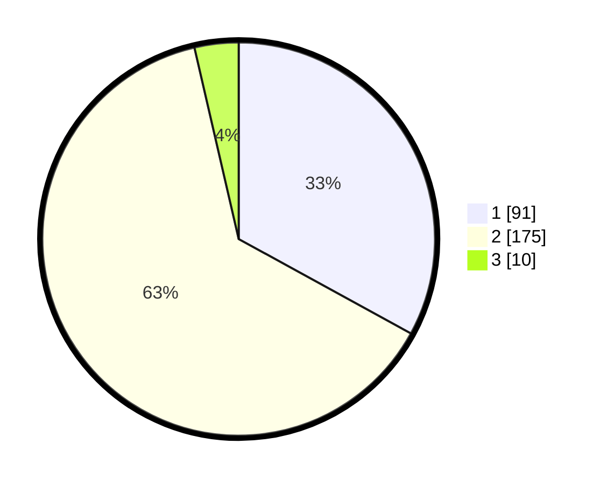

# Hasil

## Grafik

## Tabel

| No. | Nama Paslon    | Suara | Suara (raw) | Persentase |
|:--- |:-------------- | -----:| -----------:| ----------:|
| 1   | ANIES MUHAIMIN | 91    | [91][p-1]   | 32,97      |
| 2   | PRABOWO GIBRAN | 175   | [175][p-2]  | 63,41      |
| 3   | GANJAR MAHFUD  | 10    | [10][p-3]   | 3,62       |

[p-1]: https://github.com/gigit-pemilu/pemilu-2024-35-jawa-timur/blob/main/pilpres/hitung-suara/sub/35-jawa-timur/sub/27-sampang/sub/03-sampang/sub/2016-pangelen/sub/003-tps/sub/paslon-1.txt
[p-2]: https://github.com/gigit-pemilu/pemilu-2024-35-jawa-timur/blob/main/pilpres/hitung-suara/sub/35-jawa-timur/sub/27-sampang/sub/03-sampang/sub/2016-pangelen/sub/003-tps/sub/paslon-2.txt
[p-3]: https://github.com/gigit-pemilu/pemilu-2024-35-jawa-timur/blob/main/pilpres/hitung-suara/sub/35-jawa-timur/sub/27-sampang/sub/03-sampang/sub/2016-pangelen/sub/003-tps/sub/paslon-3.txt

## Foto C Plano

https://sirekap-obj-formc.kpu.go.id/f352/pemilu/ppwp/35/27/03/20/16/3527032016003-20240215-081748--cacd088b-5dd8-4a56-b3f7-f2bb17b0fbfb.jpg

https://sirekap-obj-formc.kpu.go.id/f352/pemilu/ppwp/35/27/03/20/16/3527032016003-20240214-201718--e671fb86-d7ff-41e9-8b78-18df0ee07810.jpg

https://sirekap-obj-formc.kpu.go.id/f352/pemilu/ppwp/35/27/03/20/16/3527032016003-20240214-204829--81ffb6e6-5981-4924-b5fa-0a4ca66d67cd.jpg

## Metadata

| Key        | Value               |
| ---------- | ------------------- |
| Time Stamp | 2024-02-15 09:00:24 |

