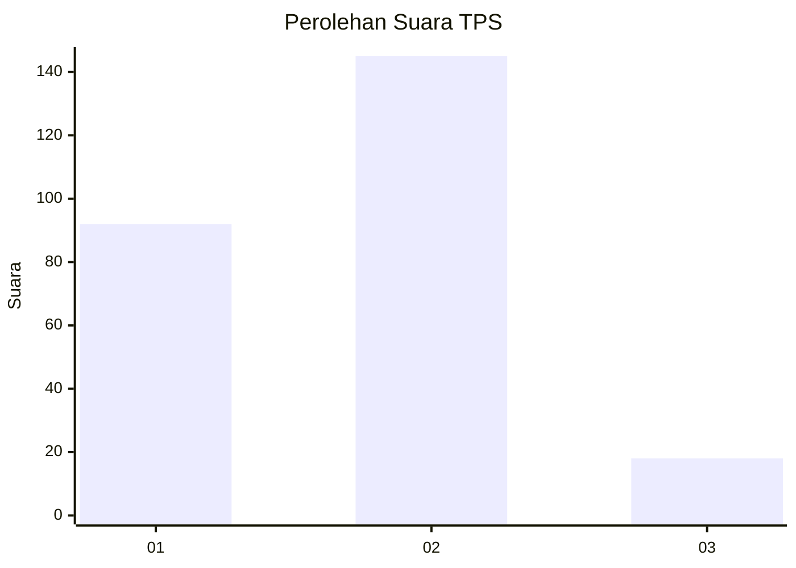
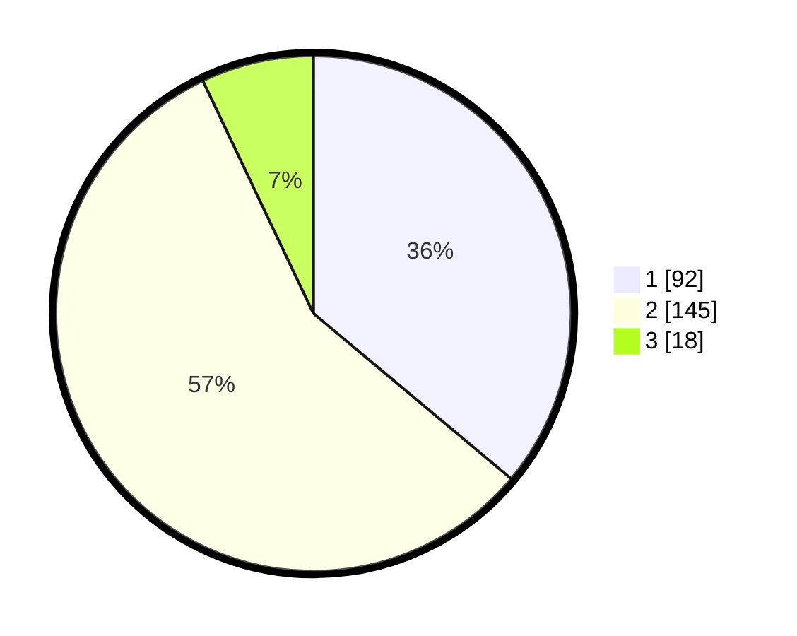

# Hasil

## Grafik

## Tabel

| No. | Nama Paslon    | Suara | Suara (raw) | Persentase |
|:--- |:-------------- | -----:| -----------:| ----------:|
| 1   | ANIES MUHAIMIN | 92    | [92][p-1]   | 36,08      |
| 2   | PRABOWO GIBRAN | 145   | [145][p-2]  | 56,86      |
| 3   | GANJAR MAHFUD  | 18    | [18][p-3]   | 7,06       |

[p-1]: https://github.com/gigit-pemilu/pemilu-2024/blob/main/pilpres/hitung-suara/sub/35-jawa-timur/sub/27-sampang/sub/03-sampang/sub/2016-pangelen/sub/004-tps/sub/paslon-1.txt
[p-2]: https://github.com/gigit-pemilu/pemilu-2024/blob/main/pilpres/hitung-suara/sub/35-jawa-timur/sub/27-sampang/sub/03-sampang/sub/2016-pangelen/sub/004-tps/sub/paslon-2.txt
[p-3]: https://github.com/gigit-pemilu/pemilu-2024/blob/main/pilpres/hitung-suara/sub/35-jawa-timur/sub/27-sampang/sub/03-sampang/sub/2016-pangelen/sub/004-tps/sub/paslon-3.txt

## Foto C Plano

https://sirekap-obj-formc.kpu.go.id/feae/pemilu/ppwp/35/27/03/20/16/3527032016004-20240214-205039--e06f8edb-d210-482c-a27d-56143cc9fbfb.jpg

https://sirekap-obj-formc.kpu.go.id/feae/pemilu/ppwp/35/27/03/20/16/3527032016004-20240214-195553--ef2408a5-87dd-450d-a381-5dbe6e2508a9.jpg

https://sirekap-obj-formc.kpu.go.id/feae/pemilu/ppwp/35/27/03/20/16/3527032016004-20240214-205150--e9c6d271-e8e2-4327-ab03-affba349b25d.jpg

## Metadata

| Key        | Value               |
| ---------- | ------------------- |
| Time Stamp | 2024-02-15 00:41:44 |

