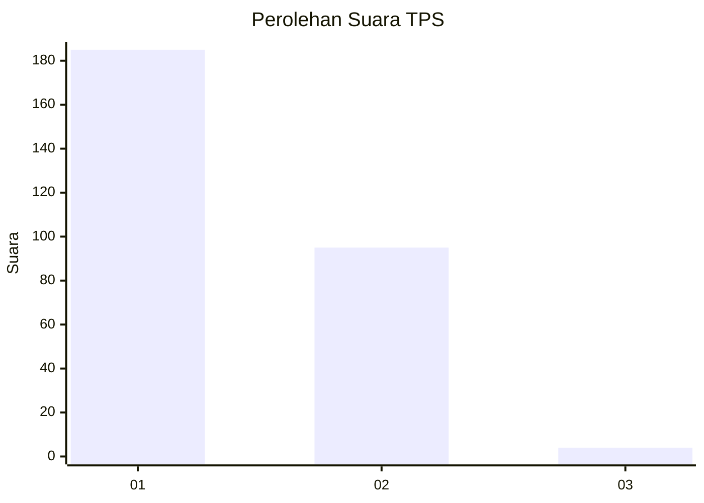
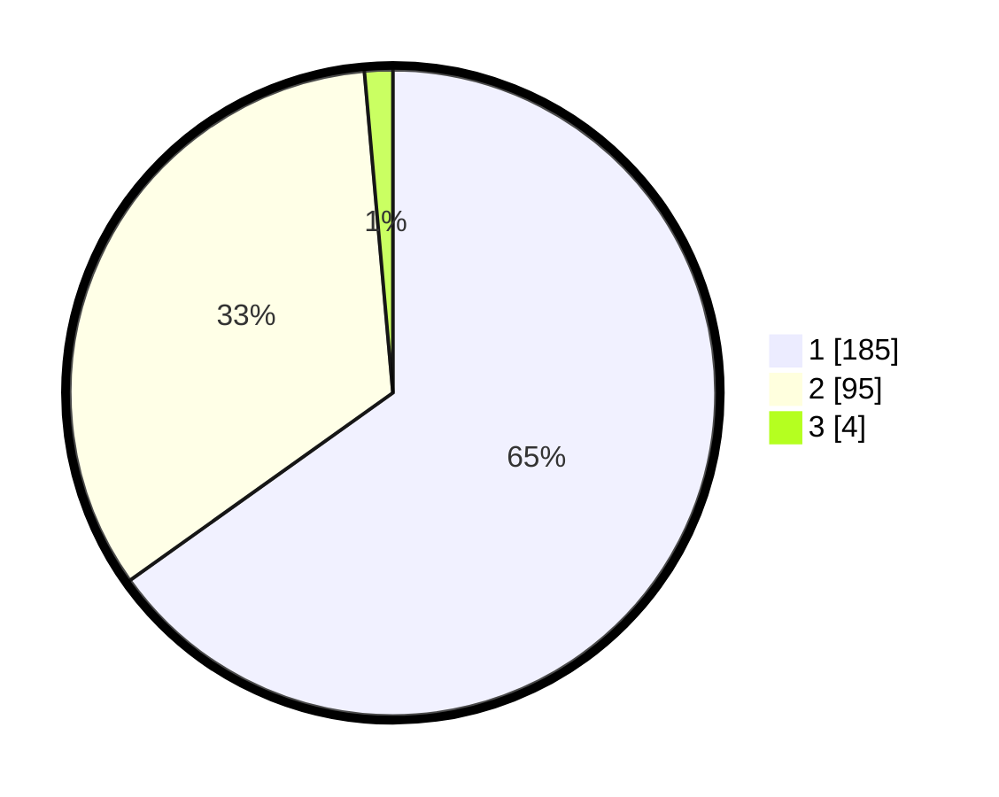

# Hasil

## Grafik

## Tabel

| No. | Nama Paslon    | Suara | Suara (raw) | Persentase |
|:--- |:-------------- | -----:| -----------:| ----------:|
| 1   | ANIES MUHAIMIN | 185   | [185][p-1]  | 65,14      |
| 2   | PRABOWO GIBRAN | 95    | [95][p-2]   | 33,45      |
| 3   | GANJAR MAHFUD  | 4     | [4][p-3]    | 1,41       |

[p-1]: https://github.com/gigit-pemilu/pemilu-2024/blob/main/pilpres/hitung-suara/sub/35-jawa-timur/sub/27-sampang/sub/03-sampang/sub/2016-pangelen/sub/006-tps/sub/paslon-1.txt
[p-2]: https://github.com/gigit-pemilu/pemilu-2024/blob/main/pilpres/hitung-suara/sub/35-jawa-timur/sub/27-sampang/sub/03-sampang/sub/2016-pangelen/sub/006-tps/sub/paslon-2.txt
[p-3]: https://github.com/gigit-pemilu/pemilu-2024/blob/main/pilpres/hitung-suara/sub/35-jawa-timur/sub/27-sampang/sub/03-sampang/sub/2016-pangelen/sub/006-tps/sub/paslon-3.txt

## Foto C Plano

https://sirekap-obj-formc.kpu.go.id/b846/pemilu/ppwp/35/27/03/20/16/3527032016006-20240214-224226--0bbf37bc-e2d9-4f4b-a4b7-658096bf7464.jpg

https://sirekap-obj-formc.kpu.go.id/b846/pemilu/ppwp/35/27/03/20/16/3527032016006-20240214-224349--f791fa2d-8e09-4ddd-bc6b-104ecc47dc7b.jpg

https://sirekap-obj-formc.kpu.go.id/b846/pemilu/ppwp/35/27/03/20/16/3527032016006-20240214-224508--bb696f21-ee58-4be1-a1c8-b47fc0e0dd67.jpg

## Metadata

| Key        | Value               |
| ---------- | ------------------- |
| Time Stamp | 2024-02-15 22:00:27 |

