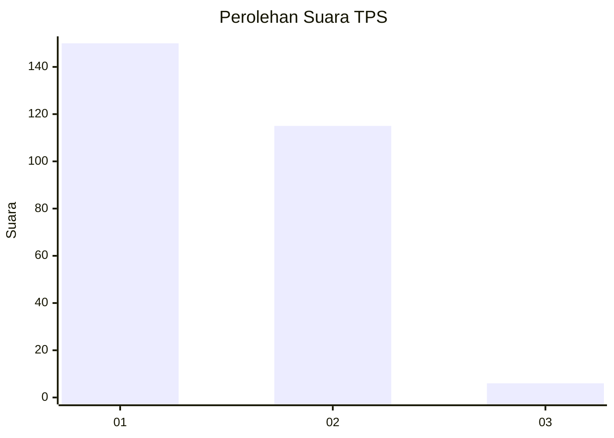
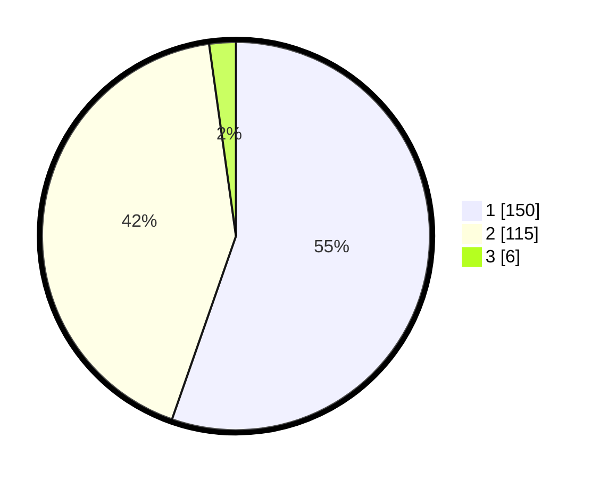

# Hasil

## Grafik

## Tabel

| No. | Nama Paslon    | Suara | Suara (raw) | Persentase |
|:--- |:-------------- | -----:| -----------:| ----------:|
| 1   | ANIES MUHAIMIN | 150   | [150][p-1]  | 55,35      |
| 2   | PRABOWO GIBRAN | 115   | [115][p-2]  | 42,44      |
| 3   | GANJAR MAHFUD  | 6     | [6][p-3]    | 2,21       |

[p-1]: https://github.com/gigit-pemilu/pemilu-2024/blob/main/pilpres/hitung-suara/sub/35-jawa-timur/sub/27-sampang/sub/03-sampang/sub/2016-pangelen/sub/008-tps/sub/paslon-1.txt
[p-2]: https://github.com/gigit-pemilu/pemilu-2024/blob/main/pilpres/hitung-suara/sub/35-jawa-timur/sub/27-sampang/sub/03-sampang/sub/2016-pangelen/sub/008-tps/sub/paslon-2.txt
[p-3]: https://github.com/gigit-pemilu/pemilu-2024/blob/main/pilpres/hitung-suara/sub/35-jawa-timur/sub/27-sampang/sub/03-sampang/sub/2016-pangelen/sub/008-tps/sub/paslon-3.txt

## Foto C Plano

https://sirekap-obj-formc.kpu.go.id/e622/pemilu/ppwp/35/27/03/20/16/3527032016008-20240214-225439--9dda4367-9739-48d3-8fac-7ee07194731f.jpg

https://sirekap-obj-formc.kpu.go.id/e622/pemilu/ppwp/35/27/03/20/16/3527032016008-20240214-231302--5a3aad96-b5c9-45eb-9230-d90af126f5a9.jpg

https://sirekap-obj-formc.kpu.go.id/e622/pemilu/ppwp/35/27/03/20/16/3527032016008-20240214-231443--d396db28-0651-4ea5-bc7d-0a68d844cca4.jpg

## Metadata

| Key        | Value               |
| ---------- | ------------------- |
| Time Stamp | 2024-02-16 12:51:22 |

