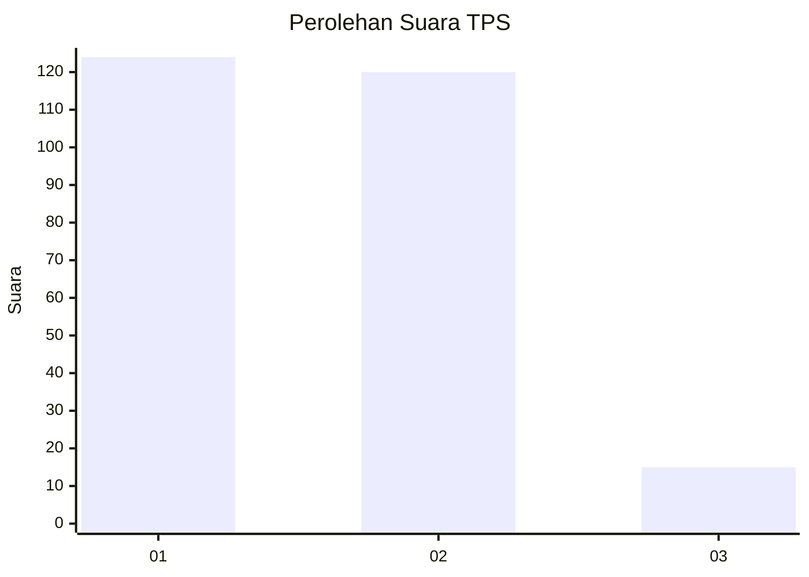
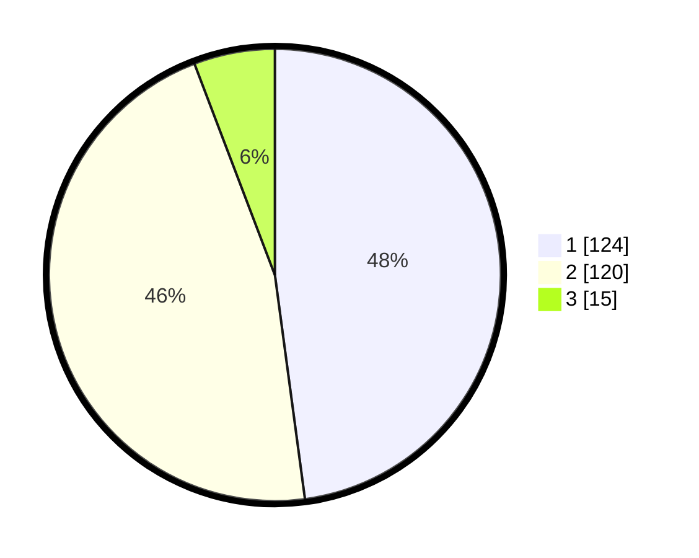

# Hasil

## Grafik

## Tabel

| No. | Nama Paslon    | Suara | Suara (raw) | Persentase |
|:--- |:-------------- | -----:| -----------:| ----------:|
| 1   | ANIES MUHAIMIN | 124   | [124][p-1]  | 47,88      |
| 2   | PRABOWO GIBRAN | 120   | [120][p-2]  | 46,33      |
| 3   | GANJAR MAHFUD  | 15    | [15][p-3]   | 5,79       |

[p-1]: https://github.com/gigit-pemilu/pemilu-2024/blob/main/pilpres/hitung-suara/sub/35-jawa-timur/sub/27-sampang/sub/03-sampang/sub/2016-pangelen/sub/014-tps/sub/paslon-1.txt
[p-2]: https://github.com/gigit-pemilu/pemilu-2024/blob/main/pilpres/hitung-suara/sub/35-jawa-timur/sub/27-sampang/sub/03-sampang/sub/2016-pangelen/sub/014-tps/sub/paslon-2.txt
[p-3]: https://github.com/gigit-pemilu/pemilu-2024/blob/main/pilpres/hitung-suara/sub/35-jawa-timur/sub/27-sampang/sub/03-sampang/sub/2016-pangelen/sub/014-tps/sub/paslon-3.txt

## Foto C Plano

https://sirekap-obj-formc.kpu.go.id/5fcf/pemilu/ppwp/35/27/03/20/16/3527032016014-20240214-213227--29daf98f-91d9-455d-825b-8240ef15ad7f.jpg

https://sirekap-obj-formc.kpu.go.id/5fcf/pemilu/ppwp/35/27/03/20/16/3527032016014-20240214-211244--02dd2216-12de-4d9a-9f05-0262c0a2c0ab.jpg

https://sirekap-obj-formc.kpu.go.id/5fcf/pemilu/ppwp/35/27/03/20/16/3527032016014-20240214-211330--7eafef0a-21fa-47d3-a64d-5f184d75baef.jpg

## Metadata

| Key        | Value               |
| ---------- | ------------------- |
| Time Stamp | 2024-02-16 12:51:22 |

