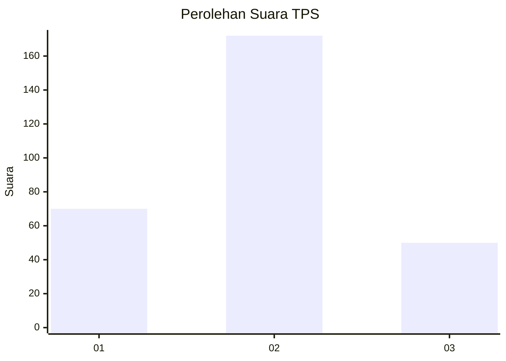

# Hasil

## Grafik

## Tabel

| No. | Nama Paslon    | Suara | Suara (raw) | Persentase |
|:--- |:-------------- | -----:| -----------:| ----------:|
| 1   | ANIES MUHAIMIN | 70    | [70][p-1]   | 23,97      |
| 2   | PRABOWO GIBRAN | 172   | [172][p-2]  | 58,90      |
| 3   | GANJAR MAHFUD  | 50    | [50][p-3]   | 17,12      |

[p-1]: https://github.com/gigit-pemilu/pemilu-2024/blob/main/pilpres/hitung-suara/sub/35-jawa-timur/sub/27-sampang/sub/03-sampang/sub/2016-pangelen/sub/015-tps/sub/paslon-1.txt
[p-2]: https://github.com/gigit-pemilu/pemilu-2024/blob/main/pilpres/hitung-suara/sub/35-jawa-timur/sub/27-sampang/sub/03-sampang/sub/2016-pangelen/sub/015-tps/sub/paslon-2.txt
[p-3]: https://github.com/gigit-pemilu/pemilu-2024/blob/main/pilpres/hitung-suara/sub/35-jawa-timur/sub/27-sampang/sub/03-sampang/sub/2016-pangelen/sub/015-tps/sub/paslon-3.txt

## Foto C Plano

https://sirekap-obj-formc.kpu.go.id/597c/pemilu/ppwp/35/27/03/20/16/3527032016015-20240215-081442--4584755c-e5ac-4a04-a15a-2d8b3f59ebcc.jpg

https://sirekap-obj-formc.kpu.go.id/597c/pemilu/ppwp/35/27/03/20/16/3527032016015-20240215-081919--2a36b920-d061-4085-bcef-615fc51a52b8.jpg

https://sirekap-obj-formc.kpu.go.id/597c/pemilu/ppwp/35/27/03/20/16/3527032016015-20240215-082045--80e5d560-6527-46f0-8abd-ad99cf8b0bfc.jpg

## Metadata

| Key        | Value               |
| ---------- | ------------------- |
| Time Stamp | 2024-02-16 12:51:22 |

