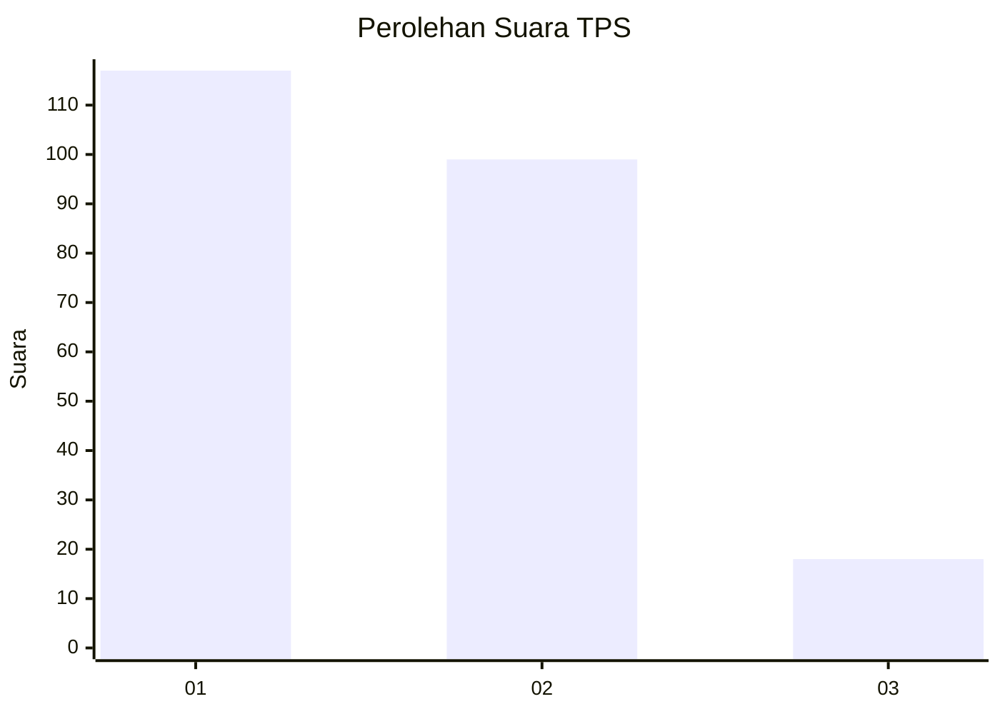
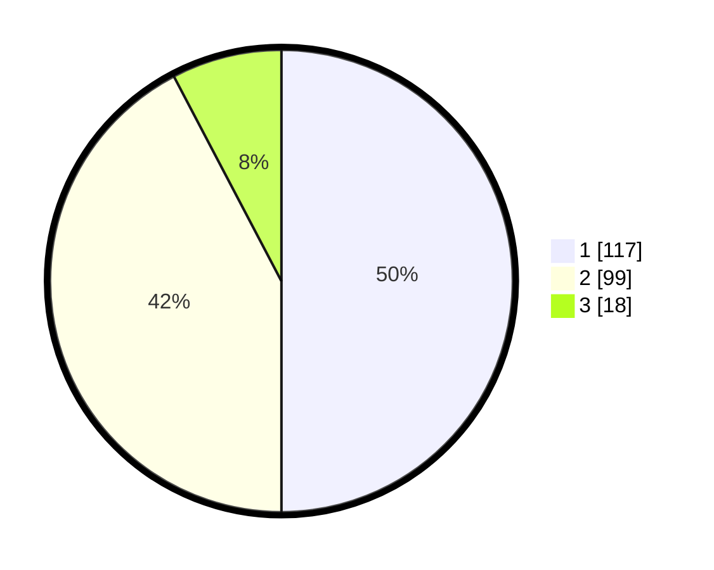

# Hasil

## Grafik

## Tabel

| No. | Nama Paslon    | Suara | Suara (raw) | Persentase |
|:--- |:-------------- | -----:| -----------:| ----------:|
| 1   | ANIES MUHAIMIN | 117   | [117][p-1]  | 50,00      |
| 2   | PRABOWO GIBRAN | 99    | [99][p-2]   | 42,31      |
| 3   | GANJAR MAHFUD  | 18    | [18][p-3]   | 7,69       |

[p-1]: https://github.com/gigit-pemilu/pemilu-2024/blob/main/pilpres/hitung-suara/sub/35-jawa-timur/sub/27-sampang/sub/03-sampang/sub/2018-baruh/sub/003-tps/sub/paslon-1.txt
[p-2]: https://github.com/gigit-pemilu/pemilu-2024/blob/main/pilpres/hitung-suara/sub/35-jawa-timur/sub/27-sampang/sub/03-sampang/sub/2018-baruh/sub/003-tps/sub/paslon-2.txt
[p-3]: https://github.com/gigit-pemilu/pemilu-2024/blob/main/pilpres/hitung-suara/sub/35-jawa-timur/sub/27-sampang/sub/03-sampang/sub/2018-baruh/sub/003-tps/sub/paslon-3.txt

## Foto C Plano

https://sirekap-obj-formc.kpu.go.id/a5db/pemilu/ppwp/35/27/03/20/18/3527032018003-20240214-210325--98280ea3-c087-4d8e-8db7-2f37188c2e10.jpg

https://sirekap-obj-formc.kpu.go.id/a5db/pemilu/ppwp/35/27/03/20/18/3527032018003-20240214-210357--585a3b1d-119d-468f-8d04-9ecf0ebd96e8.jpg

https://sirekap-obj-formc.kpu.go.id/a5db/pemilu/ppwp/35/27/03/20/18/3527032018003-20240214-210415--18e7d971-a961-4c65-ba4d-ac59a719c430.jpg

## Metadata

| Key        | Value               |
| ---------- | ------------------- |
| Time Stamp | 2024-02-16 12:51:22 |

