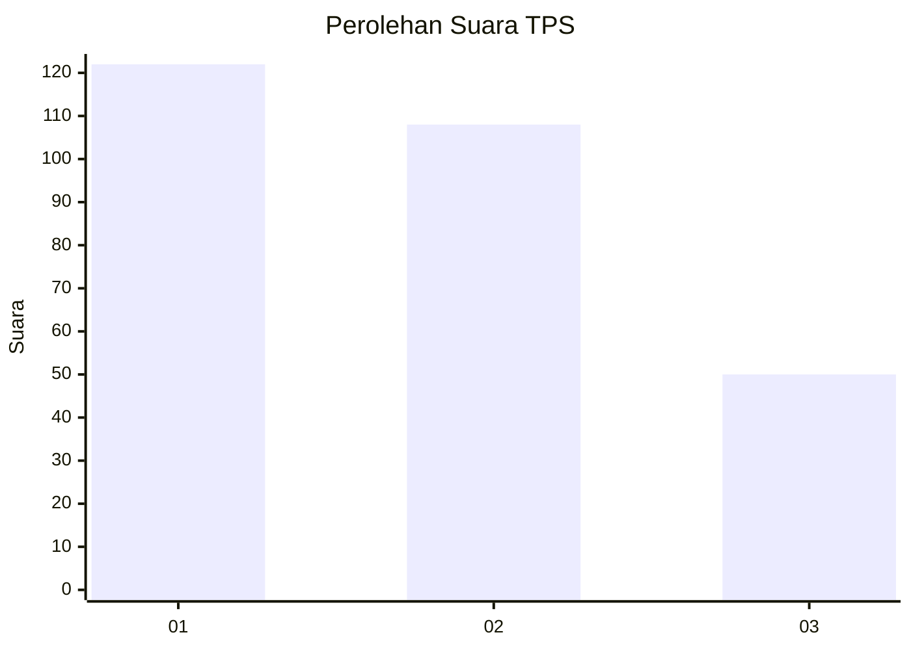
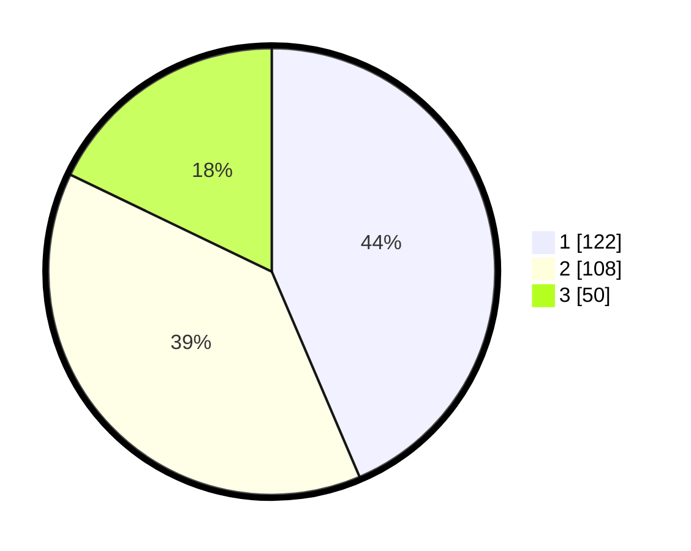

# Hasil

## Grafik

## Tabel

| No. | Nama Paslon    | Suara | Suara (raw) | Persentase |
|:--- |:-------------- | -----:| -----------:| ----------:|
| 1   | ANIES MUHAIMIN | 122   | [122][p-1]  | 43,57      |
| 2   | PRABOWO GIBRAN | 108   | [108][p-2]  | 38,57      |
| 3   | GANJAR MAHFUD  | 50    | [50][p-3]   | 17,86      |

[p-1]: https://github.com/gigit-pemilu/pemilu-2024-35-jawa-timur/blob/main/pilpres/hitung-suara/sub/35-jawa-timur/sub/27-sampang/sub/03-sampang/sub/2018-baruh/sub/004-tps/sub/paslon-1.txt
[p-2]: https://github.com/gigit-pemilu/pemilu-2024-35-jawa-timur/blob/main/pilpres/hitung-suara/sub/35-jawa-timur/sub/27-sampang/sub/03-sampang/sub/2018-baruh/sub/004-tps/sub/paslon-2.txt
[p-3]: https://github.com/gigit-pemilu/pemilu-2024-35-jawa-timur/blob/main/pilpres/hitung-suara/sub/35-jawa-timur/sub/27-sampang/sub/03-sampang/sub/2018-baruh/sub/004-tps/sub/paslon-3.txt

## Foto C Plano

https://sirekap-obj-formc.kpu.go.id/6005/pemilu/ppwp/35/27/03/20/18/3527032018004-20240214-214119--ab921198-5d07-4fe3-b502-7ce518d6972e.jpg

https://sirekap-obj-formc.kpu.go.id/6005/pemilu/ppwp/35/27/03/20/18/3527032018004-20240214-214137--00cec0f3-5a64-4bf2-8530-8b7c9a076243.jpg

https://sirekap-obj-formc.kpu.go.id/6005/pemilu/ppwp/35/27/03/20/18/3527032018004-20240214-214154--f83ab49f-42e0-4131-a992-94e2833ad70c.jpg

## Metadata

| Key        | Value               |
| ---------- | ------------------- |
| Time Stamp | 2024-02-16 12:51:22 |

