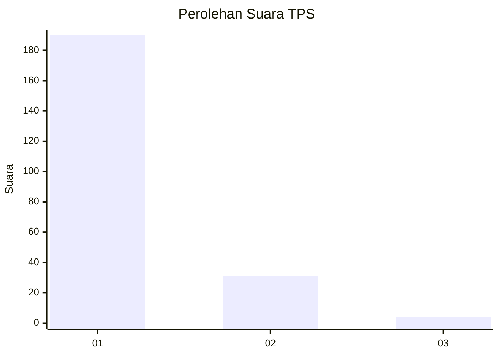
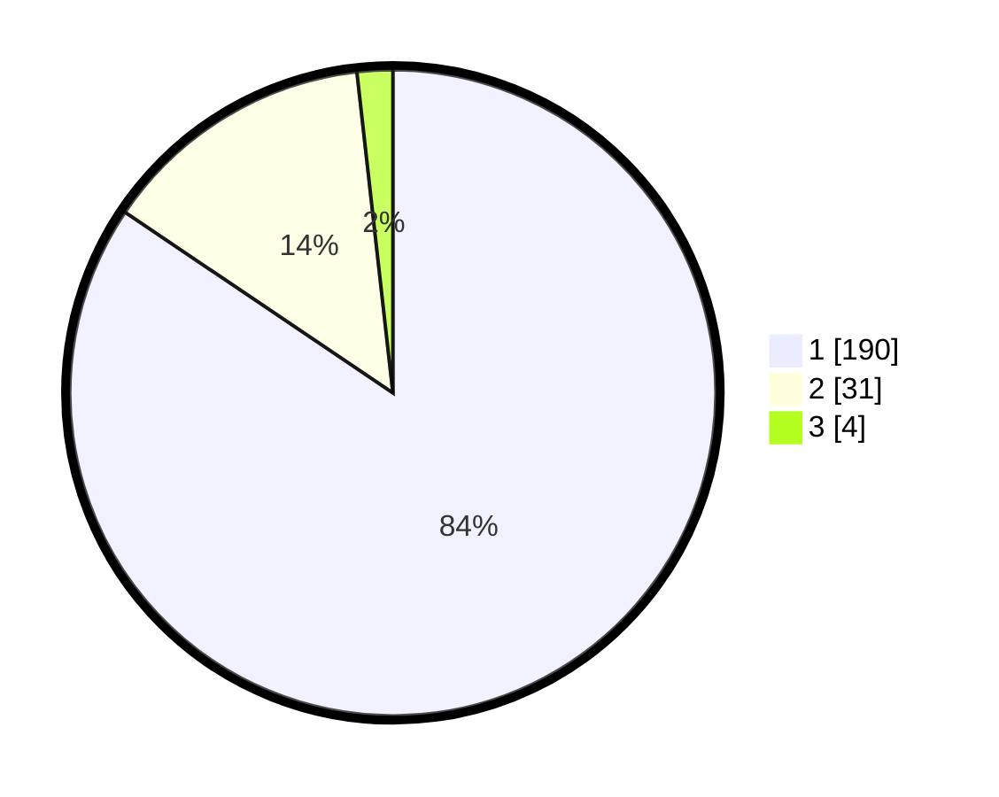

# Hasil

## Grafik

## Tabel

| No. | Nama Paslon    | Suara | Suara (raw) | Persentase |
|:--- |:-------------- | -----:| -----------:| ----------:|
| 1   | ANIES MUHAIMIN | 190   | [190][p-1]  | 84,44      |
| 2   | PRABOWO GIBRAN | 31    | [31][p-2]   | 13,78      |
| 3   | GANJAR MAHFUD  | 4     | [4][p-3]    | 1,78       |

[p-1]: https://github.com/gigit-pemilu/pemilu-2024-35-jawa-timur/blob/main/pilpres/hitung-suara/sub/35-jawa-timur/sub/27-sampang/sub/03-sampang/sub/2018-baruh/sub/006-tps/sub/paslon-1.txt
[p-2]: https://github.com/gigit-pemilu/pemilu-2024-35-jawa-timur/blob/main/pilpres/hitung-suara/sub/35-jawa-timur/sub/27-sampang/sub/03-sampang/sub/2018-baruh/sub/006-tps/sub/paslon-2.txt
[p-3]: https://github.com/gigit-pemilu/pemilu-2024-35-jawa-timur/blob/main/pilpres/hitung-suara/sub/35-jawa-timur/sub/27-sampang/sub/03-sampang/sub/2018-baruh/sub/006-tps/sub/paslon-3.txt

## Foto C Plano

https://sirekap-obj-formc.kpu.go.id/ee13/pemilu/ppwp/35/27/03/20/18/3527032018006-20240216-153355--b058fcca-8fbb-449b-8101-7760bc99ec8a.jpg

https://sirekap-obj-formc.kpu.go.id/ee13/pemilu/ppwp/35/27/03/20/18/3527032018006-20240215-014709--f707aa63-240f-40ca-aa55-65802efcae5c.jpg

https://sirekap-obj-formc.kpu.go.id/ee13/pemilu/ppwp/35/27/03/20/18/3527032018006-20240215-014757--aadf3f8e-98a9-455c-ae72-41732aaca9c7.jpg

## Metadata

| Key        | Value               |
| ---------- | ------------------- |
| Time Stamp | 2024-02-16 16:25:10 |

