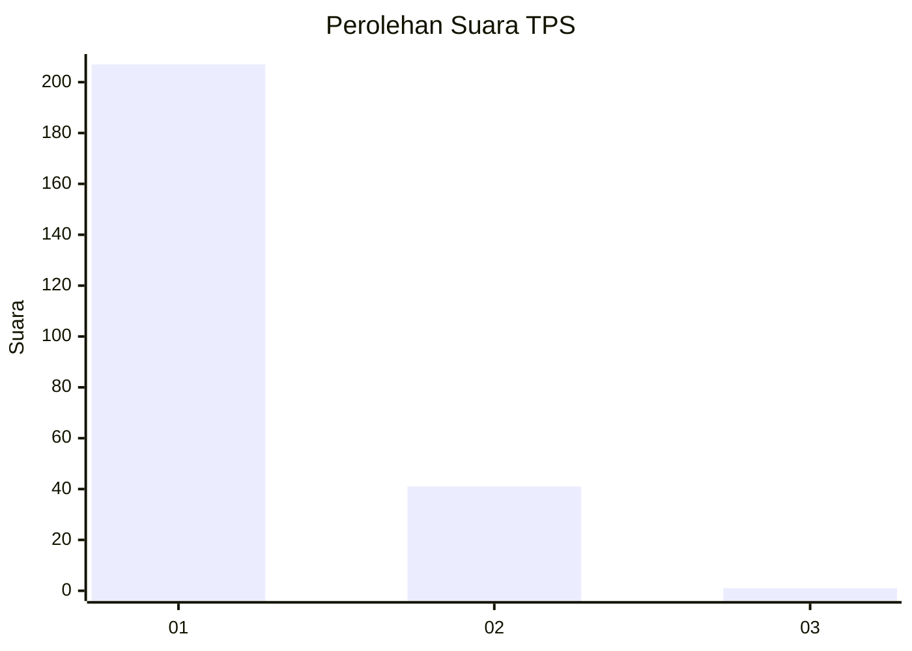
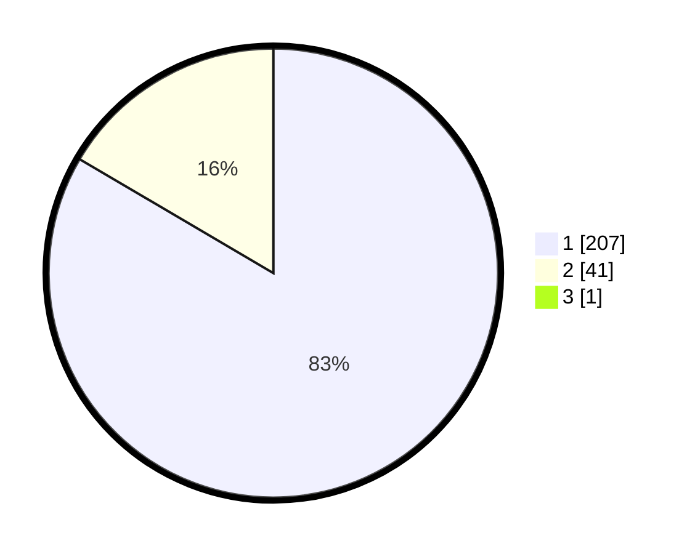

# Hasil

## Grafik

## Tabel

| No. | Nama Paslon    | Suara | Suara (raw) | Persentase |
|:--- |:-------------- | -----:| -----------:| ----------:|
| 1   | ANIES MUHAIMIN | 207   | [207][p-1]  | 83,13      |
| 2   | PRABOWO GIBRAN | 41    | [41][p-2]   | 16,47      |
| 3   | GANJAR MAHFUD  | 1     | [1][p-3]    | 0,40       |

[p-1]: https://github.com/gigit-pemilu/pemilu-2024-35-jawa-timur/blob/main/pilpres/hitung-suara/sub/35-jawa-timur/sub/27-sampang/sub/03-sampang/sub/2018-baruh/sub/007-tps/sub/paslon-1.txt
[p-2]: https://github.com/gigit-pemilu/pemilu-2024-35-jawa-timur/blob/main/pilpres/hitung-suara/sub/35-jawa-timur/sub/27-sampang/sub/03-sampang/sub/2018-baruh/sub/007-tps/sub/paslon-2.txt
[p-3]: https://github.com/gigit-pemilu/pemilu-2024-35-jawa-timur/blob/main/pilpres/hitung-suara/sub/35-jawa-timur/sub/27-sampang/sub/03-sampang/sub/2018-baruh/sub/007-tps/sub/paslon-3.txt

## Foto C Plano

https://sirekap-obj-formc.kpu.go.id/aa46/pemilu/ppwp/35/27/03/20/18/3527032018007-20240214-213648--2d096138-c70c-491d-a8a6-0b8344bac150.jpg

https://sirekap-obj-formc.kpu.go.id/aa46/pemilu/ppwp/35/27/03/20/18/3527032018007-20240214-214143--f7eba344-9b89-49e5-a219-1f1aa36f8120.jpg

https://sirekap-obj-formc.kpu.go.id/aa46/pemilu/ppwp/35/27/03/20/18/3527032018007-20240214-214417--a04f4a2c-6774-48eb-b857-7579305bf657.jpg

## Metadata

| Key        | Value               |
| ---------- | ------------------- |
| Time Stamp | 2024-02-16 12:51:22 |

