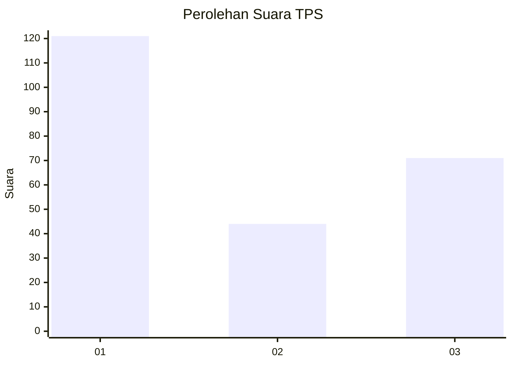
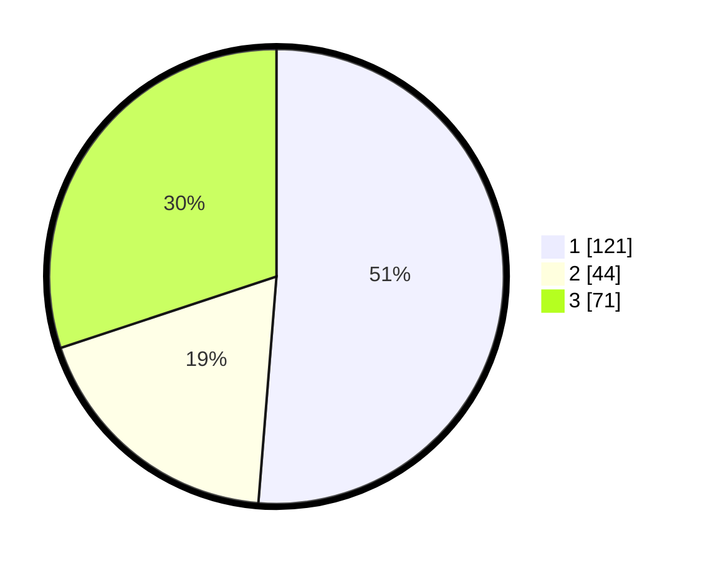

# Hasil

## Grafik

## Tabel

| No. | Nama Paslon    | Suara | Suara (raw) | Persentase |
|:--- |:-------------- | -----:| -----------:| ----------:|
| 1   | ANIES MUHAIMIN | 121   | [121][p-1]  | 51,27      |
| 2   | PRABOWO GIBRAN | 44    | [44][p-2]   | 18,64      |
| 3   | GANJAR MAHFUD  | 71    | [71][p-3]   | 30,08      |

[p-1]: https://github.com/gigit-pemilu/pemilu-2024/blob/main/pilpres/hitung-suara/sub/35-jawa-timur/sub/27-sampang/sub/03-sampang/sub/2018-baruh/sub/010-tps/sub/paslon-1.txt
[p-2]: https://github.com/gigit-pemilu/pemilu-2024/blob/main/pilpres/hitung-suara/sub/35-jawa-timur/sub/27-sampang/sub/03-sampang/sub/2018-baruh/sub/010-tps/sub/paslon-2.txt
[p-3]: https://github.com/gigit-pemilu/pemilu-2024/blob/main/pilpres/hitung-suara/sub/35-jawa-timur/sub/27-sampang/sub/03-sampang/sub/2018-baruh/sub/010-tps/sub/paslon-3.txt

## Foto C Plano

https://sirekap-obj-formc.kpu.go.id/77a9/pemilu/ppwp/35/27/03/20/18/3527032018010-20240214-212643--4779abce-ae0f-4368-a197-c7115fb7007c.jpg

https://sirekap-obj-formc.kpu.go.id/77a9/pemilu/ppwp/35/27/03/20/18/3527032018010-20240214-212654--627ac2d8-9501-4ae3-9bb0-e0803d18743e.jpg

https://sirekap-obj-formc.kpu.go.id/77a9/pemilu/ppwp/35/27/03/20/18/3527032018010-20240214-212705--fc435099-b461-41e3-8d0c-937bd4420fef.jpg

## Metadata

| Key        | Value               |
| ---------- | ------------------- |
| Time Stamp | 2024-02-16 12:51:22 |

