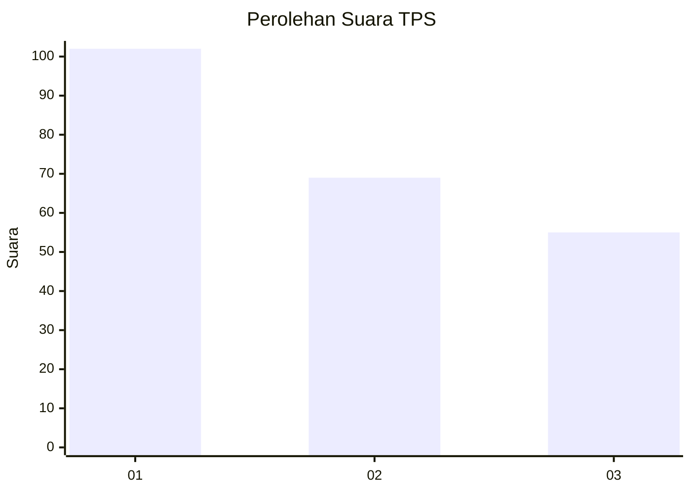
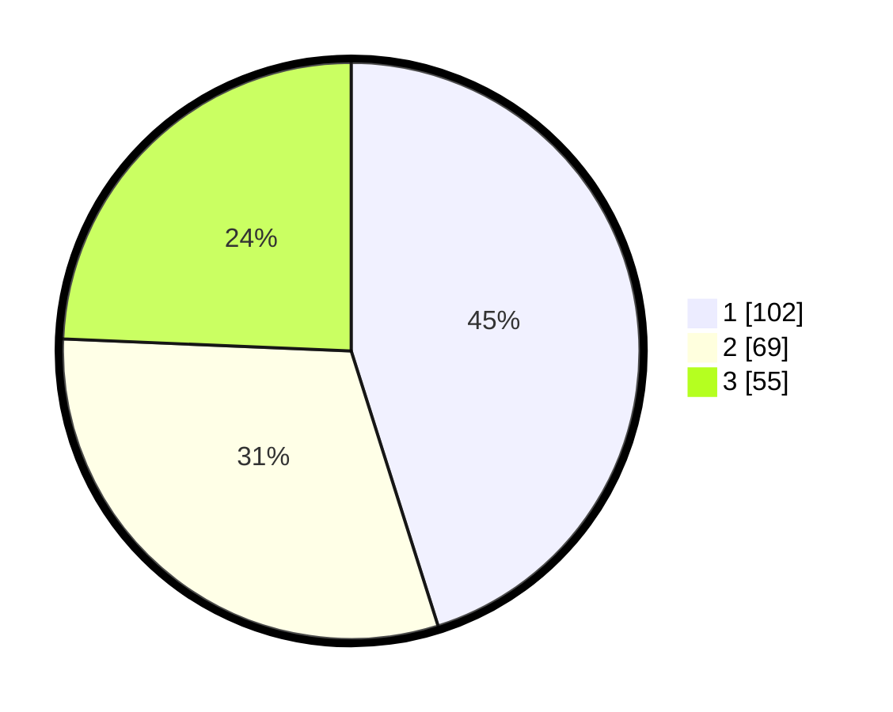

# Hasil

## Grafik

## Tabel

| No. | Nama Paslon    | Suara | Suara (raw) | Persentase |
|:--- |:-------------- | -----:| -----------:| ----------:|
| 1   | ANIES MUHAIMIN | 102   | [102][p-1]  | 45,13      |
| 2   | PRABOWO GIBRAN | 69    | [69][p-2]   | 30,53      |
| 3   | GANJAR MAHFUD  | 55    | [55][p-3]   | 24,34      |

[p-1]: https://github.com/gigit-pemilu/pemilu-2024-35-jawa-timur/blob/main/pilpres/hitung-suara/sub/35-jawa-timur/sub/27-sampang/sub/03-sampang/sub/2018-baruh/sub/011-tps/sub/paslon-1.txt
[p-2]: https://github.com/gigit-pemilu/pemilu-2024-35-jawa-timur/blob/main/pilpres/hitung-suara/sub/35-jawa-timur/sub/27-sampang/sub/03-sampang/sub/2018-baruh/sub/011-tps/sub/paslon-2.txt
[p-3]: https://github.com/gigit-pemilu/pemilu-2024-35-jawa-timur/blob/main/pilpres/hitung-suara/sub/35-jawa-timur/sub/27-sampang/sub/03-sampang/sub/2018-baruh/sub/011-tps/sub/paslon-3.txt

## Foto C Plano

https://sirekap-obj-formc.kpu.go.id/6675/pemilu/ppwp/35/27/03/20/18/3527032018011-20240214-212209--955f9035-c25d-4404-90de-474357a7fdc3.jpg

https://sirekap-obj-formc.kpu.go.id/6675/pemilu/ppwp/35/27/03/20/18/3527032018011-20240214-231859--712bc311-2ae8-4b62-a333-95bf45529e14.jpg

https://sirekap-obj-formc.kpu.go.id/6675/pemilu/ppwp/35/27/03/20/18/3527032018011-20240214-212649--8bba8a70-4a5c-4411-aca9-0747e64cc60d.jpg

## Metadata

| Key        | Value               |
| ---------- | ------------------- |
| Time Stamp | 2024-02-25 18:00:00 |

