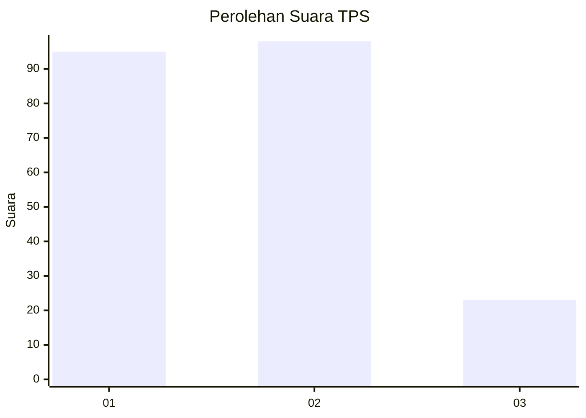
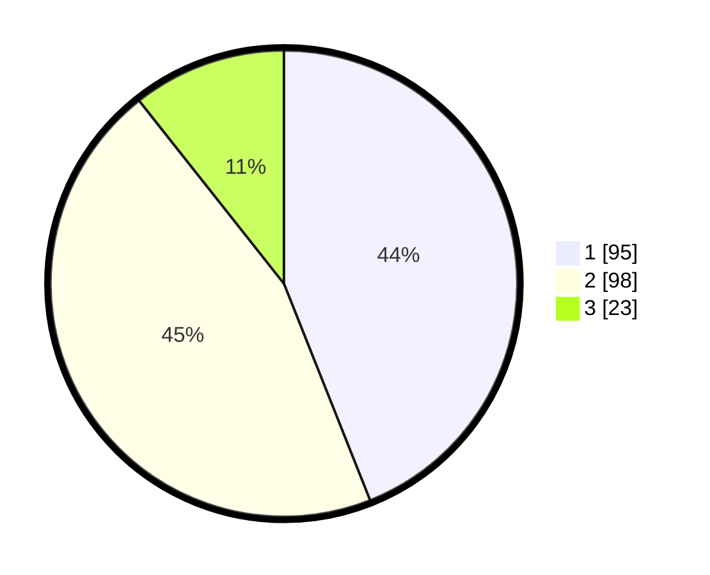

# Hasil

## Grafik

## Tabel

| No. | Nama Paslon    | Suara | Suara (raw) | Persentase |
|:--- |:-------------- | -----:| -----------:| ----------:|
| 1   | ANIES MUHAIMIN | 95    | [95][p-1]   | 43,98      |
| 2   | PRABOWO GIBRAN | 98    | [98][p-2]   | 45,37      |
| 3   | GANJAR MAHFUD  | 23    | [23][p-3]   | 10,65      |

[p-1]: https://github.com/gigit-pemilu/pemilu-2024/blob/main/pilpres/hitung-suara/sub/35-jawa-timur/sub/27-sampang/sub/03-sampang/sub/2018-baruh/sub/012-tps/sub/paslon-1.txt
[p-2]: https://github.com/gigit-pemilu/pemilu-2024/blob/main/pilpres/hitung-suara/sub/35-jawa-timur/sub/27-sampang/sub/03-sampang/sub/2018-baruh/sub/012-tps/sub/paslon-2.txt
[p-3]: https://github.com/gigit-pemilu/pemilu-2024/blob/main/pilpres/hitung-suara/sub/35-jawa-timur/sub/27-sampang/sub/03-sampang/sub/2018-baruh/sub/012-tps/sub/paslon-3.txt

## Foto C Plano

https://sirekap-obj-formc.kpu.go.id/7784/pemilu/ppwp/35/27/03/20/18/3527032018012-20240214-214243--877feb8f-3166-4fdb-ae5c-5d12daf48ec8.jpg

https://sirekap-obj-formc.kpu.go.id/7784/pemilu/ppwp/35/27/03/20/18/3527032018012-20240214-214308--e391d2ba-8263-419a-a025-4b3632755625.jpg

https://sirekap-obj-formc.kpu.go.id/7784/pemilu/ppwp/35/27/03/20/18/3527032018012-20240214-214332--d559ab03-8bf1-45b9-be1d-a1394c1caa6d.jpg

## Metadata

| Key        | Value               |
| ---------- | ------------------- |
| Time Stamp | 2024-02-16 12:51:22 |

