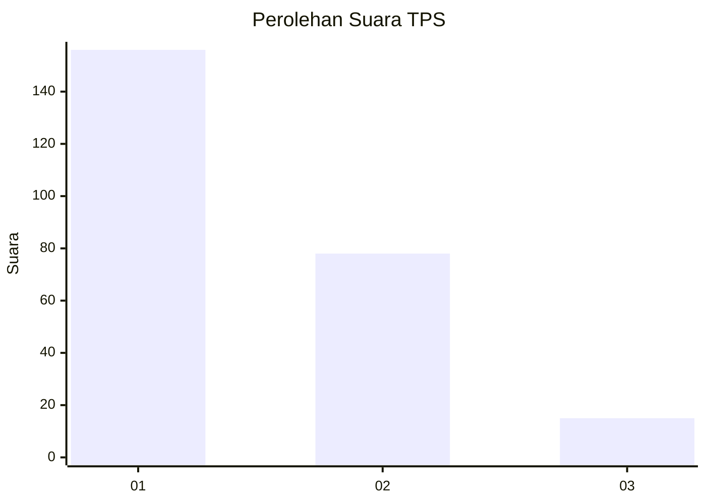
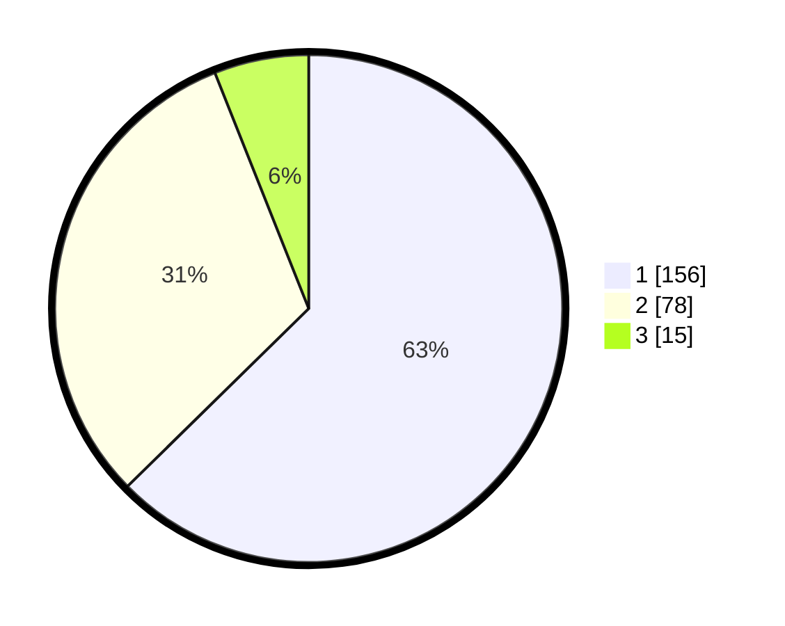

# Hasil

## Grafik

## Tabel

| No. | Nama Paslon    | Suara | Suara (raw) | Persentase |
|:--- |:-------------- | -----:| -----------:| ----------:|
| 1   | ANIES MUHAIMIN | 156   | [156][p-1]  | 62,65      |
| 2   | PRABOWO GIBRAN | 78    | [78][p-2]   | 31,33      |
| 3   | GANJAR MAHFUD  | 15    | [15][p-3]   | 6,02       |

[p-1]: https://github.com/gigit-pemilu/pemilu-2024/blob/main/pilpres/hitung-suara/sub/35-jawa-timur/sub/27-sampang/sub/03-sampang/sub/2018-baruh/sub/015-tps/sub/paslon-1.txt
[p-2]: https://github.com/gigit-pemilu/pemilu-2024/blob/main/pilpres/hitung-suara/sub/35-jawa-timur/sub/27-sampang/sub/03-sampang/sub/2018-baruh/sub/015-tps/sub/paslon-2.txt
[p-3]: https://github.com/gigit-pemilu/pemilu-2024/blob/main/pilpres/hitung-suara/sub/35-jawa-timur/sub/27-sampang/sub/03-sampang/sub/2018-baruh/sub/015-tps/sub/paslon-3.txt

## Foto C Plano

https://sirekap-obj-formc.kpu.go.id/0f7a/pemilu/ppwp/35/27/03/20/18/3527032018015-20240214-235219--2f2ec34b-4349-4ff2-b1c1-c9a05175affa.jpg

https://sirekap-obj-formc.kpu.go.id/0f7a/pemilu/ppwp/35/27/03/20/18/3527032018015-20240214-235613--d6d0a1b5-a7ec-4f0e-b09e-13baf5294133.jpg

https://sirekap-obj-formc.kpu.go.id/0f7a/pemilu/ppwp/35/27/03/20/18/3527032018015-20240214-235735--bd56bd78-1e13-4fc3-a98a-27bbae135639.jpg

## Metadata

| Key        | Value               |
| ---------- | ------------------- |
| Time Stamp | 2024-02-25 18:00:00 |

