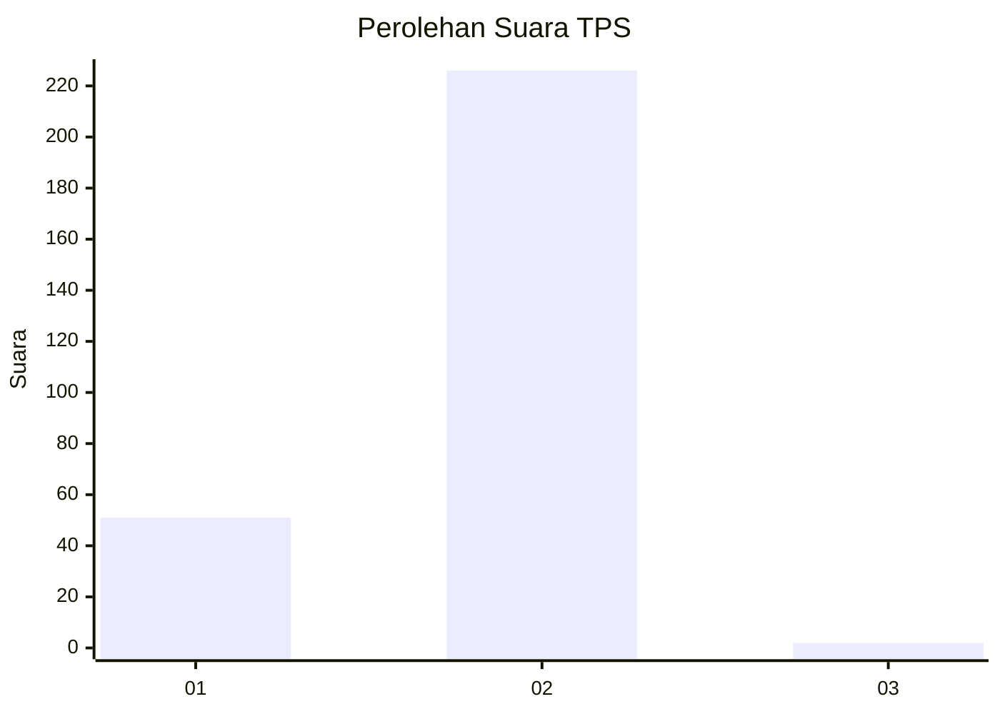
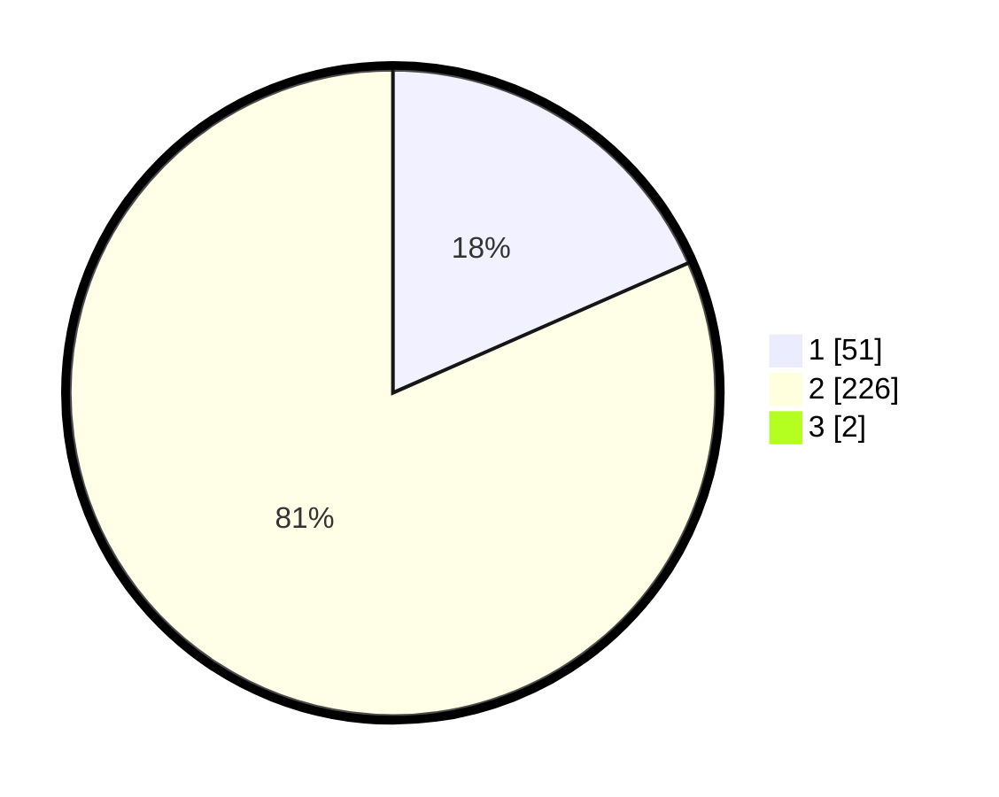

# Hasil

## Grafik

## Tabel

| No. | Nama Paslon    | Suara | Suara (raw) | Persentase |
|:--- |:-------------- | -----:| -----------:| ----------:|
| 1   | ANIES MUHAIMIN | 51    | [51][p-1]   | 18,28      |
| 2   | PRABOWO GIBRAN | 226   | [226][p-2]  | 81,00      |
| 3   | GANJAR MAHFUD  | 2     | [2][p-3]    | 0,72       |

[p-1]: https://github.com/gigit-pemilu/pemilu-2024-35-jawa-timur/blob/main/pilpres/hitung-suara/sub/35-jawa-timur/sub/27-sampang/sub/04-camplong/sub/2004-prajjan/sub/001-tps/sub/paslon-1.txt
[p-2]: https://github.com/gigit-pemilu/pemilu-2024-35-jawa-timur/blob/main/pilpres/hitung-suara/sub/35-jawa-timur/sub/27-sampang/sub/04-camplong/sub/2004-prajjan/sub/001-tps/sub/paslon-2.txt
[p-3]: https://github.com/gigit-pemilu/pemilu-2024-35-jawa-timur/blob/main/pilpres/hitung-suara/sub/35-jawa-timur/sub/27-sampang/sub/04-camplong/sub/2004-prajjan/sub/001-tps/sub/paslon-3.txt

## Foto C Plano

https://sirekap-obj-formc.kpu.go.id/a5ef/pemilu/ppwp/35/27/04/20/04/3527042004001-20240215-121455--48eb43ae-0af1-4b22-94b0-d07ce9342afe.jpg

https://sirekap-obj-formc.kpu.go.id/a5ef/pemilu/ppwp/35/27/04/20/04/3527042004001-20240215-121644--93f9d517-ecab-4db4-8752-8ba66be4696e.jpg

https://sirekap-obj-formc.kpu.go.id/a5ef/pemilu/ppwp/35/27/04/20/04/3527042004001-20240215-121735--7425b73a-b089-4aca-ae4e-ee97123f3bbb.jpg

## Metadata

| Key        | Value               |
| ---------- | ------------------- |
| Time Stamp | 2024-02-16 10:30:29 |

