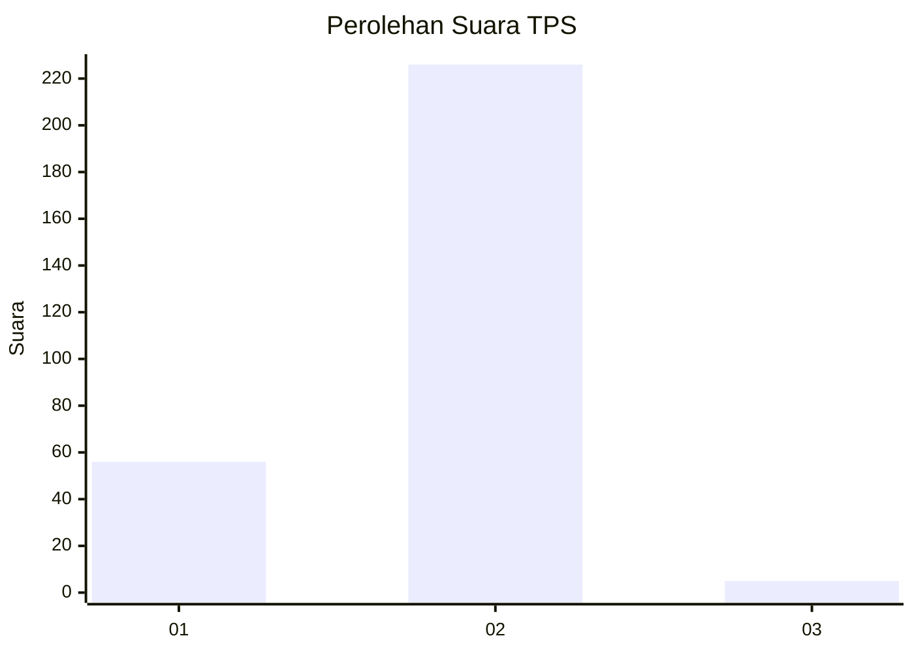
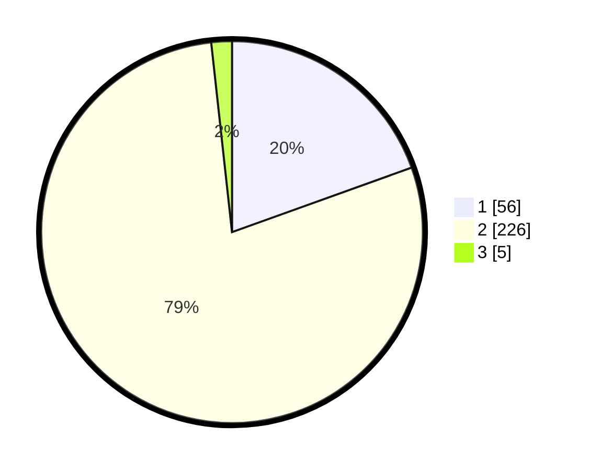

# Hasil

## Grafik

## Tabel

| No. | Nama Paslon    | Suara | Suara (raw) | Persentase |
|:--- |:-------------- | -----:| -----------:| ----------:|
| 1   | ANIES MUHAIMIN | 56    | [56][p-1]   | 19,51      |
| 2   | PRABOWO GIBRAN | 226   | [226][p-2]  | 78,75      |
| 3   | GANJAR MAHFUD  | 5     | [5][p-3]    | 1,74       |

[p-1]: https://github.com/gigit-pemilu/pemilu-2024/blob/main/pilpres/hitung-suara/sub/35-jawa-timur/sub/27-sampang/sub/04-camplong/sub/2004-prajjan/sub/002-tps/sub/paslon-1.txt
[p-2]: https://github.com/gigit-pemilu/pemilu-2024/blob/main/pilpres/hitung-suara/sub/35-jawa-timur/sub/27-sampang/sub/04-camplong/sub/2004-prajjan/sub/002-tps/sub/paslon-2.txt
[p-3]: https://github.com/gigit-pemilu/pemilu-2024/blob/main/pilpres/hitung-suara/sub/35-jawa-timur/sub/27-sampang/sub/04-camplong/sub/2004-prajjan/sub/002-tps/sub/paslon-3.txt

## Foto C Plano

https://sirekap-obj-formc.kpu.go.id/9008/pemilu/ppwp/35/27/04/20/04/3527042004002-20240215-121224--a47dd4d7-8dc2-438e-9f06-56cf96d51f91.jpg

https://sirekap-obj-formc.kpu.go.id/9008/pemilu/ppwp/35/27/04/20/04/3527042004002-20240215-121256--62c54c16-968a-48ed-b1dd-b16ed9c09e8c.jpg

https://sirekap-obj-formc.kpu.go.id/9008/pemilu/ppwp/35/27/04/20/04/3527042004002-20240215-121323--fce987f3-a17f-430a-bc02-6fcc175a24a5.jpg

## Metadata

| Key        | Value               |
| ---------- | ------------------- |
| Time Stamp | 2024-02-16 10:30:29 |

