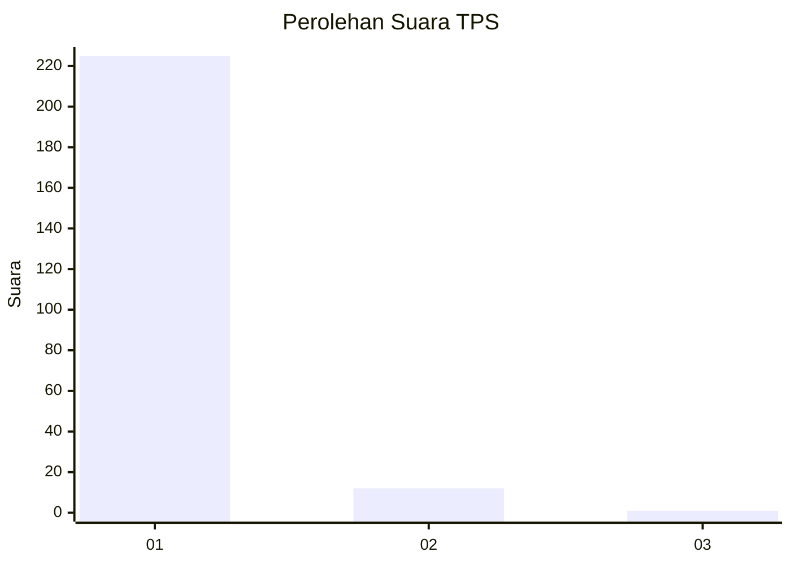
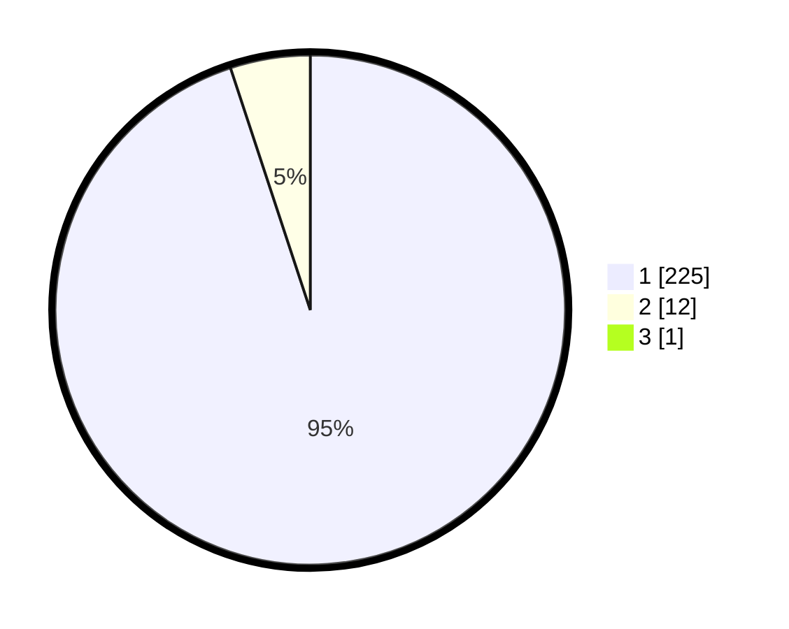

# Hasil

## Grafik

## Tabel

| No. | Nama Paslon    | Suara | Suara (raw) | Persentase |
|:--- |:-------------- | -----:| -----------:| ----------:|
| 1   | ANIES MUHAIMIN | 225   | [225][p-1]  | 94,54      |
| 2   | PRABOWO GIBRAN | 12    | [12][p-2]   | 5,04       |
| 3   | GANJAR MAHFUD  | 1     | [1][p-3]    | 0,42       |

[p-1]: https://github.com/gigit-pemilu/pemilu-2024/blob/main/pilpres/hitung-suara/sub/35-jawa-timur/sub/27-sampang/sub/04-camplong/sub/2004-prajjan/sub/003-tps/sub/paslon-1.txt
[p-2]: https://github.com/gigit-pemilu/pemilu-2024/blob/main/pilpres/hitung-suara/sub/35-jawa-timur/sub/27-sampang/sub/04-camplong/sub/2004-prajjan/sub/003-tps/sub/paslon-2.txt
[p-3]: https://github.com/gigit-pemilu/pemilu-2024/blob/main/pilpres/hitung-suara/sub/35-jawa-timur/sub/27-sampang/sub/04-camplong/sub/2004-prajjan/sub/003-tps/sub/paslon-3.txt

## Foto C Plano

https://sirekap-obj-formc.kpu.go.id/0065/pemilu/ppwp/35/27/04/20/04/3527042004003-20240215-091328--bdcc5a4b-08f5-4412-b2fe-895abb6fa3a9.jpg

https://sirekap-obj-formc.kpu.go.id/0065/pemilu/ppwp/35/27/04/20/04/3527042004003-20240215-091507--120dbd41-1357-4dbd-b067-95253f269326.jpg

https://sirekap-obj-formc.kpu.go.id/0065/pemilu/ppwp/35/27/04/20/04/3527042004003-20240215-091627--3e4e506b-98a5-474e-b421-3b4c654c50dc.jpg

## Metadata

| Key        | Value               |
| ---------- | ------------------- |
| Time Stamp | 2024-02-16 10:30:29 |

