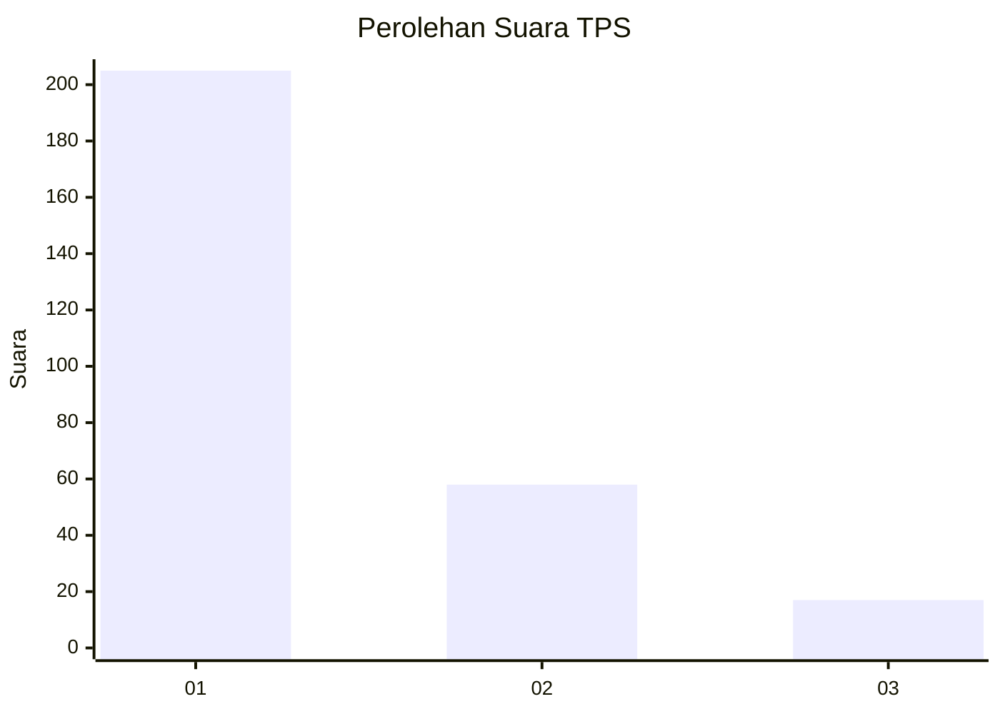
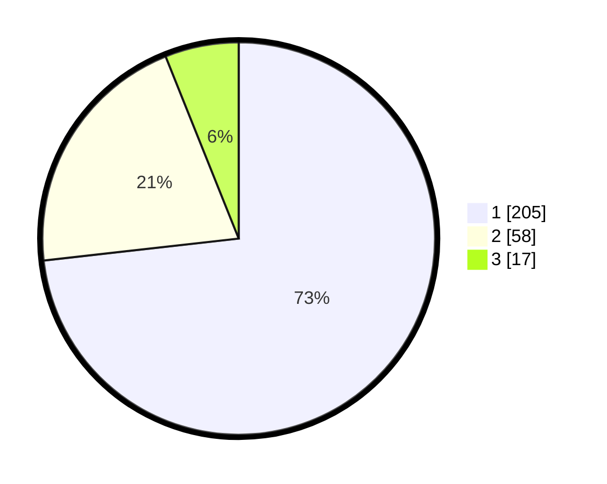

# Hasil

## Grafik

## Tabel

| No. | Nama Paslon    | Suara | Suara (raw) | Persentase |
|:--- |:-------------- | -----:| -----------:| ----------:|
| 1   | ANIES MUHAIMIN | 205   | [205][p-1]  | 73,21      |
| 2   | PRABOWO GIBRAN | 58    | [58][p-2]   | 20,71      |
| 3   | GANJAR MAHFUD  | 17    | [17][p-3]   | 6,07       |

[p-1]: https://github.com/gigit-pemilu/pemilu-2024/blob/main/pilpres/hitung-suara/sub/35-jawa-timur/sub/27-sampang/sub/04-camplong/sub/2004-prajjan/sub/005-tps/sub/paslon-1.txt
[p-2]: https://github.com/gigit-pemilu/pemilu-2024/blob/main/pilpres/hitung-suara/sub/35-jawa-timur/sub/27-sampang/sub/04-camplong/sub/2004-prajjan/sub/005-tps/sub/paslon-2.txt
[p-3]: https://github.com/gigit-pemilu/pemilu-2024/blob/main/pilpres/hitung-suara/sub/35-jawa-timur/sub/27-sampang/sub/04-camplong/sub/2004-prajjan/sub/005-tps/sub/paslon-3.txt

## Foto C Plano

https://sirekap-obj-formc.kpu.go.id/4289/pemilu/ppwp/35/27/04/20/04/3527042004005-20240215-121931--6dcc563e-216e-4684-8df6-0666bc94101e.jpg

https://sirekap-obj-formc.kpu.go.id/4289/pemilu/ppwp/35/27/04/20/04/3527042004005-20240215-122004--22322365-814b-43ce-9054-3e60dc43d959.jpg

https://sirekap-obj-formc.kpu.go.id/4289/pemilu/ppwp/35/27/04/20/04/3527042004005-20240215-122037--1e13a293-e925-410a-926c-010af69d4faa.jpg

## Metadata

| Key        | Value               |
| ---------- | ------------------- |
| Time Stamp | 2024-02-16 10:00:28 |

