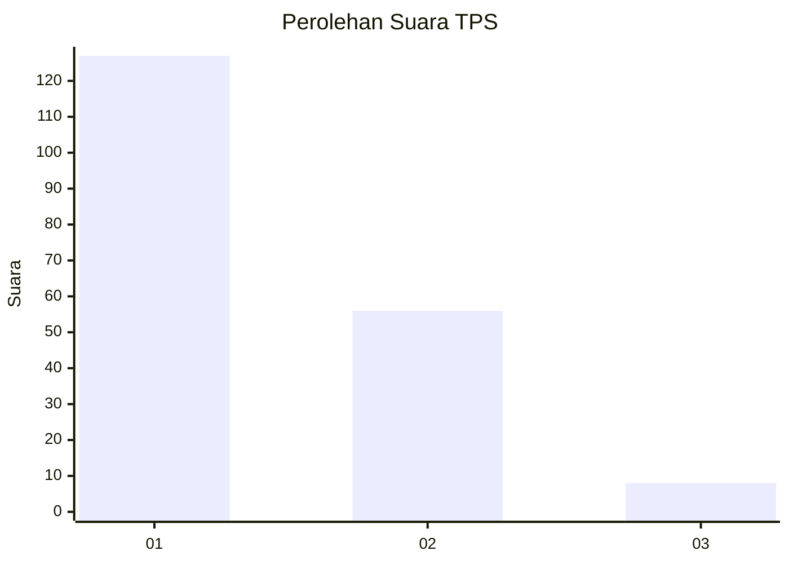
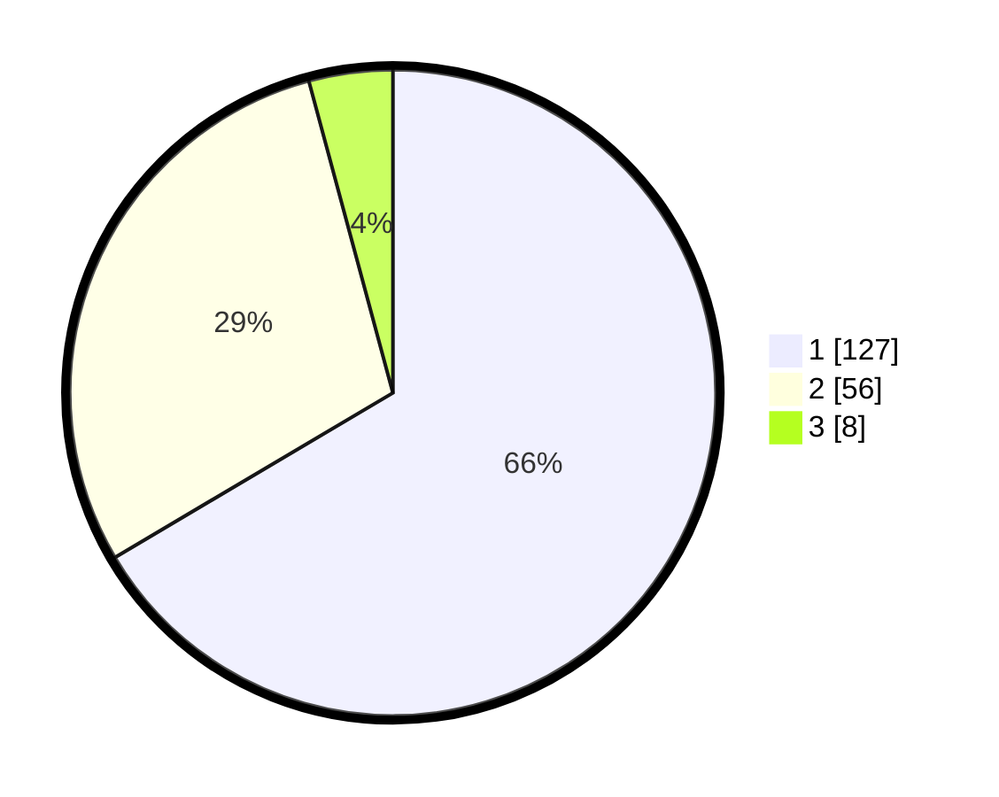

# Hasil

## Grafik

## Tabel

| No. | Nama Paslon    | Suara | Suara (raw) | Persentase |
|:--- |:-------------- | -----:| -----------:| ----------:|
| 1   | ANIES MUHAIMIN | 127   | [127][p-1]  | 66,49      |
| 2   | PRABOWO GIBRAN | 56    | [56][p-2]   | 29,32      |
| 3   | GANJAR MAHFUD  | 8     | [8][p-3]    | 4,19       |

[p-1]: https://github.com/gigit-pemilu/pemilu-2024/blob/main/pilpres/hitung-suara/sub/35-jawa-timur/sub/27-sampang/sub/04-camplong/sub/2005-dharma-camplong/sub/006-tps/sub/paslon-1.txt
[p-2]: https://github.com/gigit-pemilu/pemilu-2024/blob/main/pilpres/hitung-suara/sub/35-jawa-timur/sub/27-sampang/sub/04-camplong/sub/2005-dharma-camplong/sub/006-tps/sub/paslon-2.txt
[p-3]: https://github.com/gigit-pemilu/pemilu-2024/blob/main/pilpres/hitung-suara/sub/35-jawa-timur/sub/27-sampang/sub/04-camplong/sub/2005-dharma-camplong/sub/006-tps/sub/paslon-3.txt

## Foto C Plano

https://sirekap-obj-formc.kpu.go.id/db42/pemilu/ppwp/35/27/04/20/05/3527042005006-20240216-223954--c2ac15e7-f039-40d5-b956-d6eaa1b4d7f6.jpg

https://sirekap-obj-formc.kpu.go.id/db42/pemilu/ppwp/35/27/04/20/05/3527042005006-20240214-203819--45f3dca8-1b61-458a-8eaf-71e981fb4791.jpg

https://sirekap-obj-formc.kpu.go.id/db42/pemilu/ppwp/35/27/04/20/05/3527042005006-20240214-204013--a69752c2-fdf8-4405-8d00-0c078e03f065.jpg

## Metadata

| Key        | Value               |
| ---------- | ------------------- |
| Time Stamp | 2024-02-16 23:00:00 |

