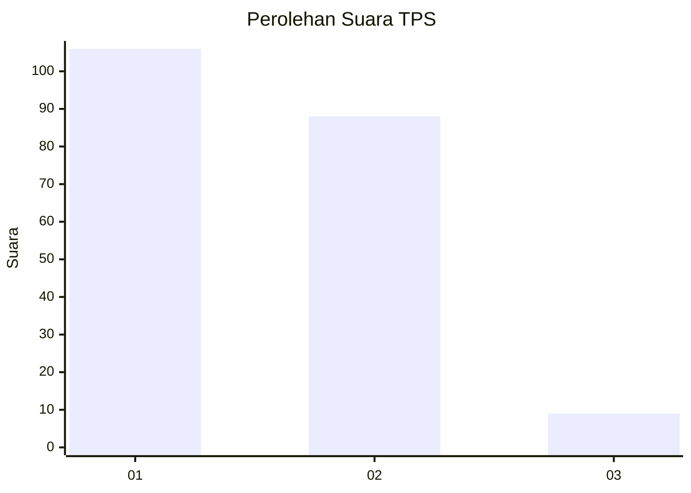
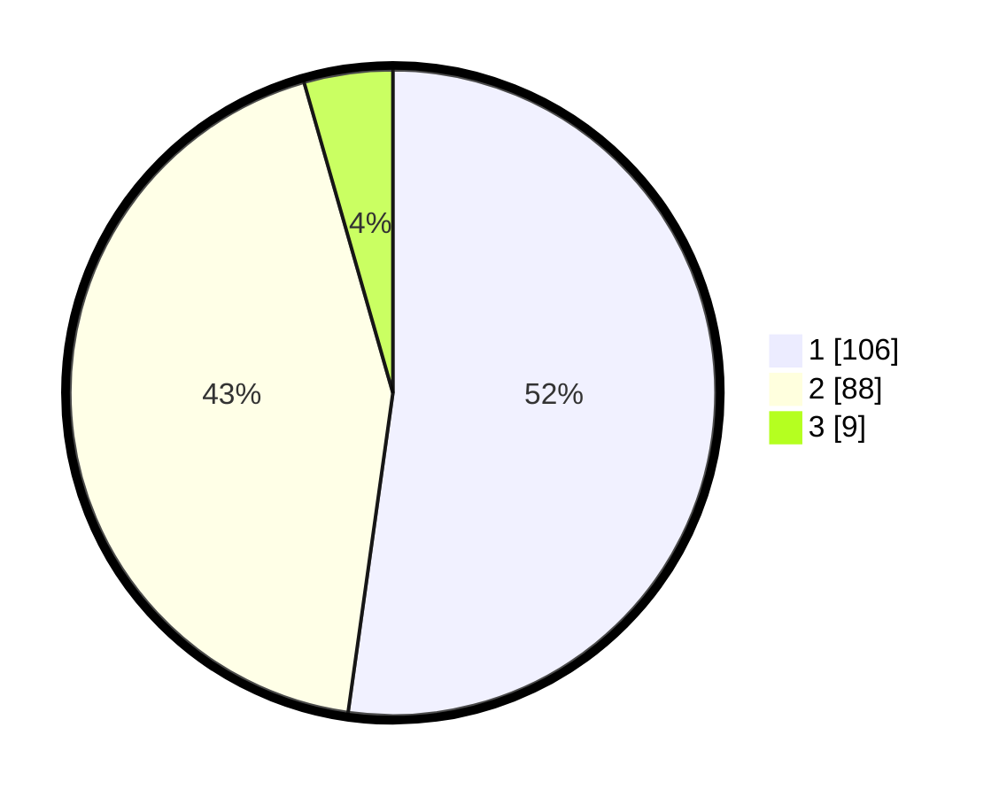

# Hasil

## Grafik

## Tabel

| No. | Nama Paslon    | Suara | Suara (raw) | Persentase |
|:--- |:-------------- | -----:| -----------:| ----------:|
| 1   | ANIES MUHAIMIN | 106   | [106][p-1]  | 52,22      |
| 2   | PRABOWO GIBRAN | 88    | [88][p-2]   | 43,35      |
| 3   | GANJAR MAHFUD  | 9     | [9][p-3]    | 4,43       |

[p-1]: https://github.com/gigit-pemilu/pemilu-2024-35-jawa-timur/blob/main/pilpres/hitung-suara/sub/35-jawa-timur/sub/27-sampang/sub/04-camplong/sub/2005-dharma-camplong/sub/010-tps/sub/paslon-1.txt
[p-2]: https://github.com/gigit-pemilu/pemilu-2024-35-jawa-timur/blob/main/pilpres/hitung-suara/sub/35-jawa-timur/sub/27-sampang/sub/04-camplong/sub/2005-dharma-camplong/sub/010-tps/sub/paslon-2.txt
[p-3]: https://github.com/gigit-pemilu/pemilu-2024-35-jawa-timur/blob/main/pilpres/hitung-suara/sub/35-jawa-timur/sub/27-sampang/sub/04-camplong/sub/2005-dharma-camplong/sub/010-tps/sub/paslon-3.txt

## Foto C Plano

https://sirekap-obj-formc.kpu.go.id/d2b2/pemilu/ppwp/35/27/04/20/05/3527042005010-20240215-063525--2a6d3443-1352-4156-93bf-793a17ac53be.jpg

https://sirekap-obj-formc.kpu.go.id/d2b2/pemilu/ppwp/35/27/04/20/05/3527042005010-20240215-063616--10917c7f-3c46-4552-8716-ac91edd5d3cd.jpg

https://sirekap-obj-formc.kpu.go.id/d2b2/pemilu/ppwp/35/27/04/20/05/3527042005010-20240215-063801--89485bad-1d72-44d0-a805-62ff70d48428.jpg

## Metadata

| Key        | Value               |
| ---------- | ------------------- |
| Time Stamp | 2024-02-16 12:51:22 |

