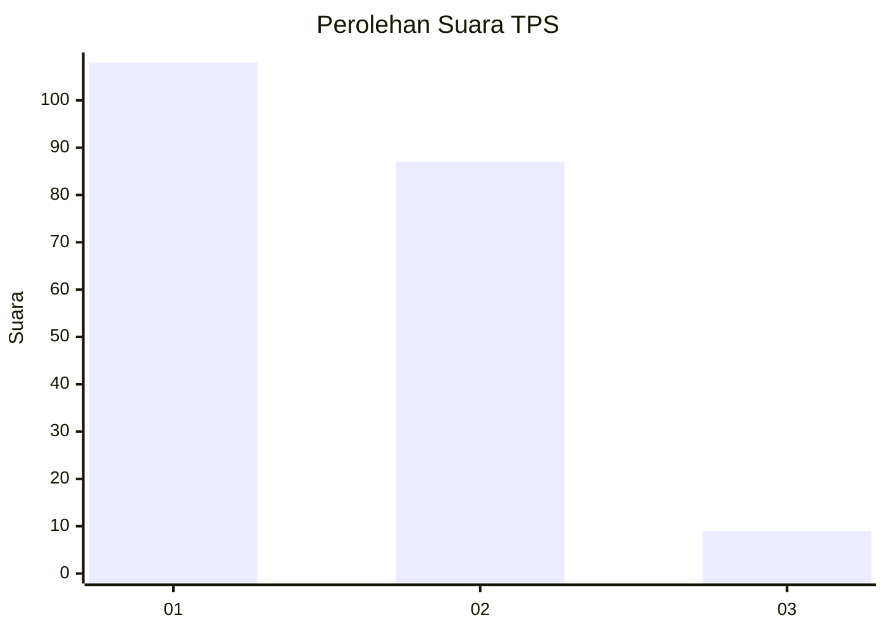
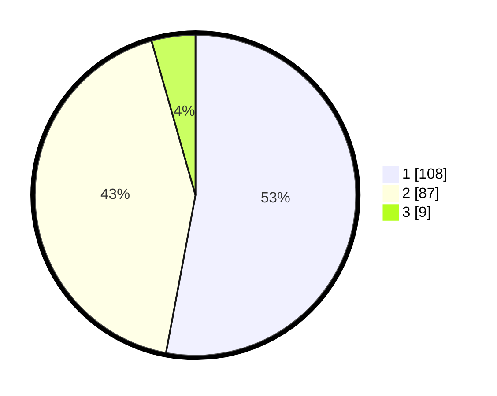

# Hasil

## Grafik

## Tabel

| No. | Nama Paslon    | Suara | Suara (raw) | Persentase |
|:--- |:-------------- | -----:| -----------:| ----------:|
| 1   | ANIES MUHAIMIN | 108   | [108][p-1]  | 52,94      |
| 2   | PRABOWO GIBRAN | 87    | [87][p-2]   | 42,65      |
| 3   | GANJAR MAHFUD  | 9     | [9][p-3]    | 4,41       |

[p-1]: https://github.com/gigit-pemilu/pemilu-2024/blob/main/pilpres/hitung-suara/sub/35-jawa-timur/sub/27-sampang/sub/04-camplong/sub/2005-dharma-camplong/sub/011-tps/sub/paslon-1.txt
[p-2]: https://github.com/gigit-pemilu/pemilu-2024/blob/main/pilpres/hitung-suara/sub/35-jawa-timur/sub/27-sampang/sub/04-camplong/sub/2005-dharma-camplong/sub/011-tps/sub/paslon-2.txt
[p-3]: https://github.com/gigit-pemilu/pemilu-2024/blob/main/pilpres/hitung-suara/sub/35-jawa-timur/sub/27-sampang/sub/04-camplong/sub/2005-dharma-camplong/sub/011-tps/sub/paslon-3.txt

## Foto C Plano

https://sirekap-obj-formc.kpu.go.id/7062/pemilu/ppwp/35/27/04/20/05/3527042005011-20240214-211727--de3e28df-52b4-41cb-8976-23785a892365.jpg

https://sirekap-obj-formc.kpu.go.id/7062/pemilu/ppwp/35/27/04/20/05/3527042005011-20240214-211814--373651e1-c024-4bcc-9e2f-9384a37d206d.jpg

https://sirekap-obj-formc.kpu.go.id/7062/pemilu/ppwp/35/27/04/20/05/3527042005011-20240214-212144--ab209b2e-8f4e-4f91-8920-b8be935357c2.jpg

## Metadata

| Key        | Value               |
| ---------- | ------------------- |
| Time Stamp | 2024-02-16 14:00:34 |

