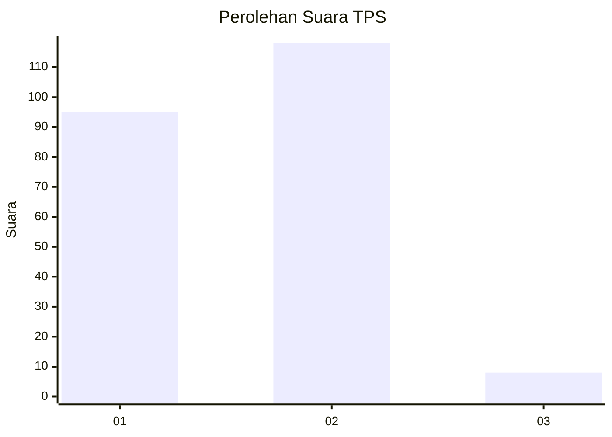
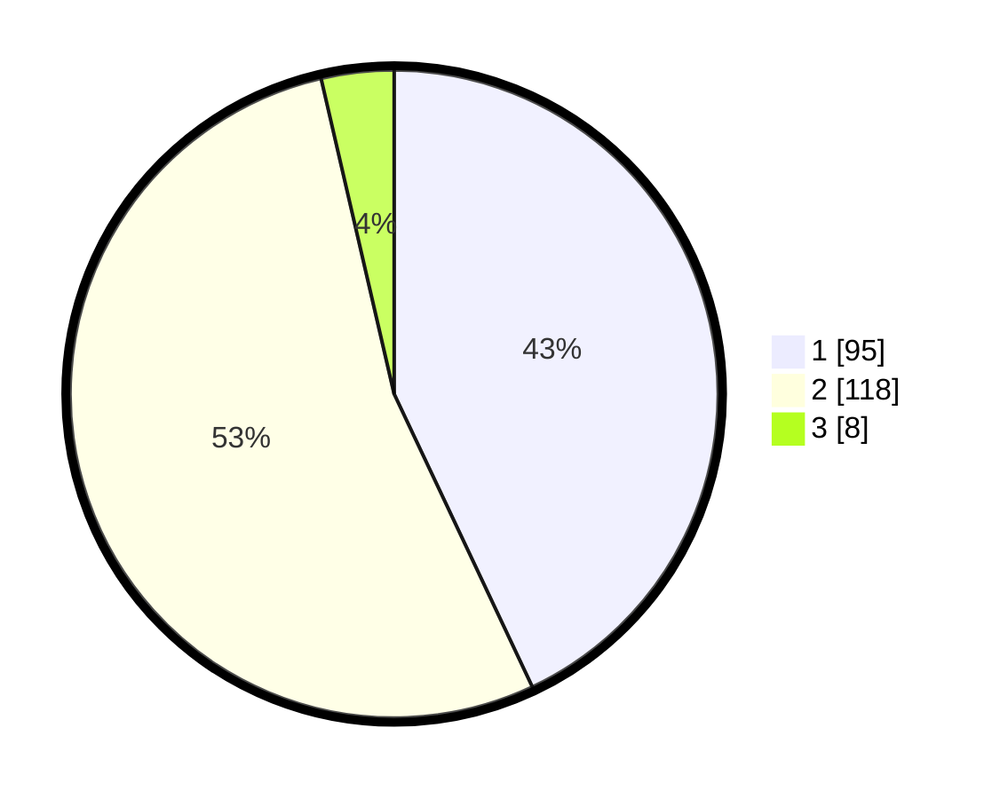

# Hasil

## Grafik

## Tabel

| No. | Nama Paslon    | Suara | Suara (raw) | Persentase |
|:--- |:-------------- | -----:| -----------:| ----------:|
| 1   | ANIES MUHAIMIN | 95    | [95][p-1]   | 42,99      |
| 2   | PRABOWO GIBRAN | 118   | [118][p-2]  | 53,39      |
| 3   | GANJAR MAHFUD  | 8     | [8][p-3]    | 3,62       |

[p-1]: https://github.com/gigit-pemilu/pemilu-2024-35-jawa-timur/blob/main/pilpres/hitung-suara/sub/35-jawa-timur/sub/27-sampang/sub/04-camplong/sub/2005-dharma-camplong/sub/018-tps/sub/paslon-1.txt
[p-2]: https://github.com/gigit-pemilu/pemilu-2024-35-jawa-timur/blob/main/pilpres/hitung-suara/sub/35-jawa-timur/sub/27-sampang/sub/04-camplong/sub/2005-dharma-camplong/sub/018-tps/sub/paslon-2.txt
[p-3]: https://github.com/gigit-pemilu/pemilu-2024-35-jawa-timur/blob/main/pilpres/hitung-suara/sub/35-jawa-timur/sub/27-sampang/sub/04-camplong/sub/2005-dharma-camplong/sub/018-tps/sub/paslon-3.txt

## Foto C Plano

https://sirekap-obj-formc.kpu.go.id/75d6/pemilu/ppwp/35/27/04/20/05/3527042005018-20240215-001904--19d36ea7-79fc-4730-ac72-efc5eaf4c2cf.jpg

https://sirekap-obj-formc.kpu.go.id/75d6/pemilu/ppwp/35/27/04/20/05/3527042005018-20240215-002415--d4a2aa0c-8b81-483d-8c93-e40313ed30dc.jpg

https://sirekap-obj-formc.kpu.go.id/75d6/pemilu/ppwp/35/27/04/20/05/3527042005018-20240215-002128--b823ec47-21d8-4f68-bdb1-edb6ce533157.jpg

## Metadata

| Key        | Value               |
| ---------- | ------------------- |
| Time Stamp | 2024-02-16 14:00:34 |

