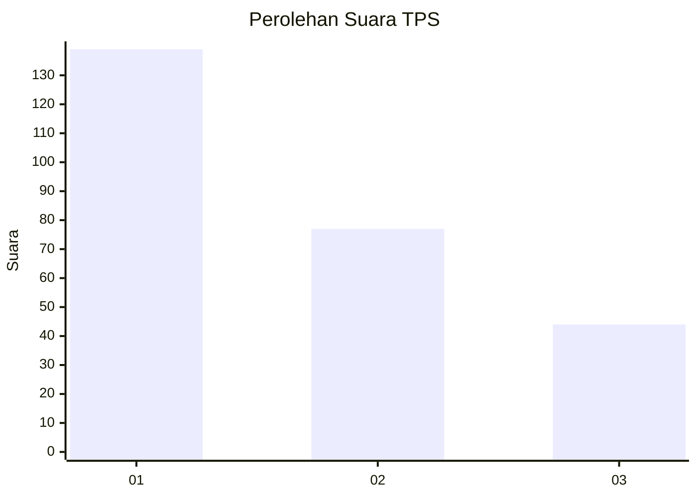
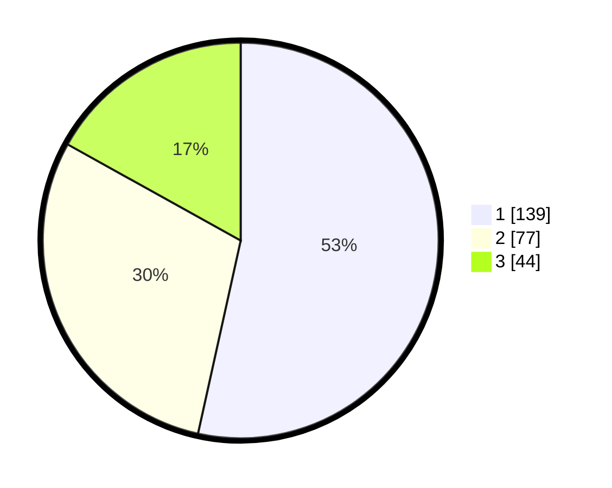

# Hasil

## Grafik

## Tabel

| No. | Nama Paslon    | Suara | Suara (raw) | Persentase |
|:--- |:-------------- | -----:| -----------:| ----------:|
| 1   | ANIES MUHAIMIN | 139   | [139][p-1]  | 53,46      |
| 2   | PRABOWO GIBRAN | 77    | [77][p-2]   | 29,62      |
| 3   | GANJAR MAHFUD  | 44    | [44][p-3]   | 16,92      |

[p-1]: https://github.com/gigit-pemilu/pemilu-2024/blob/main/pilpres/hitung-suara/sub/35-jawa-timur/sub/27-sampang/sub/04-camplong/sub/2006-batukarang/sub/009-tps/sub/paslon-1.txt
[p-2]: https://github.com/gigit-pemilu/pemilu-2024/blob/main/pilpres/hitung-suara/sub/35-jawa-timur/sub/27-sampang/sub/04-camplong/sub/2006-batukarang/sub/009-tps/sub/paslon-2.txt
[p-3]: https://github.com/gigit-pemilu/pemilu-2024/blob/main/pilpres/hitung-suara/sub/35-jawa-timur/sub/27-sampang/sub/04-camplong/sub/2006-batukarang/sub/009-tps/sub/paslon-3.txt

## Foto C Plano

https://sirekap-obj-formc.kpu.go.id/8283/pemilu/ppwp/35/27/04/20/06/3527042006009-20240214-230325--3f0b82b7-cc46-48a4-9447-677cbe95b8e6.jpg

https://sirekap-obj-formc.kpu.go.id/8283/pemilu/ppwp/35/27/04/20/06/3527042006009-20240214-230331--493efa97-db53-4b12-9482-43444c46d396.jpg

https://sirekap-obj-formc.kpu.go.id/8283/pemilu/ppwp/35/27/04/20/06/3527042006009-20240214-230337--a7c2aab7-fe88-40ac-b4f2-ad1f2248a2ab.jpg

## Metadata

| Key        | Value               |
| ---------- | ------------------- |
| Time Stamp | 2024-02-16 12:51:22 |

