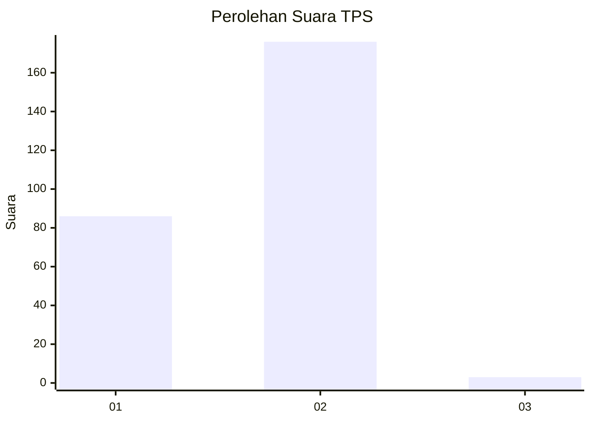
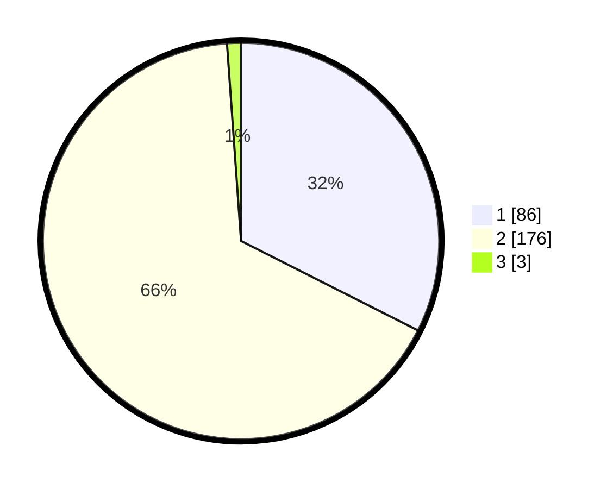

# Hasil

## Grafik

## Tabel

| No. | Nama Paslon    | Suara | Suara (raw) | Persentase |
|:--- |:-------------- | -----:| -----------:| ----------:|
| 1   | ANIES MUHAIMIN | 86    | [86][p-1]   | 32,45      |
| 2   | PRABOWO GIBRAN | 176   | [176][p-2]  | 66,42      |
| 3   | GANJAR MAHFUD  | 3     | [3][p-3]    | 1,13       |

[p-1]: https://github.com/gigit-pemilu/pemilu-2024-35-jawa-timur/blob/main/pilpres/hitung-suara/sub/35-jawa-timur/sub/27-sampang/sub/04-camplong/sub/2010-banjartabulu/sub/012-tps/sub/paslon-1.txt
[p-2]: https://github.com/gigit-pemilu/pemilu-2024-35-jawa-timur/blob/main/pilpres/hitung-suara/sub/35-jawa-timur/sub/27-sampang/sub/04-camplong/sub/2010-banjartabulu/sub/012-tps/sub/paslon-2.txt
[p-3]: https://github.com/gigit-pemilu/pemilu-2024-35-jawa-timur/blob/main/pilpres/hitung-suara/sub/35-jawa-timur/sub/27-sampang/sub/04-camplong/sub/2010-banjartabulu/sub/012-tps/sub/paslon-3.txt

## Foto C Plano

https://sirekap-obj-formc.kpu.go.id/af62/pemilu/ppwp/35/27/04/20/10/3527042010012-20240214-191433--ef967348-d3f5-46df-8e95-5e0709a0a9ca.jpg

https://sirekap-obj-formc.kpu.go.id/af62/pemilu/ppwp/35/27/04/20/10/3527042010012-20240214-191541--837c0d1f-86b7-4fd8-9b91-d78da45fb16c.jpg

https://sirekap-obj-formc.kpu.go.id/af62/pemilu/ppwp/35/27/04/20/10/3527042010012-20240214-191717--67f5eba3-2689-471d-8fcd-acd8f57427e6.jpg

## Metadata

| Key        | Value               |
| ---------- | ------------------- |
| Time Stamp | 2024-02-24 22:31:28 |

