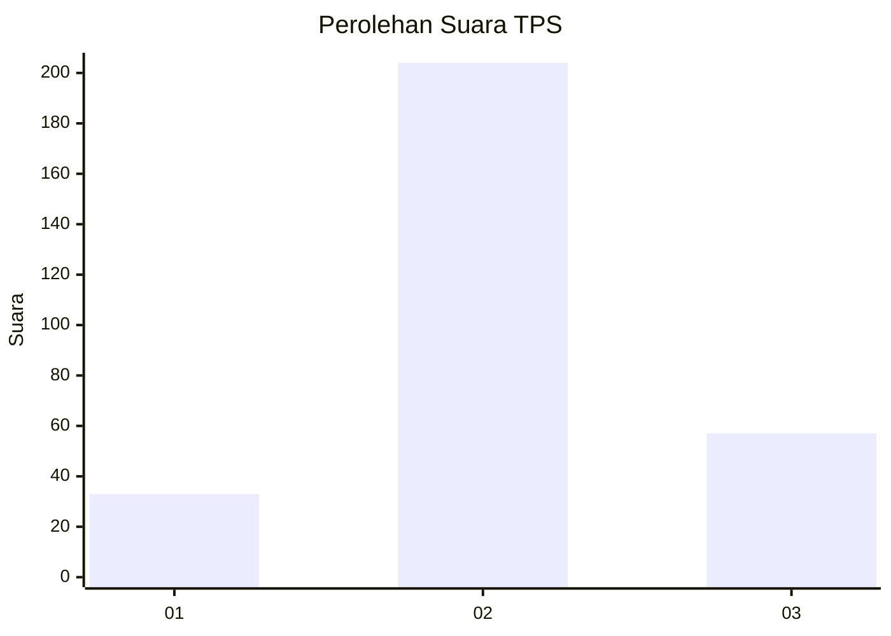
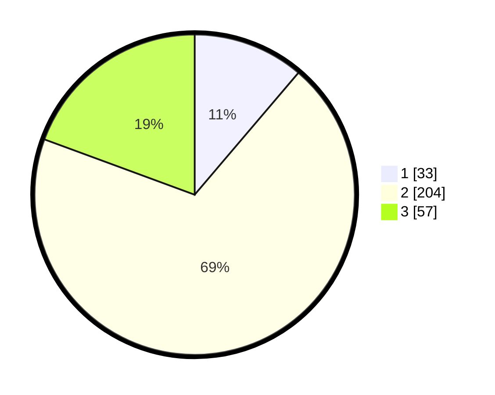

# Hasil

## Grafik

## Tabel

| No. | Nama Paslon    | Suara | Suara (raw) | Persentase |
|:--- |:-------------- | -----:| -----------:| ----------:|
| 1   | ANIES MUHAIMIN | 33    | [33][p-1]   | 11,22      |
| 2   | PRABOWO GIBRAN | 204   | [204][p-2]  | 69,39      |
| 3   | GANJAR MAHFUD  | 57    | [57][p-3]   | 19,39      |

[p-1]: https://github.com/gigit-pemilu/pemilu-2024-35-jawa-timur/blob/main/pilpres/hitung-suara/sub/35-jawa-timur/sub/27-sampang/sub/04-camplong/sub/2010-banjartabulu/sub/018-tps/sub/paslon-1.txt
[p-2]: https://github.com/gigit-pemilu/pemilu-2024-35-jawa-timur/blob/main/pilpres/hitung-suara/sub/35-jawa-timur/sub/27-sampang/sub/04-camplong/sub/2010-banjartabulu/sub/018-tps/sub/paslon-2.txt
[p-3]: https://github.com/gigit-pemilu/pemilu-2024-35-jawa-timur/blob/main/pilpres/hitung-suara/sub/35-jawa-timur/sub/27-sampang/sub/04-camplong/sub/2010-banjartabulu/sub/018-tps/sub/paslon-3.txt

## Foto C Plano

https://sirekap-obj-formc.kpu.go.id/5032/pemilu/ppwp/35/27/04/20/10/3527042010018-20240215-211745--8fd12655-2ce8-4a03-83d8-cb8bf91107f9.jpg

https://sirekap-obj-formc.kpu.go.id/5032/pemilu/ppwp/35/27/04/20/10/3527042010018-20240215-211752--40529aad-38bf-464f-b55a-69406237b853.jpg

https://sirekap-obj-formc.kpu.go.id/5032/pemilu/ppwp/35/27/04/20/10/3527042010018-20240215-211801--8e9acd3e-c5d8-47f5-a0b6-79a8e04ad2c6.jpg

## Metadata

| Key        | Value               |
| ---------- | ------------------- |
| Time Stamp | 2024-02-16 16:25:10 |

