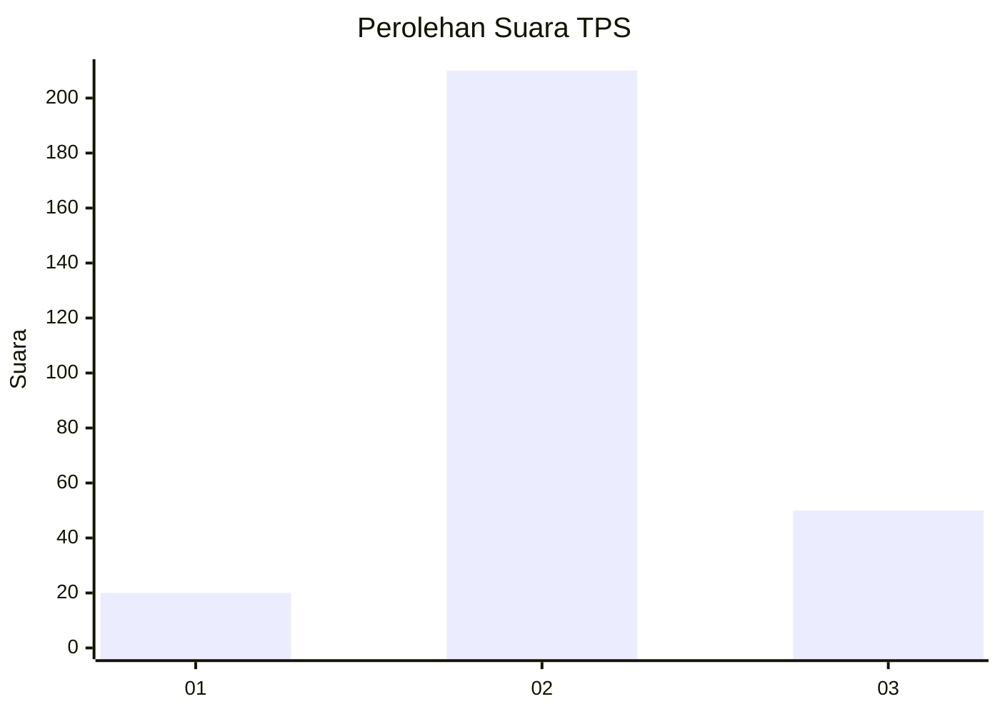

# Hasil

## Grafik

## Tabel

| No. | Nama Paslon    | Suara | Suara (raw) | Persentase |
|:--- |:-------------- | -----:| -----------:| ----------:|
| 1   | ANIES MUHAIMIN | 20    | [20][p-1]   | 7,14       |
| 2   | PRABOWO GIBRAN | 210   | [210][p-2]  | 75,00      |
| 3   | GANJAR MAHFUD  | 50    | [50][p-3]   | 17,86      |

[p-1]: https://github.com/gigit-pemilu/pemilu-2024/blob/main/pilpres/hitung-suara/sub/35-jawa-timur/sub/27-sampang/sub/04-camplong/sub/2010-banjartabulu/sub/020-tps/sub/paslon-1.txt
[p-2]: https://github.com/gigit-pemilu/pemilu-2024/blob/main/pilpres/hitung-suara/sub/35-jawa-timur/sub/27-sampang/sub/04-camplong/sub/2010-banjartabulu/sub/020-tps/sub/paslon-2.txt
[p-3]: https://github.com/gigit-pemilu/pemilu-2024/blob/main/pilpres/hitung-suara/sub/35-jawa-timur/sub/27-sampang/sub/04-camplong/sub/2010-banjartabulu/sub/020-tps/sub/paslon-3.txt

## Foto C Plano

https://sirekap-obj-formc.kpu.go.id/eab2/pemilu/ppwp/35/27/04/20/10/3527042010020-20240214-200021--41d9173a-af1f-43dd-a8a5-0d4b94279728.jpg

https://sirekap-obj-formc.kpu.go.id/eab2/pemilu/ppwp/35/27/04/20/10/3527042010020-20240214-200207--d0088297-3a25-43ac-88eb-20482247c555.jpg

https://sirekap-obj-formc.kpu.go.id/eab2/pemilu/ppwp/35/27/04/20/10/3527042010020-20240214-200315--6afc3b56-4789-446d-98af-528a74a9fdcf.jpg

## Metadata

| Key        | Value               |
| ---------- | ------------------- |
| Time Stamp | 2024-02-16 16:25:10 |

