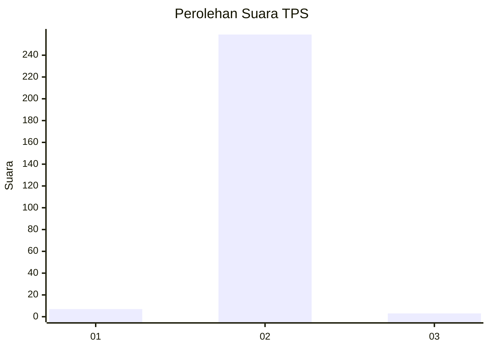
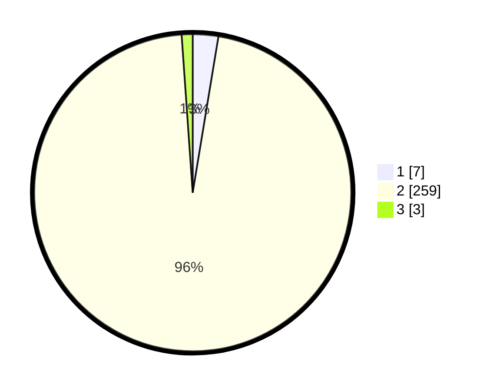

# Hasil

## Grafik

## Tabel

| No. | Nama Paslon    | Suara | Suara (raw) | Persentase |
|:--- |:-------------- | -----:| -----------:| ----------:|
| 1   | ANIES MUHAIMIN | 7     | [7][p-1]    | 2,60       |
| 2   | PRABOWO GIBRAN | 259   | [259][p-2]  | 96,28      |
| 3   | GANJAR MAHFUD  | 3     | [3][p-3]    | 1,12       |

[p-1]: https://github.com/gigit-pemilu/pemilu-2024/blob/main/pilpres/hitung-suara/sub/35-jawa-timur/sub/27-sampang/sub/04-camplong/sub/2010-banjartabulu/sub/021-tps/sub/paslon-1.txt
[p-2]: https://github.com/gigit-pemilu/pemilu-2024/blob/main/pilpres/hitung-suara/sub/35-jawa-timur/sub/27-sampang/sub/04-camplong/sub/2010-banjartabulu/sub/021-tps/sub/paslon-2.txt
[p-3]: https://github.com/gigit-pemilu/pemilu-2024/blob/main/pilpres/hitung-suara/sub/35-jawa-timur/sub/27-sampang/sub/04-camplong/sub/2010-banjartabulu/sub/021-tps/sub/paslon-3.txt

## Foto C Plano

https://sirekap-obj-formc.kpu.go.id/d3ca/pemilu/ppwp/35/27/04/20/10/3527042010021-20240214-200953--9941c987-49c8-4e2c-81a1-b96d144d39b5.jpg

https://sirekap-obj-formc.kpu.go.id/d3ca/pemilu/ppwp/35/27/04/20/10/3527042010021-20240214-201141--dbd50e65-cf10-44c8-8093-53db3fb660ac.jpg

https://sirekap-obj-formc.kpu.go.id/d3ca/pemilu/ppwp/35/27/04/20/10/3527042010021-20240214-201320--6c62e177-db6d-45af-9e85-16bf5415f510.jpg

## Metadata

| Key        | Value               |
| ---------- | ------------------- |
| Time Stamp | 2024-02-17 09:30:03 |

