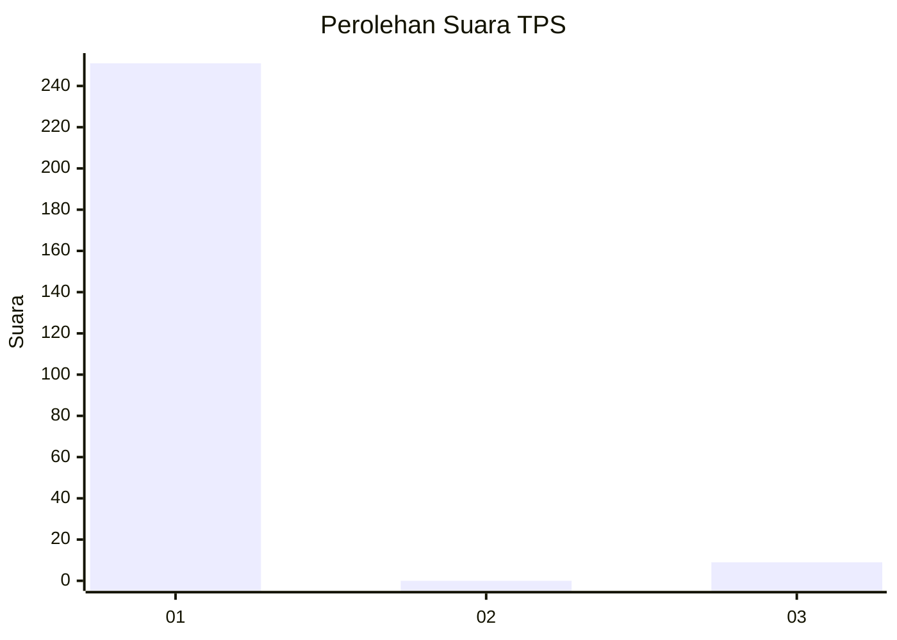
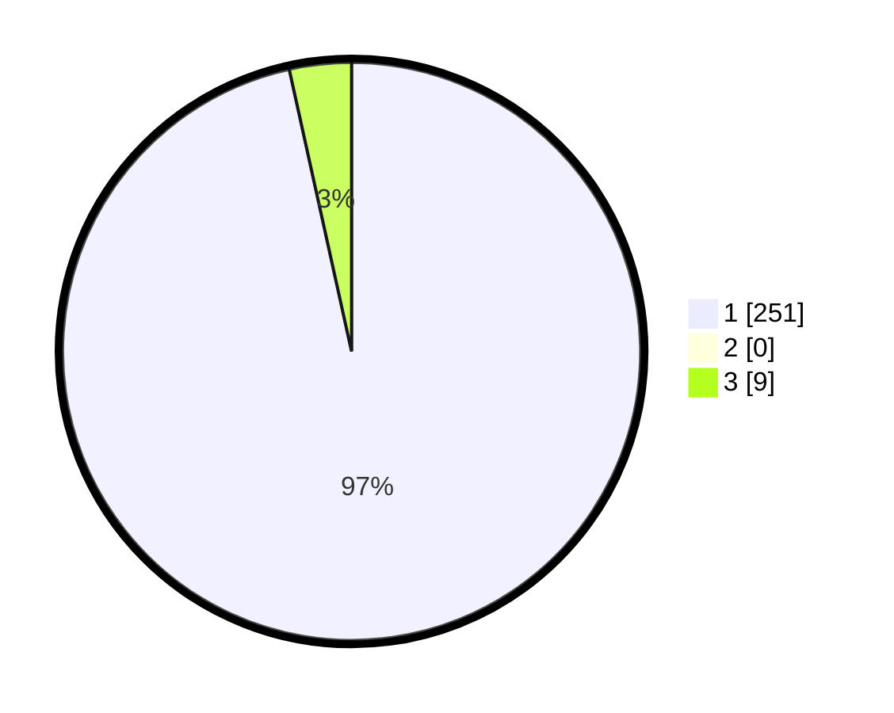

# Hasil

## Grafik

## Tabel

| No. | Nama Paslon    | Suara | Suara (raw) | Persentase |
|:--- |:-------------- | -----:| -----------:| ----------:|
| 1   | ANIES MUHAIMIN | 251   | [251][p-1]  | 96,54      |
| 2   | PRABOWO GIBRAN | 0     | [0][p-2]    | 0,00       |
| 3   | GANJAR MAHFUD  | 9     | [9][p-3]    | 3,46       |

[p-1]: https://github.com/gigit-pemilu/pemilu-2024/blob/main/pilpres/hitung-suara/sub/35-jawa-timur/sub/27-sampang/sub/04-camplong/sub/2013-pamola'an/sub/008-tps/sub/paslon-1.txt
[p-2]: https://github.com/gigit-pemilu/pemilu-2024/blob/main/pilpres/hitung-suara/sub/35-jawa-timur/sub/27-sampang/sub/04-camplong/sub/2013-pamola'an/sub/008-tps/sub/paslon-2.txt
[p-3]: https://github.com/gigit-pemilu/pemilu-2024/blob/main/pilpres/hitung-suara/sub/35-jawa-timur/sub/27-sampang/sub/04-camplong/sub/2013-pamola'an/sub/008-tps/sub/paslon-3.txt

## Foto C Plano

https://sirekap-obj-formc.kpu.go.id/49b1/pemilu/ppwp/35/27/04/20/13/3527042013008-20240214-155101--86919a96-889e-4a2f-96ee-796cc43beaa0.jpg

https://sirekap-obj-formc.kpu.go.id/49b1/pemilu/ppwp/35/27/04/20/13/3527042013008-20240214-162239--fe985bb9-994b-4f0f-928f-39bd242e6b95.jpg

https://sirekap-obj-formc.kpu.go.id/49b1/pemilu/ppwp/35/27/04/20/13/3527042013008-20240214-155256--e1181e46-dabf-46b5-9a8a-019507e33878.jpg

## Metadata

| Key        | Value               |
| ---------- | ------------------- |
| Time Stamp | 2024-02-16 16:25:10 |

